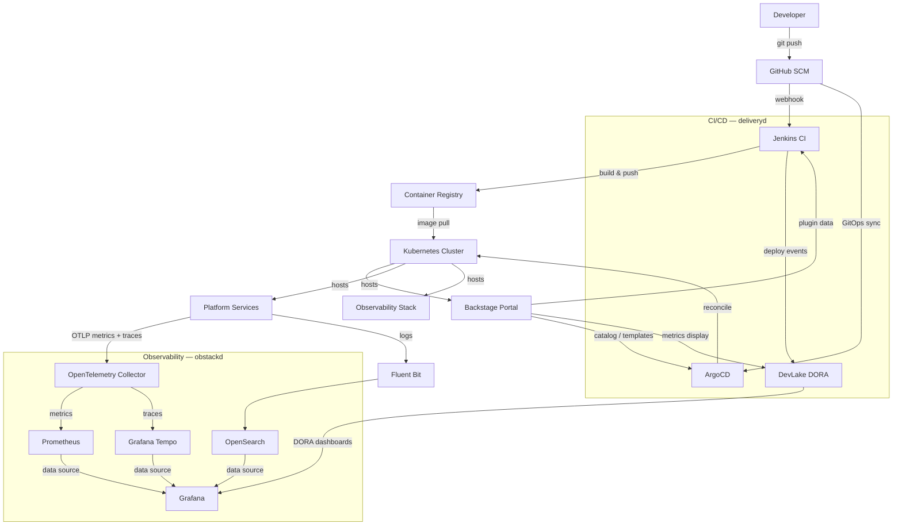
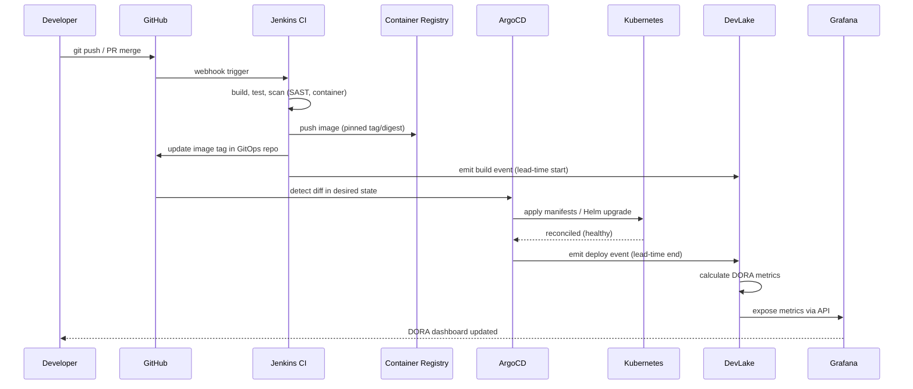
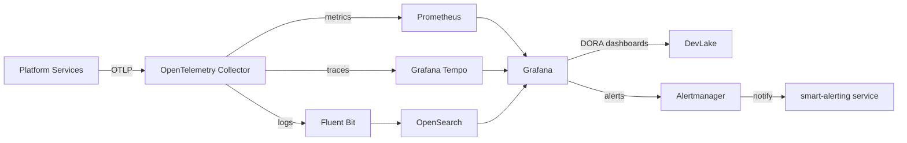
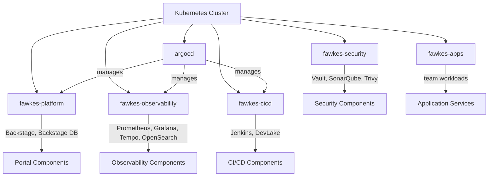

# Fawkes Architecture

> **Priority 2 context file** — read before making any cross-component change.
> See also: `AGENTS.md` §4 (Architecture Rules), `docs/CHANGE_IMPACT_MAP.md`.

---

## Table of Contents

1. [Component Overview](#component-overview)
2. [Layer Dependency Rules](#layer-dependency-rules)
3. [Component Diagram](#component-diagram)
4. [Data Flow: Commit to Metrics](#data-flow-commit-to-metrics)
5. [Allowed Inter-Service Communication](#allowed-inter-service-communication)
6. [Observability Stack](#observability-stack)
7. [Network Namespace Layout](#network-namespace-layout)
8. [Cross-Platform Dependencies](#cross-platform-dependencies)

---

## Component Overview

Fawkes is composed of four platform layers that must only depend downward:

| Layer | Directory | Primary Language | Responsibility |
|---|---|---|---|
| **Services** | `services/` | Python (FastAPI) | Stateless business-logic microservices. Go is **not** used here; Go appears only in `tests/terratest/` for infrastructure tests. |
| **Platform** | `platform/`, `charts/` | YAML + Helm | Kubernetes manifests, ArgoCD apps, Helm charts |
| **Infrastructure** | `infra/` | HCL (Terraform) | Cloud provisioning, IaC modules |
| **Scripts** | `scripts/` | Bash / Python | Automation helpers that call services and CLI tools |

---

## Layer Dependency Rules

Dependencies flow **downward only**. No layer may import or depend on a layer above it.

```
┌──────────────────────────────────────────────┐
│  Services  (services/)                        │  ← business logic, APIs
│  No direct cloud or infra calls              │
└─────────────────┬────────────────────────────┘
                  │ depends on ↓
┌─────────────────▼────────────────────────────┐
│  Platform  (platform/, charts/)               │  ← Helm, ArgoCD, K8s manifests
│  Declares desired state; does not call APIs  │
└─────────────────┬────────────────────────────┘
                  │ depends on ↓
┌─────────────────▼────────────────────────────┐
│  Infrastructure  (infra/)                     │  ← Terraform, cloud resources
│  Provisions what platform needs              │
└──────────────────────────────────────────────┘
```

**Violations that are never allowed:**

- `infra/` importing or calling anything in `services/` or `platform/`
- `platform/` containing application business logic
- `services/` directly provisioning cloud resources (use platform abstractions)
- `scripts/` containing business logic (call services instead)

---

## Component Diagram



---

## Data Flow: Commit to Metrics

The end-to-end journey from a code commit to DORA metrics:



---

## Allowed Inter-Service Communication

Services communicate via HTTP/REST only. Direct database sharing is not permitted.

| Caller | Callee | Protocol | Notes |
|---|---|---|---|
| Backstage (portal) | `analytics-dashboard` | HTTP | DORA trend data for portal widgets |
| Backstage (portal) | `discovery-metrics` | HTTP | Service health summaries |
| `feedback-bot` | `feedback` service | HTTP | Store feedback events |
| `friction-bot` | `friction-cli` | HTTP | Friction signal aggregation |
| `smart-alerting` | Grafana Alertmanager | HTTP | Route alert rules |
| `anomaly-detection` | Prometheus | HTTP (PromQL) | Pull metrics for ML analysis |
| `insights` | `analytics-dashboard` | HTTP | Aggregated insight queries |
| `vsm` service | DevLake | HTTP | Value stream mapping data |
| `rag` service | Weaviate | HTTP | Vector store queries |
| Any service | OpenTelemetry Collector | OTLP/gRPC | Traces and metrics export |

**Rules:**

- Services do **not** call `infra/` APIs or Terraform directly.
- Services do **not** share databases — each service owns its own data store.
- All external traffic routes through the Kubernetes Ingress controller.
- Service-to-service calls within the cluster use Kubernetes DNS (`svc.cluster.local`).

---

## Observability Stack

All platform components emit telemetry through a unified stack (deployed via `platform/apps/`):



| Signal | Collector | Storage | Query |
|---|---|---|---|
| Metrics | OpenTelemetry Collector | Prometheus | Grafana / PromQL |
| Logs | Fluent Bit | OpenSearch | Grafana / Lucene |
| Traces | OpenTelemetry Collector | Grafana Tempo | Grafana / TraceQL |
| DORA metrics | DevLake | DevLake DB | Grafana / DevLake API |

---

## Network Namespace Layout

All Fawkes workloads run within a dedicated Kubernetes namespace hierarchy:



| Namespace | Components | Ingress |
|---|---|---|
| `argocd` | ArgoCD server, repo-server, application-controller | Internal only |
| `fawkes-platform` | Backstage portal, PostgreSQL | External (HTTPS) |
| `fawkes-observability` | Prometheus, Grafana, Tempo, OpenSearch, OTel Collector | Internal + Grafana external |
| `fawkes-cicd` | Jenkins, DevLake | Internal + Jenkins external |
| `fawkes-security` | Vault, SonarQube, Trivy operator | Internal only |
| `fawkes-apps` | Platform microservices (`services/`) | Per-service ingress rules |

**NetworkPolicy rule**: namespaces may only receive traffic from namespaces explicitly listed in their `NetworkPolicy` manifests (`platform/policies/`). Cross-namespace calls require explicit policy approval.

---

## Cross-Platform Dependencies

### Fawkes ↔ Obstackd (Observability Platform)

Fawkes services instrument themselves using the OpenTelemetry SDK and export to the in-cluster OpenTelemetry Collector. The collector fans out to Prometheus (metrics), Tempo (traces), and Fluent Bit → OpenSearch (logs). Grafana provides the unified query and dashboard layer.

**Dependency direction:** `services/` → OTel Collector → Obstackd storage backends. Obstackd does not call back into Fawkes services.

### Fawkes ↔ Deliveryd (CI/CD Platform)

Jenkins receives webhooks from GitHub and emits build/deploy events to DevLake. ArgoCD polls the GitOps repository and applies manifests to Kubernetes. DevLake aggregates events from both Jenkins (build lead time) and ArgoCD (deployment frequency, change failure rate) to compute DORA metrics.

**Dependency direction:** GitHub → Jenkins → DevLake ← ArgoCD ← GitHub. DevLake and Grafana are read-only consumers of these events.

### Fawkes ↔ External Identity (GitHub OAuth / Vault)

Backstage and ArgoCD authenticate users via GitHub OAuth. Secrets (API keys, DB passwords, image pull secrets) are stored in Vault and synced to Kubernetes Secrets by the External Secrets Operator.

**Dependency direction:** Platform components → Vault (read). `infra/` Terraform provisions Vault; `platform/` manifests consume it.

---

> For cross-component change impact, see [`docs/CHANGE_IMPACT_MAP.md`](CHANGE_IMPACT_MAP.md).
> `docs/API_SURFACE.md` and `docs/KNOWN_LIMITATIONS.md` are planned context files (AGENTS.md §3 Priority 3 and 4) that do not yet exist. They should be created before those priorities can be satisfied.
