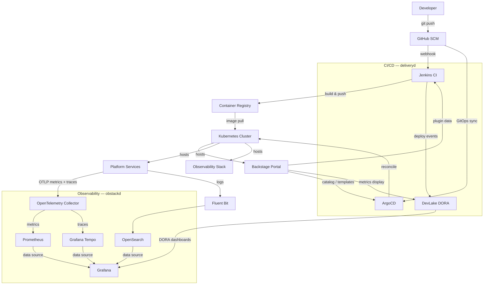
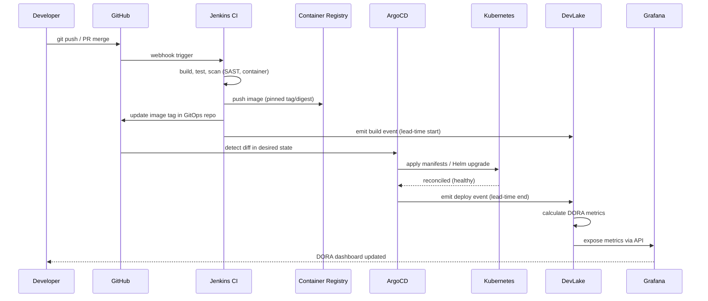
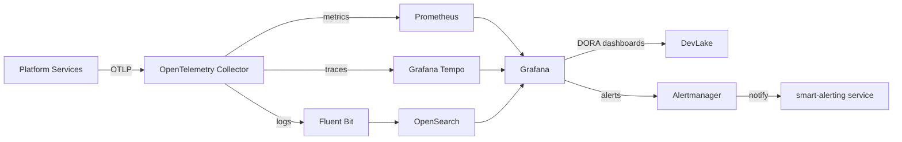
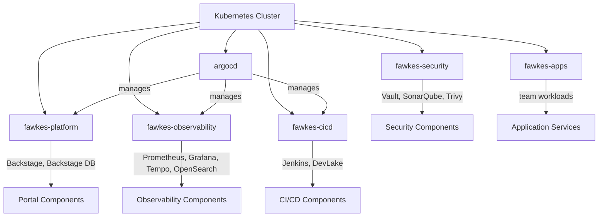

# Fawkes Architecture

> **Priority 2 context file** — read before making any cross-component change.
> See also: `AGENTS.md` §4 (Architecture Rules), `docs/CHANGE_IMPACT_MAP.md`.

---

## Table of Contents

1. [Deployment Tiers](#deployment-tiers)
2. [Component Overview](#component-overview)
3. [Layer Dependency Rules](#layer-dependency-rules)
4. [Component Diagram](#component-diagram)
5. [Data Flow: Commit to Metrics](#data-flow-commit-to-metrics)
6. [Allowed Inter-Service Communication](#allowed-inter-service-communication)
7. [Observability Stack](#observability-stack)
8. [Network Namespace Layout](#network-namespace-layout)
9. [Cross-Platform Dependencies](#cross-platform-dependencies)

---

## Deployment Tiers

Fawkes uses a two-tier deployment model that matches the user's goal and environment.
See [docs/getting-started.md](getting-started.md) for the full decision guide.

### Tier 1 — Core Platform (local or cloud)

Tier 1 is the minimum set of components required to experience the platform. It is
deployed by **Path A (local k3d)** and is also the foundation of every **Path B / Path C**
cloud deployment.

```
┌─────────────────────────────────────────────────────────────────┐
│                    Tier 1 — Core Platform                        │
│                                                                  │
│  ┌─────────────────────────────────────────────────────────┐   │
│  │  Backstage Developer Portal + Dojo Hub                   │   │
│  └─────────────────────────────────────────────────────────┘   │
│                          │                                       │
│  ┌───────────────────────┴─────────────────────────────────┐   │
│  │  ArgoCD (GitOps controller)                              │   │
│  └─────────────────────────────────────────────────────────┘   │
│                          │                                       │
│  ┌──────────────┬─────────────────────┐                        │
│  │  Prometheus  │  Grafana            │  ← DORA dashboards      │
│  └──────────────┴─────────────────────┘                        │
│                          │                                       │
│  ┌─────────────────────────────────────────────────────────┐   │
│  │  Vault (dev mode local / prod mode cloud)               │   │
│  └─────────────────────────────────────────────────────────┘   │
│                          │                                       │
│  ┌─────────────────────────────────────────────────────────┐   │
│  │  Sample Application (demonstrates CI/CD + DORA metrics) │   │
│  └─────────────────────────────────────────────────────────┘   │
│                                                                  │
│  Kubernetes: k3d (local) or managed K8s (cloud)                 │
└─────────────────────────────────────────────────────────────────┘
```

| Component | Local (Path A) | Cloud (Path B/C) |
|---|---|---|
| ArgoCD | ✅ k3d | ✅ EKS / AKS |
| Backstage | ✅ SQLite | ✅ RDS PostgreSQL |
| Prometheus + Grafana | ✅ in-cluster | ✅ in-cluster |
| Vault | ✅ dev mode (non-persistent) | ✅ production mode |
| Sample application | ✅ | ✅ |

### Tier 2 — Full Platform (cloud deployments only)

Tier 2 extends Tier 1 with the components needed for production use: CI/CD, security
scanning, log aggregation, DORA metrics, and enterprise collaboration.

```
┌─────────────────────────────────────────────────────────────────┐
│                    Tier 2 — Full Platform                        │
│  (extends Tier 1 — all Tier 1 components are also present)      │
│                                                                  │
│  ┌──────────────────────────────────────────────────────────┐  │
│  │  CI/CD Layer                                              │  │
│  │  ┌──────────┐  ┌──────────┐  ┌──────────────────────┐   │  │
│  │  │ Jenkins  │  │ DevLake  │  │ Container Registry   │   │  │
│  │  │ (CI/CD)  │  │ (DORA)   │  │ (Harbor / ECR)       │   │  │
│  │  └──────────┘  └──────────┘  └──────────────────────┘   │  │
│  └──────────────────────────────────────────────────────────┘  │
│                                                                  │
│  ┌──────────────────────────────────────────────────────────┐  │
│  │  Security Layer                                           │  │
│  │  ┌────────────┐  ┌────────┐  ┌────────────────────────┐  │  │
│  │  │ SonarQube  │  │ Trivy  │  │ External Secrets Oper. │  │  │
│  │  │ (SAST)     │  │ (scan) │  │ (secrets sync)         │  │  │
│  │  └────────────┘  └────────┘  └────────────────────────┘  │  │
│  └──────────────────────────────────────────────────────────┘  │
│                                                                  │
│  ┌──────────────────────────────────────────────────────────┐  │
│  │  Extended Observability                                   │  │
│  │  ┌────────────┐  ┌──────────────┐  ┌─────────────────┐   │  │
│  │  │ OpenSearch │  │ Grafana Tempo│  │ OTel Collector  │   │  │
│  │  │ (logs)     │  │ (traces)     │  │ (fan-out)       │   │  │
│  │  └────────────┘  └──────────────┘  └─────────────────┘   │  │
│  └──────────────────────────────────────────────────────────┘  │
│                                                                  │
│  ┌──────────────────────────────────────────────────────────┐  │
│  │  Collaboration                                            │  │
│  │  ┌────────────────────────────────────────────────────┐  │  │
│  │  │ Mattermost + Focalboard (chat + project management)│  │  │
│  │  └────────────────────────────────────────────────────┘  │  │
│  └──────────────────────────────────────────────────────────┘  │
│                                                                  │
│  Cloud: Amazon EKS + RDS + S3  (or Azure AKS / GKE)            │
│  DNS + TLS: cert-manager + Let's Encrypt                        │
└─────────────────────────────────────────────────────────────────┘
```

| Component | Tier 1 | Tier 2 |
|---|---|---|
| ArgoCD | ✅ | ✅ |
| Backstage | ✅ | ✅ |
| Prometheus + Grafana | ✅ | ✅ |
| Vault | ✅ | ✅ |
| Sample application | ✅ | ✅ |
| Jenkins CI/CD | — | ✅ |
| DevLake (DORA aggregation) | — | ✅ |
| SonarQube (SAST) | — | ✅ |
| Trivy (container scanning) | — | ✅ |
| Container registry (Harbor / ECR) | — | ✅ |
| OpenSearch (logs) | — | ✅ |
| Grafana Tempo (traces) | — | ✅ |
| External Secrets Operator | — | ✅ |
| Mattermost + Focalboard | — | ✅ |
| cert-manager + Let's Encrypt | — | ✅ |
| Amazon RDS / managed DB | — | ✅ |

---

## Component Overview

Fawkes is composed of four platform layers that must only depend downward:

| Layer | Directory | Primary Language | Responsibility |
|---|---|---|---|
| **Services** | `services/` | Python (FastAPI) | Stateless business-logic microservices. Infrastructure tests (Terratest/Go) live in `tests/terratest/`, not here. |
| **Platform** | `platform/`, `charts/` | YAML + Helm | Kubernetes manifests, ArgoCD apps, Helm charts |
| **Infrastructure** | `infra/` | HCL (Terraform) | Cloud provisioning, IaC modules |
| **Scripts** | `scripts/` | Bash / Python | Automation helpers that call services and CLI tools |

### Platform Services (`services/`)

| Service | Directory | Purpose |
|---|---|---|
| VSM | `services/vsm/` | Value Stream Mapping — tracks work items through 8-stage pipeline, calculates flow metrics |
| Analytics Dashboard | `services/analytics-dashboard/` | DORA trend data for Backstage portal widgets |
| Anomaly Detection | `services/anomaly-detection/` | ML-based anomaly detection using Prometheus metrics |
| Smart Alerting | `services/smart-alerting/` | Intelligent alert routing via Grafana Alertmanager |
| Feedback | `services/feedback/` | Collect and store developer feedback events |
| Feedback Bot | `services/feedback-bot/` | Automated feedback collection via Mattermost |
| Friction CLI / Bot | `services/friction-cli/`, `services/friction-bot/` | Friction signal collection and aggregation |
| Discovery Metrics | `services/discovery-metrics/` | Service health summaries for Backstage |
| SPACE Metrics | `services/space-metrics/` | SPACE framework metrics collection |
| AI Code Review | `services/ai-code-review/` | AI-powered code review automation |
| NPS | `services/nps/` | Net Promoter Score collection |
| DevEx Survey | `services/devex-survey-automation/` | Developer experience survey automation |
| Insights | `services/insights/` | Aggregated insight queries over analytics data |
| Data API | `services/data-api/` | Unified data access layer |
| MCP K8s Server | `services/mcp-k8s-server/` | Model Context Protocol server for Kubernetes |

> **Extensions**: The RAG service (Weaviate + semantic search) and DataHub (data
> catalog) are optional extensions. See `extensions/`.

---

## Layer Dependency Rules

Dependencies flow **downward only**. No layer may import or depend on a layer above it.

```
┌──────────────────────────────────────────────┐
│  Services  (services/)                        │  ← business logic, APIs
│  No direct cloud or infra calls              │
└─────────────────┬────────────────────────────┘
                  │ depends on ↓
┌─────────────────▼────────────────────────────┐
│  Platform  (platform/, charts/)               │  ← Helm, ArgoCD, K8s manifests
│  Declares desired state; does not call APIs  │
└─────────────────┬────────────────────────────┘
                  │ depends on ↓
┌─────────────────▼────────────────────────────┐
│  Infrastructure  (infra/)                     │  ← Terraform, cloud resources
│  Provisions what platform needs              │
└──────────────────────────────────────────────┘
```

**Violations that are never allowed:**

- `infra/` importing or calling anything in `services/` or `platform/`
- `platform/` containing application business logic
- `services/` directly provisioning cloud resources (use platform abstractions)
- `scripts/` containing business logic (call services instead)

---

## Component Diagram



---

## Data Flow: Commit to Metrics

The end-to-end journey from a code commit to DORA metrics:



---

## Allowed Inter-Service Communication

Services communicate via HTTP/REST only. Direct database sharing is not permitted.

| Caller | Callee | Protocol | Notes |
|---|---|---|---|
| Backstage (portal) | `analytics-dashboard` | HTTP | DORA trend data for portal widgets |
| Backstage (portal) | `discovery-metrics` | HTTP | Service health summaries |
| `feedback-bot` | `feedback` service | HTTP | Store feedback events |
| `friction-bot` | `friction-cli` | HTTP | Friction signal aggregation |
| `smart-alerting` | Grafana Alertmanager | HTTP | Route alert rules |
| `anomaly-detection` | Prometheus | HTTP (PromQL) | Pull metrics for ML analysis |
| `insights` | `analytics-dashboard` | HTTP | Aggregated insight queries |
| `vsm` service | DevLake | HTTP | Value stream mapping data |
| Any service | OpenTelemetry Collector | OTLP/gRPC | Traces and metrics export |

**Rules:**

- Services do **not** call `infra/` APIs or Terraform directly.
- Services do **not** share databases — each service owns its own data store.
- All external traffic routes through the Kubernetes Ingress controller.
- Service-to-service calls within the cluster use Kubernetes DNS (`svc.cluster.local`).

---

## Observability Stack

All platform components emit telemetry through a unified stack (deployed via `platform/apps/`):



| Signal | Collector | Storage | Query |
|---|---|---|---|
| Metrics | OpenTelemetry Collector | Prometheus | Grafana / PromQL |
| Logs | Fluent Bit | OpenSearch | Grafana / Lucene |
| Traces | OpenTelemetry Collector | Grafana Tempo | Grafana / TraceQL |
| DORA metrics | DevLake | DevLake DB | Grafana / DevLake API |

---

## Network Namespace Layout

All Fawkes workloads run within a dedicated Kubernetes namespace hierarchy:



| Namespace | Components | Ingress |
|---|---|---|
| `argocd` | ArgoCD server, repo-server, application-controller | Internal only |
| `fawkes-platform` | Backstage portal, PostgreSQL | External (HTTPS) |
| `fawkes-observability` | Prometheus, Grafana, Tempo, OpenSearch, OTel Collector | Internal + Grafana external |
| `fawkes-cicd` | Jenkins, DevLake | Internal + Jenkins external |
| `fawkes-security` | Vault, SonarQube, Trivy operator | Internal only |
| `fawkes-apps` | Platform microservices (`services/`) | Per-service ingress rules |

**NetworkPolicy rule**: namespaces may only receive traffic from namespaces explicitly
listed in their `NetworkPolicy` manifests (`platform/policies/`). Cross-namespace calls
require explicit policy approval.

---

## Cross-Platform Dependencies

### Fawkes ↔ Obstackd (Observability Platform)

Fawkes services instrument themselves using the OpenTelemetry SDK and export to the
in-cluster OpenTelemetry Collector. The collector fans out to Prometheus (metrics),
Tempo (traces), and Fluent Bit → OpenSearch (logs). Grafana provides the unified
query and dashboard layer.

**Dependency direction:** `services/` → OTel Collector → Obstackd storage backends.
Obstackd does not call back into Fawkes services.

### Fawkes ↔ Deliveryd (CI/CD Platform)

Jenkins receives webhooks from GitHub and emits build/deploy events to DevLake.
ArgoCD polls the GitOps repository and applies manifests to Kubernetes. DevLake
aggregates events from both Jenkins (build lead time) and ArgoCD (deployment
frequency, change failure rate) to compute DORA metrics.

**Dependency direction:** GitHub → Jenkins → DevLake ← ArgoCD ← GitHub.
DevLake and Grafana are read-only consumers of these events.

### Fawkes ↔ External Identity (GitHub OAuth / Vault)

Backstage and ArgoCD authenticate users via GitHub OAuth. Secrets (API keys,
DB passwords, image pull secrets) are stored in Vault and synced to Kubernetes
Secrets by the External Secrets Operator.

**Dependency direction:** Platform components → Vault (read). `infra/` Terraform
provisions Vault; `platform/` manifests consume it.

---

## Test Architecture

| Layer | Location | Tool | Scope |
|---|---|---|---|
| Bash unit tests | `tests/bats/unit/` | bats-core | `scripts/lib/` modules (common, flags, validation, prereqs) |
| Python unit tests | `tests/unit/` | pytest | Isolated Python utility functions |
| BDD scenarios | `tests/bdd/` | pytest-bdd | Platform acceptance criteria in business language |
| Integration tests | `tests/integration/` | pytest / bash | Cross-component API and platform checks |
| Infrastructure tests | `tests/terratest/` | Go / Terratest | Terraform module validation |
| E2E tests | `tests/e2e/` | bash | Full platform smoke tests (requires live cluster) |

Helper libraries for bats tests live in `tests/bats/helpers/`:

- `test_helper.bash` — project root detection, environment setup/teardown, mock helpers
- `mocks.bash` — mock implementations for `kubectl`, `helm`, external CLIs

---

> For cross-component change impact, see [`docs/CHANGE_IMPACT_MAP.md`](CHANGE_IMPACT_MAP.md).
> For public service interfaces, see [`docs/API_SURFACE.md`](API_SURFACE.md).
> For known platform limitations and workarounds, see [`docs/KNOWN_LIMITATIONS.md`](KNOWN_LIMITATIONS.md).
