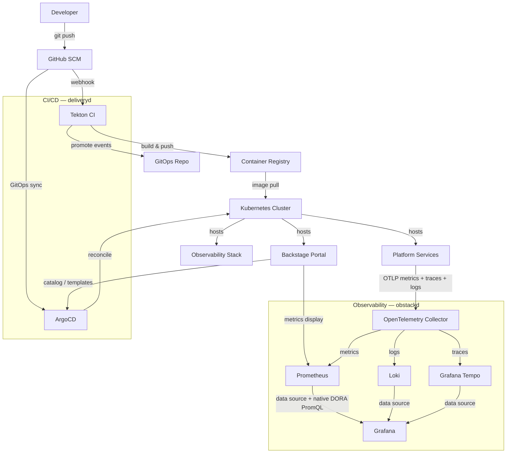
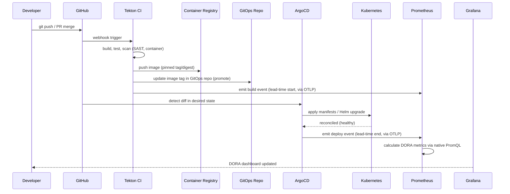
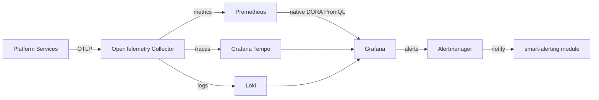
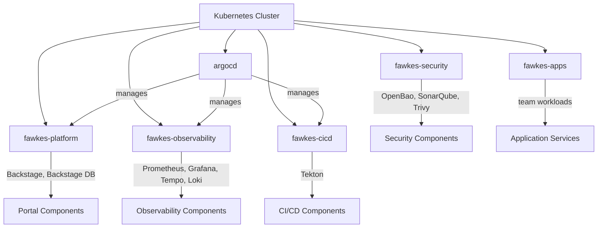

# Fawkes Architecture

> **Priority 2 context file** — read before making any cross-component change.
> See also: `AGENTS.md` §4 (Architecture Rules), `docs/CHANGE_IMPACT_MAP.md`.

---

## Table of Contents

1. [Deployment Tiers](#deployment-tiers)
1a. [Cluster Topology (Which Cluster Is Canonical?)](#cluster-topology-which-cluster-is-canonical)
2. [Component Overview](#component-overview)
3. [Layer Dependency Rules](#layer-dependency-rules)
4. [Component Diagram](#component-diagram)
5. [Data Flow: Commit to Metrics](#data-flow-commit-to-metrics)
6. [Allowed Inter-Service Communication](#allowed-inter-service-communication)
7. [Observability Stack](#observability-stack)
8. [Network Namespace Layout](#network-namespace-layout)
9. [Cross-Platform Dependencies](#cross-platform-dependencies)

---

## Deployment Tiers

Fawkes uses a two-tier deployment model that matches the user's goal and environment.
See [docs/getting-started.md](getting-started.md) for the full decision guide.

### Tier 1 — Core Platform (local or cloud)

Tier 1 is the minimum set of components required to experience the platform. It is
deployed by **Path A (local k3d)** and is also the foundation of every **Path B / Path C**
cloud deployment.

```
┌─────────────────────────────────────────────────────────────────┐
│                    Tier 1 — Core Platform                        │
│                                                                  │
│  ┌─────────────────────────────────────────────────────────┐   │
│  │  Backstage Developer Portal + Dojo Hub                   │   │
│  └─────────────────────────────────────────────────────────┘   │
│                          │                                       │
│  ┌───────────────────────┴─────────────────────────────────┐   │
│  │  ArgoCD (GitOps controller)                              │   │
│  └─────────────────────────────────────────────────────────┘   │
│                          │                                       │
│  ┌──────────────┬─────────────────────┐                        │
│  │  Prometheus  │  Grafana            │  ← DORA dashboards      │
│  └──────────────┴─────────────────────┘                        │
│                          │                                       │
│  ┌─────────────────────────────────────────────────────────┐   │
│  │  OpenBao (dev mode local / prod mode cloud)             │   │
│  └─────────────────────────────────────────────────────────┘   │
│                          │                                       │
│  ┌─────────────────────────────────────────────────────────┐   │
│  │  Sample Application (demonstrates CI/CD + DORA metrics) │   │
│  └─────────────────────────────────────────────────────────┘   │
│                                                                  │
│  Kubernetes: k3d (local) or managed K8s (cloud)                 │
└─────────────────────────────────────────────────────────────────┘
```

| Component            | Local (Path A)                 | Cloud (Path B/C)       |
| -------------------- | ------------------------------ | ---------------------- |
| ArgoCD               | ✅ k3d                         | ✅ EKS / AKS           |
| Backstage            | ✅ SQLite                      | ✅ RDS PostgreSQL      |
| Prometheus + Grafana | ✅ in-cluster                  | ✅ in-cluster          |
| OpenBao              | ✅ dev mode (non-persistent)   | ✅ production mode     |
| Sample application   | ✅                             | ✅                     |

### Cluster Topology (Which Cluster Is Canonical?)

Three clusters have been used at different points in this project's history
with no prior reconciliation: a local `kind` cluster, a LAN homelab k3s
cluster (Mac Mini control-plane + a Windows/WSL2 worker node, `mini-gamer`),
and Azure AKS. As of 2026-09-12, live-verified:

- **Azure AKS (`fawkes-dev-aks`) is the canonical golden-path proving
  ground.** All Phase 2 live verification this project has done — golden
  path CI runs, ArgoCD sync checks, canary rollout + automated rollback —
  has run against this cluster. Cost-managed: it is provisioned and
  destroyed per session (see runbook notes in `docs/BACKLOG.md`), so do not
  assume it persists between sessions.
- **The homelab k3s cluster (`mac-mini-k3s` kubeconfig context) is kept
  running as a secondary/dev cluster**, not torn down. It is not currently
  used for golden-path verification.
- **`kind-fawkes`** is a local, ephemeral dev cluster (Docker Desktop);
  no canonical role, safe to create/destroy freely.

Known bootstrap gap (tracked, not yet fixed): `platform/bootstrap/*.yaml`
ApplicationSet changes require a manual `kubectl apply -k platform/bootstrap`
re-apply after merge — the ApplicationSet controller reconciles from its own
live spec, not directly from git, so a merged bootstrap change does nothing
until someone re-applies it by hand.

### Tier 2 — Full Platform (cloud deployments only)

Tier 2 extends Tier 1 with the components needed for production use: CI/CD, security
scanning, log aggregation, DORA metrics, and enterprise collaboration.

```
┌─────────────────────────────────────────────────────────────────┐
│                    Tier 2 — Full Platform                        │
│  (extends Tier 1 — all Tier 1 components are also present)      │
│                                                                  │
│  ┌──────────────────────────────────────────────────────────┐  │
│  │  CI/CD Layer                                              │  │
│  │  ┌────────────────────┐  ┌──────────────────────────┐    │  │
│  │  │ Tekton (CI only)   │  │ Container Registry       │    │  │
│  │  │ build/test/scan    │  │ (Harbor / ECR)           │    │  │
│  │  │ SBOM/sign/promote  │  │                          │    │  │
│  │  └────────────────────┘  └──────────────────────────┘    │  │
│  │                                                            │  │
│  │  ArgoCD (CD only) — GitOps deployment & reconciliation   │  │
│  └──────────────────────────────────────────────────────────┘  │
│                                                                  │
│  ┌──────────────────────────────────────────────────────────┐  │
│  │  Security Layer                                           │  │
│  │  ┌────────────┐  ┌────────┐  ┌────────────────────────┐  │  │
│  │  │ SonarQube  │  │ Trivy  │  │ External Secrets Oper. │  │  │
│  │  │ (SAST)     │  │ (scan) │  │ (secrets sync)         │  │  │
│  │  └────────────┘  └────────┘  └────────────────────────┘  │  │
│  └──────────────────────────────────────────────────────────┘  │
│                                                                  │
│  ┌──────────────────────────────────────────────────────────┐  │
│  │  Extended Observability                                   │  │
│  │  ┌────────────┐  ┌──────────────┐  ┌─────────────────┐   │  │
│  │  │ Loki       │  │ Grafana Tempo│  │ OTel Collector  │   │  │
│  │  │ (logs)     │  │ (traces)     │  │ (fan-out)       │   │  │
│  │  └────────────┘  └──────────────┘  └─────────────────┘   │  │
│  └──────────────────────────────────────────────────────────┘  │
│                                                                  │
│  ┌──────────────────────────────────────────────────────────┐  │
│  │  Collaboration                                            │  │
│  │  ┌────────────────────────────────────────────────────┐  │  │
│  │  │ Mattermost + Focalboard (chat + project management)│  │  │
│  │  └────────────────────────────────────────────────────┘  │  │
│  └──────────────────────────────────────────────────────────┘  │
│                                                                  │
│  Cloud: Amazon EKS + RDS + S3  (or Azure AKS / GKE)            │
│  DNS + TLS: cert-manager + Let's Encrypt                        │
└─────────────────────────────────────────────────────────────────┘
```

| Component                         | Tier 1 | Tier 2 |
| --------------------------------- | ------ | ------ |
| ArgoCD                            | ✅     | ✅     |
| Backstage                         | ✅     | ✅     |
| Prometheus + Grafana              | ✅     | ✅     |
| OpenBao (secrets management)      | ✅     | ✅     |
| Sample application                | ✅     | ✅     |
| Tekton CI/CD                      | —      | ✅     |
| SonarQube (SAST)                  | —      | ✅     |
| Trivy (container scanning)        | —      | ✅     |
| Container registry (Harbor / ECR) | —      | ✅     |
| Loki (logs)                       | —      | ✅     |
| Grafana Tempo (traces)            | —      | ✅     |
| External Secrets Operator         | —      | ✅     |
| Mattermost + Focalboard           | —      | ✅     |
| cert-manager + Let's Encrypt      | —      | ✅     |
| Amazon RDS / managed DB           | —      | ✅     |

---

## Component Overview

Fawkes is composed of four platform layers that must only depend downward:

| Layer              | Directory              | Primary Language | Responsibility                                                                                                    |
| ------------------ | ---------------------- | ---------------- | ----------------------------------------------------------------------------------------------------------------- |
| **Services**       | `services/`            | Python (FastAPI) | Stateless business-logic microservices. Infrastructure tests (Terratest/Go) live in `tests/terratest/`, not here. |
| **Platform**       | `platform/`, `charts/` | YAML + Helm      | Kubernetes manifests, ArgoCD apps, Helm charts                                                                    |
| **Infrastructure** | `infra/`               | HCL (Terraform)  | Cloud provisioning, IaC modules                                                                                   |
| **Scripts**        | `scripts/`             | Bash / Python    | Automation helpers that call services and CLI tools                                                               |

### Platform App Registration (`platform/bootstrap/`)

Every platform app (`platform/apps/**/*-application.yaml`) is registered with
ArgoCD by a single `ApplicationSet` (`platform-applicationset.yaml`, #1842),
using a `git` generator with `files` globbing - **not** the `directories`
generator, which collided across ~29 of 45 matched directories in an earlier
iteration of this same idea (worked around at the time with a 28-entry
manual exclude list, itself later replaced). The ApplicationSet controller
is the sole owner of every Application it generates: nothing else may apply,
template, or manage those objects. A second, competing mechanism doing so is
exactly what caused two separate live incidents before this design -
`ingress-nginx` registered twice under one plain-Application directory scan,
and a leftover app-of-apps Application independently reconciling the same
directory.

Two apps sit outside the ApplicationSet by design, not oversight:
`fawkes-networking` and the default `AppProject` are foundational,
one-of-a-kind resources, not instances of the repeating "one Helm chart or
kustomize dir per app" pattern the generator solves - they stay as plain
`Application`/`AppProject` manifests listed directly in
`platform/bootstrap/kustomization.yaml`.

**CI enforcement**: `scripts/render-all-applications.sh` actually fetches
and renders every app's real Helm chart or kustomize source (`helm
template` / `kubectl kustomize`) and fails the build on error, wired into
the `argocd-validate` pre-commit hook. Its predecessor called `argocd app
validate` - a client-side schema check on the Application CR itself, never
touching the underlying chart - and silently downgraded every failure to a
warning; it never once failed a build. The replacement caught two real,
previously-undetected defects (a Helm values schema mismatch, an OCI chart
reference bug) the first time it ran.

### Platform Services (`services/`)

Following the consolidation directive (17 microservices → 2 domain monoliths), Fawkes now runs two unified platform services:

| Service             | Directory                              | Database             | Purpose                                                                                    |
| ------------------- | -------------------------------------- | -------------------- | ------------------------------------------------------------------------------------------ |
| **Telemetry Engine** | `services/fawkes-telemetry-engine/`    | `telemetry_db`       | Unified telemetry: DORA metrics (native PromQL), SPACE metrics, anomaly detection, analytics dashboard, insights, discovery metrics, data API |
| **DevEx Service**   | `services/fawkes-devex-service/`       | `devex_db`           | Developer experience: feedback collection, friction tracking, VSM, NPS, **SPACE surveys (quarterly NPS, weekly pulse, friction widget)**, AI code review, MCP K8s server |

> **Shared PostgreSQL Instance**: Both monoliths connect to a single PostgreSQL instance (managed via CloudNativePG / Patroni on Kubernetes, or managed RDS/CloudSQL) but use **separate databases** (`telemetry_db`, `devex_db`) with dedicated users and connection pools. This provides operational simplicity (one instance to manage) while preserving logical isolation and independent schema evolution.
>
> **Migration Note**: The following 17 microservices have been consolidated:
> - `vsm`, `analytics-dashboard`, `anomaly-detection`, `smart-alerting`, `feedback`, `feedback-bot`, `friction-cli`, `friction-bot`, `discovery-metrics`, `space-metrics`, `ai-code-review`, `nps`, `devx-survey-automation`, `insights`, `data-api`, `mcp-k8s-server`
>
> Their functionality is preserved as internal modules within the two monoliths. Inter-service HTTP calls have been replaced with direct Go/Python imports. Shared libraries live in `services/common/`.
>
> **Extensions**: The RAG service (Weaviate + semantic search) and DataHub (data catalog) remain optional extensions. See [`extensions/`](../extensions/README.md).

---

## Layer Dependency Rules

Dependencies flow **downward only**. No layer may import or depend on a layer above it.

```
┌──────────────────────────────────────────────┐
│  Services  (services/)                        │  ← business logic, APIs
│  No direct cloud or infra calls              │
└─────────────────┬────────────────────────────┘
                  │ depends on ↓
┌─────────────────▼────────────────────────────┐
│  Platform  (platform/, charts/)               │  ← Helm, ArgoCD, K8s manifests
│  Declares desired state; does not call APIs  │
└─────────────────┬────────────────────────────┘
                  │ depends on ↓
┌─────────────────▼────────────────────────────┐
│  Infrastructure  (infra/)                     │  ← Terraform, cloud resources
│  Provisions what platform needs              │
└──────────────────────────────────────────────┘
```

**Violations that are never allowed:**

- `infra/` importing or calling anything in `services/` or `platform/`
- `platform/` containing application business logic
- `services/` directly provisioning cloud resources (use platform abstractions)
- `scripts/` containing business logic (call services instead)

---

## Component Diagram


```mermaid
graph TD
    Dev[Developer] -->|git push| GitHub[GitHub SCM]

    GitHub -->|webhook| Tekton[Tekton CI]
    GitHub -->|GitOps sync| ArgoCD[ArgoCD]

    Tekton -->|build & push| Registry[Container Registry]
    Tekton -->|promote events| GitOps[GitOps Repo]

    ArgoCD -->|reconcile| K8s[Kubernetes Cluster]
    Registry -->|image pull| K8s

    K8s -->|hosts| Backstage[Backstage Portal]
    K8s -->|hosts| Services[Platform Services]
    K8s -->|hosts| Observability[Observability Stack]

    Backstage -->|catalog / templates| ArgoCD
    Backstage -->|metrics display| Prometheus

    Services -->|OTLP metrics + traces + logs| OTel[OpenTelemetry Collector]
    OTel -->|metrics| Prometheus[Prometheus]
    OTel -->|traces| Tempo[Grafana Tempo]
    OTel -->|logs| Loki[Loki]

    Prometheus -->|data source + native DORA PromQL| Grafana[Grafana]
    Loki -->|data source| Grafana
    Tempo -->|data source| Grafana

    subgraph Obstackd [Observability — obstackd]
        Prometheus
        Grafana
        Tempo
        Loki
        OTel[OpenTelemetry Collector]
    end

    subgraph Deliveryd [CI/CD — deliveryd]
        Tekton
        ArgoCD
    end
```

---

## Data Flow: Commit to Metrics

The end-to-end journey from a code commit to DORA metrics (native PromQL, no DevLake):


```mermaid
sequenceDiagram
    participant Dev as Developer
    participant GH as GitHub
    participant Tekton as Tekton CI
    participant Registry as Container Registry
    participant GitOps as GitOps Repo
    participant ArgoCD as ArgoCD
    participant K8s as Kubernetes
    participant Prometheus as Prometheus
    participant Grafana as Grafana

    Dev->>GH: git push / PR merge
    GH->>Tekton: webhook trigger
    Tekton->>Tekton: build, test, scan (SAST, container)
    Tekton->>Registry: push image (pinned tag/digest)
    Tekton->>GitOps: update image tag in GitOps repo (promote)
    Tekton->>Prometheus: emit build event (lead-time start, via OTLP)

    GH->>ArgoCD: detect diff in desired state
    ArgoCD->>K8s: apply manifests / Helm upgrade
    K8s-->>ArgoCD: reconciled (healthy)
    ArgoCD->>Prometheus: emit deploy event (lead-time end, via OTLP)

    Prometheus->>Prometheus: calculate DORA metrics via native PromQL
    Grafana-->>Dev: DORA dashboard updated
```

---

## Allowed Inter-Service Communication

Platform services communicate via HTTP/REST only. Direct database sharing is not permitted.
Internal module calls within the two monoliths use direct Go/Python imports (no network hop).

| Caller              | Callee                    | Protocol    | Notes                              |
| ------------------- | ------------------------- | ----------- | ---------------------------------- |
| Backstage (portal)  | `fawkes-telemetry-engine` | HTTP        | DORA trend data, service health    |
| Backstage (portal)  | `fawkes-devex-service`    | HTTP        | Feedback, VSM, NPS, surveys        |
| `fawkes-devex-service` | Grafana Alertmanager    | HTTP        | Route alert rules (via smart-alerting module) |
| `fawkes-telemetry-engine` | Prometheus            | HTTP (PromQL) | Pull metrics for anomaly detection |
| Any service         | OpenTelemetry Collector   | OTLP/gRPC   | Traces and metrics export          |

**Rules:**

- Services do **not** call `infra/` APIs or Terraform directly.
- Services do **not** share database schemas/tables — each monolith owns its database (`telemetry_db`, `devex_db`) on a shared PostgreSQL instance.
- All external traffic routes through the Kubernetes Ingress controller.
- Service-to-service calls within the cluster use Kubernetes DNS (`svc.cluster.local`).

---

## Observability Stack

All platform components emit telemetry through a unified stack (deployed via `platform/apps/`):


```mermaid
graph LR
    Apps[Platform Services] -->|OTLP| OTel[OpenTelemetry Collector]
    OTel -->|metrics| Prom[Prometheus]
    OTel -->|traces| Tempo[Grafana Tempo]
    OTel -->|logs| Loki[Loki]

    Prom -->|native DORA PromQL| Grafana[Grafana]
    Tempo --> Grafana
    Loki --> Grafana

    Grafana -->|alerts| Alertmanager[Alertmanager]
    Alertmanager -->|notify| SmartAlerting[smart-alerting module]
```

| Signal          | Collector               | Storage       | Query                 |
| --------------- | ----------------------- | ------------- | --------------------- |
| Metrics         | OpenTelemetry Collector | Prometheus    | Grafana / PromQL      |
| Logs            | OpenTelemetry Collector | Loki          | Grafana / LogQL       |
| Traces          | OpenTelemetry Collector | Grafana Tempo | Grafana / TraceQL     |
| DORA metrics    | Native PromQL (no ETL)  | Prometheus    | Grafana / PromQL      |

---

## DORA Metrics: Native PromQL Recording Rules

All 5 DORA metrics are computed natively in Prometheus via recording rules — **no DevLake ETL required**. Recording rules are deployed via `platform/apps/prometheus/rules/dora.yml`.

### Raw Events Required (Emitted via OTLP)

| Event | Source | Key Labels |
|-------|--------|------------|
| `tekton_pipelinerun_start` | Tekton CI | `commit_sha`, `pipeline`, `namespace` |
| `tekton_pipelinerun_finished` | Tekton CI | `commit_sha`, `pipeline`, `status` (success/failed) |
| `argocd_application_sync_started` | ArgoCD | `app`, `commit_sha`, `namespace` |
| `argocd_application_sync_succeeded` | ArgoCD | `app`, `commit_sha`, `namespace` |
| `argocd_application_sync_failed` | ArgoCD | `app`, `commit_sha`, `namespace` |
| `argocd_application_rollback` | ArgoCD | `app`, `commit_sha`, `namespace` |
| `alertmanager_alert_firing` | Alertmanager | `incident_id`, `alertname`, `severity` |
| `alertmanager_alert_resolved` | Alertmanager | `incident_id`, `alertname` |
| `service_up` | Prometheus | `service`, `namespace`, `job` |

### Recording Rules (`dora.yml`)

```yaml
groups:
- name: dora-metrics
  interval: 30s
  rules:
  # Deployment Frequency: syncs per day per app/env
  - expr: |
      sum by (app, namespace) (
        rate(argocd_application_sync_succeeded_total[24h])
      )
    record: dora:deployment_frequency:ratio_1d

  # Lead Time for Changes: commit → production sync (hours)
  - expr: |
      histogram_quantile(0.5,
        sum by (le, commit_sha) (
          rate(
            (
              argocd_application_sync_succeeded_timestamp_seconds{job="argocd"}
              -
              tekton_pipelinerun_start_timestamp_seconds{job="tekton"}
            ) / 3600
          )[24h]
        )
      )
    record: dora:lead_time_for_changes:hours_1d

  # Change Failure Rate: failed syncs / total syncs
  - expr: |
      sum by (app, namespace) (
        rate(argocd_application_sync_failed_total[24h])
      )
      /
      sum by (app, namespace) (
        rate(argocd_application_sync_total[24h])
      )
    record: dora:change_failure_rate:ratio_1d

  # Mean Time to Recovery: alert firing → resolved (hours)
  - expr: |
      histogram_quantile(0.5,
        sum by (le, incident_id) (
          rate(
            (
              alertmanager_alert_resolved_timestamp_seconds
              -
              alertmanager_alert_firing_timestamp_seconds
            ) / 3600
          )[24h]
        )
      )
    record: dora:mttr:hours_1d

  # Reliability (5th key): service availability % meeting SLO
  - expr: |
      sum by (service, namespace) (
        rate(service_up_total{job="prometheus"}[30d])
      )
      /
      sum by (service, namespace) (
        rate(service_up_total{job="prometheus"}[30d]) + rate(service_down_total{job="prometheus"}[30d])
      )
    record: dora:reliability:ratio_30d
```

### Grafana Dashboard Queries

| Metric | Grafana Query |
|--------|---------------|
| Deployment Frequency | `dora:deployment_frequency:ratio_1d` |
| Lead Time (P50) | `dora:lead_time_for_changes:hours_1d` |
| Change Failure Rate | `dora:change_failure_rate:ratio_1d * 100` |
| MTTR (P50) | `dora:mttr:hours_1d` |
| Reliability | `dora:reliability:ratio_30d * 100` |

---

## OTel Sidecar Configurations

### Tekton CI: Built-in OTel Exporter

Tekton Pipelines supports native OTel export via controller config:

```yaml
# platform/apps/tekton/config/observability.yaml
apiVersion: v1
kind: ConfigMap
metadata:
  name: tekton-pipeline-observability
  namespace: tekton-pipelines
data:
  _observability: |
    metrics:
      backend-destination: "otlp"
      otlp:
        endpoint: "http://otel-collector.fawkes-observability.svc:4317"
        insecure: true
    tracing:
      backend-destination: "otlp"
      otlp:
        endpoint: "http://otel-collector.fawkes-observability.svc:4317"
        insecure: true
      sampling-rate: "1.0"
```

**Events emitted**: PipelineRun/TaskRun start/end with `commit_sha`, `pipeline`, `status` attributes.

### ArgoCD: OTel Sidecar for Sync Events

ArgoCD doesn't natively emit OTel; deploy a sidecar that watches Application status:

```yaml
# platform/apps/argo-cd/argocd-otel-sidecar.yaml
apiVersion: apps/v1
kind: Deployment
metadata:
  name: argocd-application-controller
  namespace: argocd
spec:
  template:
    spec:
      containers:
      - name: application-controller
        # ... existing config ...
      - name: otel-sync-exporter
        image: ghcr.io/paruff/argocd-otel-exporter:v0.1.0
        env:
        - name: ARGOCD_SERVER
          value: "argocd-server.argocd.svc:443"
        - name: OTLP_ENDPOINT
          value: "http://otel-collector.fawkes-observability.svc:4317"
        - name: SYNC_INTERVAL
          value: "30s"
        # Emits: argocd_application_sync_started/succeeded/failed/rollback
        # with labels: app, commit_sha, namespace, revision
```

### Alertmanager: Native OTel Integration

```yaml
# platform/apps/alertmanager/config.yaml
global:
  resolve_timeout: 5m
route:
  group_by: ['alertname', 'namespace', 'app']
  group_wait: 30s
  group_interval: 5m
  repeat_interval: 4h
  receiver: 'default'
receivers:
- name: 'default'
  otlp:
    endpoint: 'http://otel-collector.fawkes-observability.svc:4317'
    # Emits: alertmanager_alert_firing/resolved with incident_id
```

---

## Network Namespace Layout

All Fawkes workloads run within a dedicated Kubernetes namespace hierarchy:


```mermaid
graph TD
    Cluster[Kubernetes Cluster]

    Cluster --> NS_Argocd[argocd]
    Cluster --> NS_Platform[fawkes-platform]
    Cluster --> NS_Obs[fawkes-observability]
    Cluster --> NS_CICD[fawkes-cicd]
    Cluster --> NS_Security[fawkes-security]
    Cluster --> NS_Apps[fawkes-apps]

    NS_Argocd -->|manages| NS_Platform
    NS_Argocd -->|manages| NS_Obs
    NS_Argocd -->|manages| NS_CICD

    NS_Platform -->|Backstage, Backstage DB| PlatComp[Portal Components]
    NS_Obs -->|Prometheus, Grafana, Tempo, Loki| ObsComp[Observability Components]
    NS_CICD -->|Tekton| CICDComp[CI/CD Components]
    NS_Security -->|OpenBao, SonarQube, Trivy| SecComp[Security Components]
    NS_Apps -->|team workloads| AppComp[Application Services]
```

| Namespace              | Components                                             | Ingress                     |
| ---------------------- | ------------------------------------------------------ | --------------------------- |
| `argocd`               | ArgoCD server, repo-server, application-controller     | Internal only               |
| `fawkes-platform`      | Backstage portal, PostgreSQL                           | External (HTTPS)            |
| `fawkes-observability` | Prometheus, Grafana, Tempo, Loki, OTel Collector       | Internal + Grafana external |
| `fawkes-cicd`          | Tekton                                                 | Internal + Tekton external  |
| `fawkes-security`      | OpenBao, SonarQube, Trivy operator                       | Internal only               |
| `fawkes-apps`          | Platform microservices (`services/`)                   | Per-service ingress rules   |

**NetworkPolicy rule**: namespaces may only receive traffic from namespaces explicitly
listed in their `NetworkPolicy` manifests (`platform/policies/`). Cross-namespace calls
require explicit policy approval.

---

## Cross-Platform Dependencies

### Fawkes ↔ Obstackd (Observability Platform)

Fawkes services instrument themselves using the OpenTelemetry SDK and export to the
in-cluster OpenTelemetry Collector. The collector fans out to Prometheus (metrics),
Tempo (traces), and Loki (logs). Grafana provides the unified
query and dashboard layer.

**Dependency direction:** `services/` → OTel Collector → Obstackd storage backends.
Obstackd does not call back into Fawkes services.

### Fawkes ↔ Deliveryd (CI/CD Platform)

Tekton receives webhooks from GitHub and emits build events via OTLP to the collector. ArgoCD polls the GitOps repository and applies manifests to Kubernetes, emitting sync events via OTLP. **All 5 DORA metrics are computed natively in Prometheus via recording rules — DevLake is optional for historical cross-repo analytics only.**

**Dependency direction:** GitHub → Tekton (CI) → OTel Collector → Prometheus ← ArgoCD (CD).
Grafana queries Prometheus for DORA dashboards. DevLake is not on the critical path.

### Fawkes ↔ External Identity (GitHub OAuth / OpenBao)

Backstage and ArgoCD authenticate users via GitHub OAuth. Secrets (API keys,
DB passwords, image pull secrets) are stored in OpenBao and synced to Kubernetes
Secrets by the External Secrets Operator.

**Dependency direction:** Platform components → OpenBao (read). `infra/` Terraform
provisions OpenBao; `platform/` manifests consume it.

---

## Test Architecture

| Layer                | Location             | Tool           | Scope                                                       |
| -------------------- | -------------------- | -------------- | ----------------------------------------------------------- |
| Bash unit tests      | `tests/bats/unit/`   | bats-core      | `scripts/lib/` modules (common, flags, validation, prereqs) |
| Python unit tests    | `tests/unit/`        | pytest         | Isolated Python utility functions                           |
| BDD scenarios        | `tests/bdd/`         | pytest-bdd     | Platform acceptance criteria in business language           |
| Integration tests    | `tests/integration/` | pytest / bash  | Cross-component API and platform checks                     |
| Infrastructure tests | `tests/terratest/`   | Go / Terratest | Terraform module validation                                 |
| E2E tests            | `tests/e2e/`         | bash           | Full platform smoke tests (requires live cluster)           |

Helper libraries for bats tests live in `tests/bats/helpers/`:

- `test_helper.bash` — project root detection, environment setup/teardown, mock helpers
- `mocks.bash` — mock implementations for `kubectl`, `helm`, external CLIs

---

## Implementation Action Items (Post-Architecture Update)

The following items are required to fully implement the architecture described above:

### 1. OTel Sidecars for Tekton and ArgoCD

- **Tekton**: Enable native OTel export via `tekton-pipeline-observability` ConfigMap (see §OTel Sidecar Configurations)
- **ArgoCD**: Deploy `argocd-otel-exporter` sidecar to emit sync/rollback events
- **Alertmanager**: Configure OTLP receiver for alert firing/resolved events
- **Status**: Documented in architecture; implementation pending

### 2. PromQL Recording Rules for 5 DORA Metrics

- **File**: `platform/apps/prometheus/rules/dora.yml`
- **Rules**: Deployment Frequency, Lead Time, Change Failure Rate, MTTR, Reliability
- **Status**: Documented in architecture (§DORA Metrics: Native PromQL Recording Rules); file needs creation

### 3. DevLake Dependency Removal from Tier 2

- **Action**: Remove DevLake from Tier 2 component table; mark as optional extension
- **Impact**: Eliminates MySQL dependency, DB migration blockers (KL-15), manual ArgoCD connection config (KL-06)
- **Status**: Architecture updated; manifests need removal

### 4. SPACE Surveys in fawkes-devex-service

- **Modules**: NPS (quarterly), Weekly Pulse (2-min), Friction Widget (always-on), Annual DevEx (15-min)
- **Storage**: `devex_db` with dedicated survey schema
- **Collection**: Backstage plugin for surveys; Mattermost bot for pulse reminders
- **Status**: Architecture updated; code migration pending

### 5. Service Consolidation: 17 → 2 Monoliths

- **Target**: `fawkes-telemetry-engine`, `fawkes-devex-service`
- **Shared**: `services/common/` (DB, auth, config, logging, metrics)
- **Migration**: Internal modules replace HTTP calls; single Deployment per monolith
- **Status**: Architecture defined; code migration in progress (KL-17)

### 6. OpenBao Deployment via Terraform

- **Module**: `infra/terraform/openbao/` (replaces `infra/terraform/vault/`)
- **Provider**: `openbao` (not `vault`)
- **Integration**: External Secrets Operator unchanged
- **Status**: Architecture updated; Terraform module pending

### 7. Prometheus Rules File Creation

- **Path**: `platform/apps/prometheus/rules/dora.yml`
- **Content**: Recording rules from §DORA Metrics: Native PromQL Recording Rules
- **Deployment**: ArgoCD Application for Prometheus rules
- **Status**: Rules documented; file needs creation

### 8. OTel Exporter Images Build

- **Images**: `ghcr.io/paruff/tekton-otel-exporter`, `ghcr.io/paruff/argocd-otel-exporter`
- **Base**: `otel/opentelemetry-collector-contrib` with custom config
- **Pipeline**: Build → Scan → Sign → SBOM → GHCR push (Tekton golden path)
- **Status**: Architecture documented; Dockerfiles and pipeline tasks pending

---

> For cross-component change impact, see [`docs/CHANGE_IMPACT_MAP.md`](CHANGE_IMPACT_MAP.md).
> For public service interfaces, see [`docs/API_SURFACE.md`](API_SURFACE.md).
> For known platform limitations and workarounds, see [`docs/KNOWN_LIMITATIONS.md`](KNOWN_LIMITATIONS.md).
