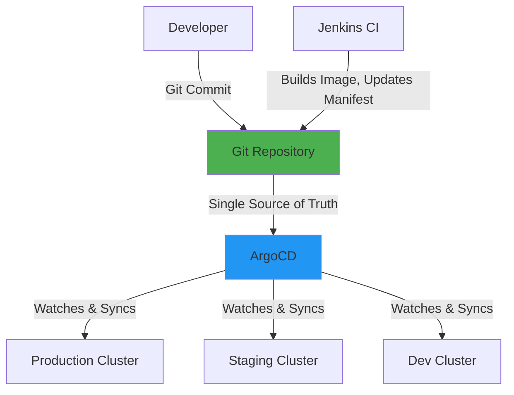

# GitOps Strategy: From Push to Pull

## Context

In traditional CI/CD pipelines, your build system (like Jenkins) has credentials to your production Kubernetes cluster and **pushes** changes directly. This "push-based" model has been the norm for decades, but it carries significant security and operational risks in cloud-native environments.

GitOps inverts this model: instead of CI pushing to production, production **pulls** its desired state from Git. The cluster itself watches a Git repository and continuously reconciles reality with the declared state. This seemingly small shift has profound implications for security, auditability, and reliability.

Fawkes adopted GitOps as a **core architectural principle** because it directly supports the behaviors that enable elite DORA performance: high deployment frequency, low change failure rate, and fast recovery time.

## The Problem: Why Push-Based CD Falls Short

### Security: The Credential Problem

**The Traditional Model:**


In push-based CI/CD:
- **Jenkins holds production credentials** - If Jenkins is compromised, so is production
- **Credentials must be distributed** - Every build agent needs cluster access
- **Blast radius is massive** - A CI security breach means production breach
- **Credential rotation is painful** - Update all CI configs when rotating

### Drift: Configuration Divergence

When humans have `kubectl` access and deadlines loom, they make "quick fixes" directly in the cluster:

```bash
# "Just for now" - Famous last words
kubectl scale deployment critical-app --replicas=10
kubectl set env deployment/api LOG_LEVEL=debug
```

**The Result:**
- Production state diverges from Git
- Git is no longer the source of truth
- Disaster recovery becomes guesswork: "What was the actual config?"
- Compliance audits fail: "Show us the change approval for that scaling event"

### Auditability: The Black Box Deployment

Push-based deployments create an audit gap:
- Git shows code changes
- Jenkins shows build execution
- But the actual deployment? Often just a line in Jenkins logs
- **Question**: "Who changed the replica count from 3 to 5?"
- **Answer**: ¯\\_(ツ)_/¯ "Could be anyone with kubectl access"

### Rollback: The Manual Scramble

When a bad deployment hits production in a push model:

1. Find the previous good version (search through Jenkins jobs)
2. Trigger a rebuild (hope dependencies haven't changed)
3. Push again (cross fingers)
4. Repeat if it fails again

**Time to Restore**: 15-45 minutes (not elite)

## The Solution: GitOps Pull Model

### How ArgoCD Changes the Game



**Key Principles:**

1. **Git as Single Source of Truth**
   - Entire desired state lives in Git (applications, configs, infrastructure)
   - Want to know production state? Read Git
   - Want to change production? Open a PR

2. **Declarative Configuration**
   - Describe what you want, not how to get there
   - ArgoCD figures out the `kubectl apply` dance
   - Idempotent: Apply the same config 100 times = same result

3. **Automated Sync**
   - ArgoCD polls Git every 3 minutes (or use webhooks for instant sync)
   - Detects drift and auto-corrects
   - No manual intervention needed

4. **Self-Healing**
   - Someone does `kubectl edit` to "fix" something?
   - ArgoCD reverts it back to Git state
   - Want it to stick? Commit to Git

### The App-of-Apps Pattern

A single ArgoCD "Application" manages other Applications - like a meta-deployment:

```yaml
# bootstrap/app-of-apps.yaml
apiVersion: argoproj.io/v1alpha1
kind: Application
metadata:
  name: platform-apps
  namespace: argocd
spec:
  source:
    repoURL: https://github.com/paruff/fawkes
    path: platform/apps
    targetRevision: main
  destination:
    server: https://kubernetes.default.svc
    namespace: argocd
```

**What This Enables:**
- Deploy the entire platform with one Application
- Add a new service? Just add a directory in `platform/apps/`
- ArgoCD discovers and deploys it automatically
- Remove a service? Delete its directory and it's undeployed

**The Bootstrap Process:**
1. Install ArgoCD itself (one-time manual step)
2. Create the root App-of-Apps
3. Everything else (Jenkins, Backstage, Prometheus) deploys automatically
4. **Never touch `kubectl` again** (well, rarely)

### Security Model Shift

**Before (Push Model):**
```
CI System → Stores credentials → Deploys to cluster
```

**After (Pull Model):**
```
CI System → Updates Git → ArgoCD (running IN cluster) syncs
```

**Benefits:**
- ✅ **No credentials in CI** - Jenkins doesn't need cluster access
- ✅ **Credentials never leave cluster** - ArgoCD uses in-cluster service account
- ✅ **Reduced attack surface** - Compromise CI ≠ Compromise Production
- ✅ **Easier credential rotation** - Only ArgoCD service account to manage

## Trade-Offs: What You Gain and Lose

### What GitOps Gives You

| Benefit | Impact | DORA Metric |
|---------|--------|-------------|
| **Audit Trail** | Complete Git history of who changed what, when, why | All metrics (compliance reduces incidents) |
| **Fast Rollback** | `git revert` + auto-sync = 30-second rollback | ⬇️ Time to Restore Service |
| **Configuration as Code** | No more "snowflake servers" or tribal knowledge | ⬇️ Change Failure Rate |
| **Self-Healing** | Drift auto-corrected, no manual fixes | ⬇️ Time to Restore Service |
| **Preview Deployments** | Every PR can have ephemeral environment | ⬆️ Deployment Frequency |
| **Disaster Recovery** | Cluster dies? Rebuild and re-sync from Git | ⬇️ Time to Restore Service |

### What GitOps Costs You

| Challenge | Mitigation |
|-----------|------------|
| **Learning Curve** | ArgoCD concepts (Applications, Sync Policies) require training. **Mitigation**: Fawkes Dojo has [GitOps module](../../dojo/modules/green-belt/module-09-gitops-argocd.md) |
| **Git as Bottleneck** | Emergency fixes must go through Git/PR process. **Mitigation**: "Break-glass" procedure for true emergencies, webhooks for instant sync |
| **Secret Management** | Can't commit secrets to Git. **Mitigation**: External Secrets Operator fetches from Vault (see [ADR-015](../../adr/ADR-015%20vault%20deployment.md)) |
| **Sync Delays** | Default 3-minute poll interval. **Mitigation**: Use webhooks for instant notification, or manual refresh for urgent changes |
| **Initial Complexity** | Setting up multi-cluster, RBAC, ApplicationSets. **Mitigation**: Fawkes provides bootstrap templates and [onboarding guide](../../how-to/gitops/onboard-service-argocd.md) |

### The Cultural Shift

GitOps requires a mindset change:

| Old Habit | New Behavior |
|-----------|--------------|
| "I'll just `kubectl edit` this quickly" | "I'll open a PR with the change" |
| "Let me SSH and debug in prod" | "I'll check Git to see the config" |
| "The deployment failed, let me retry in Jenkins" | "The sync failed, let me check ArgoCD UI for the diff" |
| "What's running in production?" | "What's in the `main` branch?" |

**This is a feature, not a bug.** Forcing changes through Git creates the paper trail that auditors love and future-you will thank.

## Why ArgoCD Over Alternatives

### The Landscape

When Fawkes was designed, we evaluated:
- **Flux CD** - CNCF Graduated, excellent tool, more modular
- **Spinnaker** - Formerly used by Fawkes, powerful but heavyweight
- **Jenkins X** - Opinionated, too tightly coupled to Jenkins
- **Helm alone** - Not GitOps, manual processes

### Why ArgoCD Won

1. **The UI Advantage**
   - Visual application topology (see dependencies at a glance)
   - Diff view (Git vs. cluster side-by-side)
   - Real-time sync status
   - **Developer Experience**: Devs troubleshoot faster with visuals

2. **Proven at Scale**
   - Used by Intuit, Red Hat, IBM, Adobe
   - 15,000+ GitHub stars
   - CNCF Graduated (highest maturity)

3. **App-of-Apps Pattern**
   - Elegant solution for managing platform
   - Mirrors Fawkes' "platform of platforms" architecture

4. **Argo Ecosystem**
   - Argo Rollouts (canary deployments)
   - Argo Events (event-driven automation)
   - Argo Workflows (complex pipelines)
   - Integrated, not duct-taped together

5. **Backstage Integration**
   - Official ArgoCD plugin shows deployment status in Backstage
   - Developers see sync state in their service catalog
   - Unified developer portal experience

### What About Flux?

Flux is **excellent** and a valid choice. The decision was not dogmatic:

**Choose ArgoCD if:** You value built-in UI, visual topology, and simpler mental model
**Choose Flux if:** You prefer CLI-first, lower resource usage, GitOps Toolkit modularity

Fawkes prioritized **Developer Experience**, and ArgoCD's UI is a significant UX advantage for troubleshooting and understanding system state.

## Historical Context: From Spinnaker to ArgoCD

**Fawkes 1.0 (2022-2023):** Used Spinnaker for deployment orchestration

**Why We Left Spinnaker:**
- **Operational Burden**: 10+ microservices just to run Spinnaker itself
- **Resource Hungry**: 4GB+ RAM for control plane
- **Configuration Complexity**: Pipelines defined in UI or JSON, hard to version
- **Not GitOps-Native**: Push model, required cloud credentials
- **Overkill**: Multi-cloud deployment orchestration when we only needed Kubernetes

**What We Learned:**
Spinnaker is phenomenal if you're deploying to VMs, cloud functions, AND Kubernetes across multiple clouds. But for a Kubernetes-focused platform, ArgoCD gives 80% of the value with 20% of the operational cost.

## Practical Implications

### For Developers

**Q: How do I deploy my application?**
**A:** Merge your PR. ArgoCD syncs automatically.

**Q: How do I roll back a bad deployment?**
**A:** `git revert <commit>` and push. ArgoCD reverts in ~30 seconds.

**Q: Can I still use `kubectl` for debugging?**
**A:** Yes! Read-only commands are fine. But changes won't persist (ArgoCD reverts them).

### For Platform Engineers

**Q: How do I onboard a new service?**
**A:** Add a directory in `platform/apps/<service>/`. See the [onboarding guide](../../how-to/gitops/onboard-service-argocd.md).

**Q: How do I handle secrets?**
**A:** Use External Secrets Operator to fetch from Vault. Never commit raw secrets to Git.

**Q: What about emergency fixes in production?**
**A:** Use `argocd app sync --force` for immediate sync, or manual `kubectl` with "break-glass" documentation.

### For Consultants

When a client asks **"Why can't we just use Jenkins for deployments?"**:

1. **Security**: Show the credential diagram (push vs. pull)
2. **Audit Trail**: Demonstrate Git commit history as deployment log
3. **Rollback Speed**: `git revert` vs. "search Jenkins for old build"
4. **Drift Prevention**: Show how GitOps auto-corrects manual changes
5. **DORA Alignment**: GitOps directly improves all four key metrics

**Objection Handling:**
- "But we have Jenkins already!" → *Jenkins still does CI (build/test), ArgoCD does CD (deploy). Separation of concerns.*
- "GitOps is too slow!" → *Webhooks give instant sync. Plus, slow and safe beats fast and fragile.*
- "We need manual approval for production!" → *ArgoCD supports manual sync policies. Automation doesn't mean no governance.*

## Related Reading

- **How-To**: [Onboard a Service to ArgoCD](../../how-to/gitops/onboard-service-argocd.md)
- **How-To**: [Sync an ArgoCD Application](../../how-to/gitops/sync-argocd-app.md)
- **ADR**: [ADR-003: ArgoCD for GitOps](../../adr/ADR-003%20argocd.md) (detailed decision rationale)
- **Tutorial**: [Module 9: GitOps with ArgoCD](../../dojo/modules/green-belt/module-09-gitops-argocd.md)
- **Reference**: [ArgoCD Best Practices](https://argo-cd.readthedocs.io/en/stable/user-guide/best_practices/)

## Conclusion

GitOps is not just a deployment tool—it's an **operational philosophy**. By making Git the single source of truth and inverting the deployment model from push to pull, we gain security, auditability, and reliability.

The shift from Spinnaker to ArgoCD wasn't about rejecting a tool; it was about right-sizing our architecture. ArgoCD gives us true GitOps in a Kubernetes-native way without the operational overhead of more general-purpose solutions.

**The Golden Path**: Git → ArgoCD → Production. No sidesteps, no shortcuts, no SSH into production servers at 2am.
