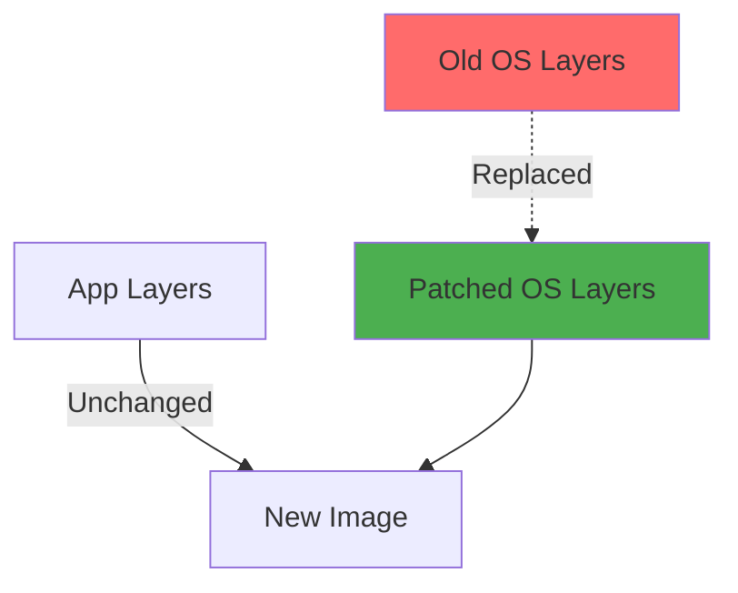
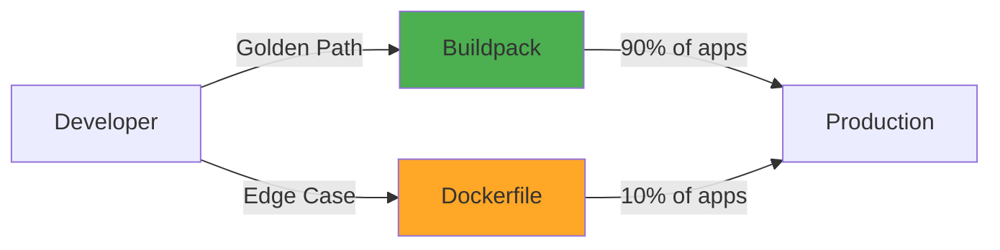

# Buildpacks Philosophy: Security and Convenience vs. Control

## Context

When you need to deploy an application to Kubernetes, you must create a container image. For decades, the answer has been simple: **write a Dockerfile**. But Fawkes takes a different approach for the Golden Path: **Cloud Native Buildpacks (CNB)**.

This choice surprises developers. "Why can't I just write my own Dockerfile?" The answer isn't that you *can't*—it's that for 80% of applications, you *shouldn't need to*. Buildpacks trade manual control for automated maintenance, and in platform engineering, that's usually the right trade.

This document explains the **philosophy** behind Buildpacks, not the mechanics (for that, see our [How-To guide on debugging buildpack failures](../../how-to/development/debug-buildpack-failure.md)).

## The Problem: Dockerfile Sprawl and Security Debt

### The Traditional Dockerfile Approach

Every team writes their own container build logic:

```dockerfile
# Team A's Node.js Dockerfile
FROM node:16-alpine
WORKDIR /app
COPY package*.json ./
RUN npm ci --production
COPY . .
EXPOSE 3000
CMD ["node", "server.js"]
```

```dockerfile
# Team B's Node.js Dockerfile (slightly different)
FROM node:14
RUN apt-get update && apt-get install -y curl
WORKDIR /usr/src/app
COPY package.json package-lock.json ./
RUN npm install
COPY . .
EXPOSE 8080
CMD ["npm", "start"]
```

**What's Wrong Here?**

1. **Version Sprawl**: Team A uses Node 16, Team B uses Node 14. Who's patching vulnerabilities?
2. **OS Differences**: Alpine vs. Debian. Different CVE scan results, different behavior.
3. **Security Lag**: Node 16 has a critical CVE. Who remembers to update 47 Dockerfiles?
4. **No Rebase**: OS layer has vulnerability. Must rebuild every image? Or ignore it?
5. **Tribal Knowledge**: Why `npm ci` vs `npm install`? Why `--production`? Lost when Team A member leaves.

### The OS Patching Problem

A critical vulnerability is discovered in `glibc` (the C library used by most Linux distros). Your images are affected.

**Dockerfile Approach:**
1. Update base image tag in every Dockerfile (`FROM node:16.20.1` → `FROM node:16.20.2`)
2. Rebuild every application image
3. Re-test every application
4. Re-deploy every application
5. Hope you found all the Dockerfiles (did you check that archived repo?)

**Time to Patch**: Days to weeks
**MTTR Impact**: ⬆️ (High)
**Deployment Frequency**: ⬇️ (Slowed by rebuild toil)

### The "Works on My Machine" Syndrome

Developers optimize for local development:
```dockerfile
# "I need curl for debugging"
RUN apt-get install -y curl wget netcat vim

# "I'll clean this up later" (Narrator: They didn't)
COPY devtools.sh /usr/local/bin/
```

**Result:**
- Production images bloated with debug tools
- Larger attack surface
- Slower image pulls
- Container sprawl: 1GB+ images for 10MB applications

## The Solution: Cloud Native Buildpacks

### What Are Buildpacks?

Buildpacks are **pluggable, modular components** that inspect your source code, detect the framework, install dependencies, and build an optimized container image—**without a Dockerfile**.

```bash
# No Dockerfile needed
pack build my-app --builder paketobuildpacks/builder:base

# Buildpack detects: "This is a Node.js app"
# Buildpack installs: Node.js runtime, npm dependencies
# Buildpack configures: Start command, environment
# Buildpack outputs: Optimized multi-layer image
```

**The Magic:**
- **Detection**: Buildpacks analyze source code (`package.json` → Node.js, `pom.xml` → Java)
- **Installation**: Install exactly what's needed (no `apt-get` required)
- **Caching**: Smart layer caching (dependencies separate from app code)
- **Optimization**: Production-ready defaults (minimal base images, non-root users)

### The Rebase Superpower

This is where Buildpacks shine:

**Scenario**: A CVE is found in Ubuntu base layer.

**Buildpack Approach:**
1. Paketo team publishes new base image (patched)
2. Run `pack rebase my-app:v1.2.3` (no source code needed!)
3. New image layers swapped in **without rebuilding**
4. Push updated image to registry
5. Deploy with confidence (app layers untouched)

**Time to Patch**: Minutes
**MTTR Impact**: ⬇️ (Low)
**Deployment Frequency**: Maintains high (no rebuild bottleneck)



**Why This Matters:**
- **No app rebuild** - Don't re-run tests, don't involve developers
- **No behavior change** - App code and dependencies identical
- **Fast patching** - Security team can patch without developer involvement
- **Supply chain security** - Base images maintained by Paketo community, not random Dockerfiles

### Standardization: The Platform Advantage

With Buildpacks, Fawkes enforces **sensible defaults**:

| Aspect | Dockerfile Chaos | Buildpack Consistency |
|--------|------------------|----------------------|
| **Base Image** | `node:16-alpine`, `node:14`, `node:latest` (😱) | Paketo Node.js buildpack (curated, patched) |
| **User** | Often root (security risk) | Non-root user (automatic) |
| **Dependency Caching** | Manually optimized (if at all) | Automatic layer splitting |
| **Security Scanning** | Per-Dockerfile results | Uniform scan results |
| **Start Command** | Hardcoded in Dockerfile | Buildpack auto-detects (`npm start`, `java -jar`) |

**Developer Experience:**
- **No Dockerfile to write** - Just push code
- **No OS knowledge required** - Don't need to know Alpine vs. Debian
- **No "copy-paste from Stack Overflow"** - Buildpack handles it
- **Consistent behavior** - All Node.js apps built the same way

## Trade-Offs: What You Gain and Lose

### What Buildpacks Give You

| Benefit | Explanation | DORA Impact |
|---------|-------------|-------------|
| **Automated OS Patching** | Rebase without rebuild | ⬇️ MTTR (faster security patches) |
| **Supply Chain Security** | Curated, signed base images | ⬇️ Change Failure Rate (fewer vulnerabilities) |
| **Dependency Scanning** | Bill of Materials (SBOM) generated automatically | Compliance (audit trail) |
| **Zero Dockerfile Maintenance** | No more "update base image" PRs across 50 repos | ⬆️ Deployment Frequency (less toil) |
| **Best Practice Enforcement** | Non-root users, minimal images, proper caching | ⬇️ Change Failure Rate (fewer misconfigurations) |
| **Framework-Specific Optimization** | Node.js buildpack knows Node.js best practices | Performance (optimized startup, smaller images) |

### What Buildpacks Cost You

| Challenge | Mitigation |
|-----------|------------|
| **Less Control** | Can't `RUN apt-get install custom-tool`. **Mitigation**: Use buildpack extensions or multi-stage builds with base buildpack image for edge cases |
| **Black Box Feeling** | "What's the buildpack doing?" **Mitigation**: `pack build --verbose` shows every step. Buildpacks are open source (inspect on GitHub) |
| **Framework Lock-In** | Only works if buildpack exists for your language. **Mitigation**: Paketo covers Java, Node.js, Python, Go, Ruby, PHP, .NET—90% of apps. Use Dockerfile for exotic stacks |
| **Debugging Learning Curve** | Different errors than Dockerfile failures. **Mitigation**: [Debug guide](../../how-to/development/debug-buildpack-failure.md) and Fawkes Dojo training |
| **Build Time** | First build can be slower (detecting, caching setup). **Mitigation**: Subsequent builds very fast due to smart caching |

### When to Use Dockerfiles Anyway

Buildpacks are the **Golden Path**, but not the **Only Path**:

**Use Buildpacks When:**
- ✅ Standard web application (Node.js, Java, Python, Go, Ruby, PHP, .NET)
- ✅ Willing to follow framework conventions (`package.json`, `pom.xml`, etc.)
- ✅ Value security automation over customization

**Use Dockerfile When:**
- ⚠️ Truly unique requirements (custom OS, exotic dependencies)
- ⚠️ Legacy app with specific build steps not automatable
- ⚠️ Polyglot app (Node.js + Python + Java in one container—please don't)
- ⚠️ Embedded systems or non-standard architectures

**Fawkes Policy**: Golden Path is Buildpacks. Dockerfile opt-out allowed with justification (architectural review required).

## The Philosophy: Platform as Product

### The "Paved Road" Concept

Buildpacks embody the **Golden Path** philosophy:

- **Easy things should be easy** - Deploying a standard Node.js app: zero config
- **Hard things should be possible** - Need custom build? Dockerfile escape hatch exists
- **Safe by default** - Security and best practices baked in, not opt-in



**The Contract:**
- Platform team maintains buildpacks (updates, security patches, optimizations)
- Developers follow conventions (standard project structure, framework best practices)
- Everyone benefits (fast deploys, secure images, low cognitive load)

### The Maintenance Burden Shift

**Before Buildpacks (Dockerfile Era):**
```
Platform Team:
- Writes "recommended Dockerfile" guide
- Reviews 200 Dockerfiles in PRs
- Manually reminds teams to update base images

Developers:
- Copy-paste Dockerfiles from other projects
- Cargo-cult optimizations they don't understand
- Ignore security patches (too much work)
```

**After Buildpacks:**
```
Platform Team:
- Maintains 1 buildpack configuration
- Updates platform builder when patches released
- Automatically rebases all images (via CI)

Developers:
- Write code
- Push code
- Deployments happen
- (No Dockerfile to maintain)
```

**Who Wins?** Everyone. Platform team scales better. Developers ship faster. Security team sleeps better.

## Real-World Example: The Log4Shell Response

In December 2021, the **Log4Shell** vulnerability (CVE-2021-44228) was discovered in Log4j, affecting millions of Java applications.

### Dockerfile World Response

1. **Identify affected apps** - Search 300 repos for `pom.xml` or `build.gradle` with Log4j
2. **Update dependencies** - Each team updates their `pom.xml` (version 2.15.0)
3. **Rebuild images** - `docker build` for each app (wait for CI)
4. **Re-test** - Run full test suites (hours)
5. **Re-deploy** - 300 deployments over 2 weeks
6. **Miss stragglers** - That archived repo? Still vulnerable

**Time to Remediate**: 2-3 weeks
**Human Effort**: Hundreds of developer-hours

### Buildpack World Response

1. **Paketo team updates buildpack** - Log4j version bumped in Java buildpack
2. **Platform team updates builder** - `pack builder pull paketobuildpacks/builder:base`
3. **CI triggers rebuilds** - Automated pipeline rebuilds all Java apps (parallel)
4. **Automated testing** - Smoke tests pass (no code changes)
5. **Automated deployment** - GitOps syncs new images
6. **Complete coverage** - Every Java app patched automatically

**Time to Remediate**: 2-3 days
**Human Effort**: One platform engineer

**This is the promise of Buildpacks**: When a platform team of 3 can patch 300 applications faster than 300 developers, you've achieved leverage.

## Philosophical Underpinnings

### Principle 1: Convention Over Configuration

**Dockerfile Philosophy**: "Give developers full control; they'll make good choices."
**Reality**: Developers copy-paste, cargo-cult, and move fast (breaking things).

**Buildpack Philosophy**: "Encode best practices; let developers override when necessary."
**Reality**: 90% follow convention happily. 10% understand enough to safely override.

### Principle 2: Separation of Concerns

**Dockerfile**: Developer is responsible for OS, runtime, dependencies, app code, optimization, security.

**Buildpack**:
- **Platform Team**: Maintains OS, runtime, build tools (centralized expertise)
- **Developer**: Focuses on application code and business logic
- **Clear Boundary**: `package.json` is the interface; everything below is abstracted

### Principle 3: Scale Through Standardization

**The Formula:**
```
Operational Efficiency = (Standard Patterns) / (Custom Snowflakes)
```

100 unique Dockerfiles = 100 maintenance burdens
100 apps using 1 buildpack = 1 maintenance point

**This is why platforms exist**: To amortize expertise across many teams.

## Addressing Common Objections

### "But I'm a senior engineer; I know how to write a good Dockerfile!"

**Response**: You probably do! And that's valuable for the 10% edge cases. But:

1. **Your team might not** - Junior engineers copy your Dockerfile and miss subtleties
2. **You might leave** - Tribal knowledge doesn't scale
3. **Security doesn't wait** - Can you patch 50 Dockerfiles when a CVE drops at 5pm Friday?

**Buildpacks are for scale**, not because we doubt your skills.

### "Buildpacks are a black box; I don't trust what I don't understand."

**Response**:
1. **Buildpacks are open source** - [Paketo Buildpacks on GitHub](https://github.com/paketo-buildpacks)
2. **Full transparency** - Run `pack build --verbose` to see every command
3. **SBOM generated** - Bill of Materials shows exactly what's in your image
4. **Inspectable** - `pack inspect-image my-app` shows layers, buildpacks used, metadata

**Dockerfiles can be black boxes too** - How many devs actually audit `node:16-alpine`?

### "What if I need to install a system package?"

**Response**: Buildpack extensions allow custom install steps:

```yaml
# buildpack.yml
---
nodejs:
  version: 18

extensions:
  - name: install-custom-tool
    run: |
      apt-get update && apt-get install -y my-tool
```

**Or**: Use Dockerfile for that app. Buildpacks are the **default**, not a prison.

### "Our build is too custom/complex for a buildpack."

**Response**: Probably true for 5-10% of apps. Those should use Dockerfiles. But:

1. **Are you sure?** - 80% of "we're special" claims aren't (seen this repeatedly)
2. **Can it be simplified?** - Complex builds often indicate architectural issues
3. **Can we contribute?** - If it's a valid use case, propose a buildpack extension

**The goal isn't 100% buildpack adoption**—it's **making the common case trivial**.

## Related Reading

- **How-To**: [Debug Buildpack Failures](../../how-to/development/debug-buildpack-failure.md)
- **Tutorial**: [Module 6: Golden Path](../../dojo/modules/yellow-belt/module-06-golden-path.md)
- **Reference**: [Paketo Buildpacks Documentation](https://paketo.io)
- **Reference**: [Cloud Native Buildpacks Specification](https://buildpacks.io)

## Conclusion

Buildpacks are a **philosophical choice**, not just a technical one. They represent a belief that:

1. **Automation beats manual toil** - Even when you're good at the toil
2. **Centralized expertise scales** - Better than distributed mediocrity
3. **Security is a platform concern** - Not every team's homework
4. **Convention liberates** - By removing low-level decisions, we free developers to focus on business value

The question isn't "Can I write a better Dockerfile than a buildpack?" (you might).
The question is "Can I maintain 50 better Dockerfiles, patch them in hours during a CVE, and train my whole team to do the same?" (you can't).

**Buildpacks are the Golden Path because they scale.**

And when you need to step off the Golden Path? Dockerfiles still exist. The door is always open—we've just made it so most people don't need to walk through it.
