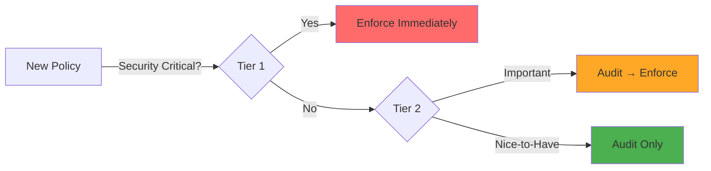
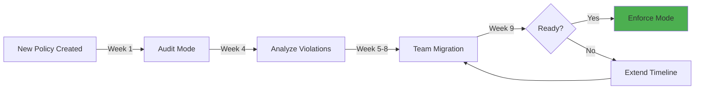

# Policy as Code Tiers: Audit vs. Enforce

## Context

Security policies are necessary but **enforcement is a spectrum**, not binary. Enforcing every security best practice from day one would:
- Block legitimate developer workflows
- Create change resistance ("Platform team said NO again")
- Slow down delivery (waiting for exceptions, workarounds)
- Reduce platform adoption (developers route around strict controls)

The solution is **tiered policy enforcement**: critical policies enforced immediately, important policies audited before enforced, best practices remain advisory.

This document explains Fawkes' **Policy-as-Code Tiers** framework using Kyverno, and why **gradual enforcement** is better than "big bang" compliance.

## The Problem: All-or-Nothing Enforcement Fails

### Scenario 1: The Zero-Tolerance Trap

**Platform Team Decision**: "All pods must be non-root, no exceptions. Security is non-negotiable."

**Week 1**: Policy enforced across all namespaces

**Week 2**: Developers revolt
- Legacy app runs as root (vendor-provided image, can't change)
- Database StatefulSets need elevated privileges
- Debugging containers blocked (troubleshooting tools need root)

**Week 3**: Platform team creates exception process
- Developers submit tickets requesting policy exemptions
- Platform team reviews each request manually
- **Ticket backlog**: 40+ exception requests

**Week 4**: Developers route around platform
- Deploy to "dev" namespace (policies disabled to "not slow down development")
- Promote to prod via kubectl (bypassing GitOps)
- Shadow IT: Run workloads in separate clusters outside platform team control

**Outcome**: Policy exists on paper, violated in practice. Worse security posture than gradual enforcement.

### Scenario 2: The Permissive Paralysis

**Platform Team Decision**: "We'll make policies advisory-only. Developers know best."

**Week 1**: Policies in audit mode, violations logged

**Month 3**: 10,000+ policy violations logged, nobody fixes them

**Month 6**: Real security incident
- Privileged container exploited
- Attacker pivots to other workloads
- **Root cause**: Container ran as root (policy violation ignored for 6 months)

**Outcome**: Audit-only policies without enforcement roadmap = no improvement.

## The Solution: Tiered Enforcement Model

Fawkes uses a **three-tier policy framework**:

| Tier | Enforcement | Scope | Examples |
|------|-------------|-------|----------|
| **Tier 1: Critical** | ✅ **Enforce** | Immediate security risks | No privileged escalation, no host network, approved registries only |
| **Tier 2: Important** | ⚠️ **Audit → Enforce** | Hardening and compliance | Resource limits, non-root users, read-only root filesystem |
| **Tier 3: Best Practice** | ℹ️ **Audit Only** | Operational excellence | Recommended labels, deployment strategies, cost tagging |



### Tier 1: Critical (Enforce Immediately)

**Philosophy**: Block obvious security holes that no legitimate workload should need.

**Examples:**

**1. No Privileged Containers**

```yaml
apiVersion: kyverno.io/v1
kind: ClusterPolicy
metadata:
  name: disallow-privileged-containers
  annotations:
    policies.kyverno.io/tier: critical
    policies.kyverno.io/severity: high
spec:
  validationFailureAction: Enforce  # Block deployment
  background: true
  rules:
    - name: privileged-containers
      match:
        any:
          - resources:
              kinds:
                - Pod
      validate:
        message: "Privileged containers are not allowed"
        pattern:
          spec:
            containers:
              - =(securityContext):
                  =(privileged): "false"
```

**Rationale**:
- Privileged containers can break out to host
- Virtually no legitimate use case (0.1% of workloads)
- **Risk of blocking**: Very low
- **Risk of allowing**: Very high

**2. No Host Namespaces**

```yaml
apiVersion: kyverno.io/v1
kind: ClusterPolicy
metadata:
  name: disallow-host-namespaces
spec:
  validationFailureAction: Enforce
  rules:
    - name: host-namespaces
      match:
        any:
          - resources:
              kinds:
                - Pod
      validate:
        message: "Sharing host namespaces is not allowed"
        pattern:
          spec:
            =(hostNetwork): "false"
            =(hostIPC): "false"
            =(hostPID): "false"
```

**Rationale**:
- Host network/PID/IPC access = container breakout vector
- Legitimate use cases: <1% (CNI plugins, monitoring agents)
- Those exceptions: Platform team manages, not developers

**3. Images from Approved Registries Only**

```yaml
apiVersion: kyverno.io/v1
kind: ClusterPolicy
metadata:
  name: restrict-image-registries
spec:
  validationFailureAction: Enforce
  rules:
    - name: approved-registries
      match:
        any:
          - resources:
              kinds:
                - Pod
      validate:
        message: "Images must be from approved registries: harbor.fawkes.io, gcr.io/fawkes"
        pattern:
          spec:
            containers:
              - image: "harbor.fawkes.io/* | gcr.io/fawkes/*"
```

**Rationale**:
- Public Docker Hub images: unvetted, potential supply chain attacks
- Approved registries: scanned for vulnerabilities, signed
- **Risk**: Developer pulls `random/cryptominer:latest` (supply chain attack)

**Tier 1 Exception Process**: Manual approval by security team, documented justification, time-limited exemption.

### Tier 2: Important (Audit → Enforce)

**Philosophy**: Security hardening that requires migration time for existing workloads.

**Rollout Process:**

| Phase | Duration | Action | Developer Impact |
|-------|----------|--------|------------------|
| **Phase 1: Audit** | Month 1-2 | Log violations, no blocking | None (visibility only) |
| **Phase 2: Alert** | Month 3 | Weekly reports to teams | Awareness |
| **Phase 3: Warn** | Month 4 | Deployments succeed with warning | Noise |
| **Phase 4: Enforce** | Month 5+ | Block non-compliant deployments | Compliance required |

**Examples:**

**1. Require Resource Limits**

```yaml
apiVersion: kyverno.io/v1
kind: ClusterPolicy
metadata:
  name: require-resource-limits
  annotations:
    policies.kyverno.io/tier: important
spec:
  validationFailureAction: Audit  # Will become Enforce after migration period
  background: true
  rules:
    - name: check-resource-limits
      match:
        any:
          - resources:
              kinds:
                - Pod
      validate:
        message: "CPU and memory limits are required"
        pattern:
          spec:
            containers:
              - resources:
                  limits:
                    memory: "?*"
                    cpu: "?*"
```

**Why Gradual**:
- **Legacy apps** may not have limits set (works fine, but risky)
- **Impact analysis needed**: What limits are appropriate?
- **Migration time**: Teams need to test with limits, adjust

**Rollout**:
1. **Month 1 (Audit)**: Platform team identifies 120 pods without limits
2. **Month 2 (Alert)**: Teams notified via Slack, given template configs
3. **Month 3 (Warn)**: Deployments warn but succeed, countdown timer shown
4. **Month 4 (Enforce)**: Policy enforced, non-compliant deployments blocked

**2. Non-Root Users**

```yaml
apiVersion: kyverno.io/v1
kind: ClusterPolicy
metadata:
  name: require-non-root
spec:
  validationFailureAction: Audit  # Gradual rollout
  rules:
    - name: non-root-user
      match:
        any:
          - resources:
              kinds:
                - Pod
      validate:
        message: "Containers must run as non-root user"
        pattern:
          spec:
            containers:
              - securityContext:
                  runAsNonRoot: true
```

**Why Gradual**:
- Many images default to root user
- Developer needs to rebuild image or override in security context
- **Migration**: Takes time to rebuild images

**3. Read-Only Root Filesystem**

```yaml
apiVersion: kyverno.io/v1
kind: ClusterPolicy
metadata:
  name: require-read-only-root-filesystem
spec:
  validationFailureAction: Audit
  rules:
    - name: read-only-root-fs
      match:
        any:
          - resources:
              kinds:
                - Pod
      validate:
        message: "Root filesystem should be read-only"
        pattern:
          spec:
            containers:
              - securityContext:
                  readOnlyRootFilesystem: true
```

**Why Gradual**:
- Apps that write to local filesystem must be refactored (write to emptyDir volume instead)
- Requires code changes, testing

**Tier 2 Exception Process**: Team lead approval, documented technical reason, review every 90 days.

### Tier 3: Best Practice (Audit Only)

**Philosophy**: Encourage good practices but never block. Use visibility to drive cultural change.

**Examples:**

**1. Recommended Labels**

```yaml
apiVersion: kyverno.io/v1
kind: ClusterPolicy
metadata:
  name: recommended-labels
spec:
  validationFailureAction: Audit  # Never enforced
  rules:
    - name: check-labels
      match:
        any:
          - resources:
              kinds:
                - Deployment
      validate:
        message: "Recommended labels missing: app.kubernetes.io/name, app.kubernetes.io/version, team"
        pattern:
          metadata:
            labels:
              app.kubernetes.io/name: "?*"
              app.kubernetes.io/version: "?*"
              team: "?*"
```

**Why Audit-Only**:
- Labels helpful for observability, cost allocation, ownership
- But lack of labels doesn't create security risk
- **Carrot, not stick**: Show teams their compliance score, let them improve voluntarily

**2. Deployment Strategies**

```yaml
apiVersion: kyverno.io/v1
kind: ClusterPolicy
metadata:
  name: recommended-deployment-strategy
spec:
  validationFailureAction: Audit
  rules:
    - name: rolling-update
      match:
        any:
          - resources:
              kinds:
                - Deployment
      validate:
        message: "Recommended strategy: RollingUpdate (not Recreate)"
        pattern:
          spec:
            strategy:
              type: RollingUpdate
```

**Why Audit-Only**:
- RollingUpdate preferred (zero-downtime deployments)
- But Recreate valid for stateful apps, development environments
- **Education**: Show metric "85% of deployments use RollingUpdate", team can improve

**3. Cost Allocation Tags**

```yaml
apiVersion: kyverno.io/v1
kind: ClusterPolicy
metadata:
  name: cost-allocation-tags
spec:
  validationFailureAction: Audit
  rules:
    - name: cost-center-label
      match:
        any:
          - resources:
              kinds:
                - Deployment
      validate:
        message: "Recommended label for cost tracking: cost-center"
        pattern:
          metadata:
            labels:
              cost-center: "?*"
```

**Why Audit-Only**:
- Helps finance team allocate cloud costs
- But not a security requirement
- **Gradual adoption**: Teams add cost-center labels for accurate chargeback

## Policy Lifecycle: From Audit to Enforce

### The Migration Path



**Example: "Require Non-Root Users" Policy**

**Week 1-4: Audit Phase**
- Policy deployed in audit mode
- Violations logged to PolicyReport CRD
- Platform team analyzes impact

**Report:**
```yaml
apiVersion: wgpolicyk8s.io/v1alpha2
kind: PolicyReport
metadata:
  name: require-non-root-violations
summary:
  pass: 42
  fail: 18  # 18 pods violating policy
  warn: 0
  error: 0
results:
  - policy: require-non-root
    rule: non-root-user
    result: fail
    resources:
      - kind: Pod
        namespace: api-gateway
        name: api-pod-abc123
    message: "Container 'api' runs as root user"
```

**Week 5-8: Migration Phase**
1. **Communication**: Email teams with violations
   - "Your `api-gateway` service runs as root. Here's how to fix..."
   - Link to documentation, example configs

2. **Office Hours**: Weekly drop-in sessions for teams needing help

3. **Tracking**: Dashboard shows compliance trend
   - Week 5: 70% compliant
   - Week 6: 80% compliant
   - Week 7: 90% compliant

**Week 9: Enforcement Decision**
- ✅ 90%+ compliant → Switch to enforce mode
- ⚠️ <90% compliant → Extend migration timeline

**Week 10+: Enforce Mode**
```yaml
spec:
  validationFailureAction: Enforce  # Now blocking
```

**Remaining violations**: Platform team works 1-on-1 with teams or grants time-limited exemptions.

## Governance: Who Decides What Tier?

### Policy Review Board

**Members**:
- Platform Lead
- Security Engineer
- 2x Developer Representatives (rotates quarterly)

**Responsibilities**:
1. **Review new policies**: Assign tier (Critical, Important, Best Practice)
2. **Monitor audit-to-enforce transitions**: Are teams ready?
3. **Handle exception requests**: Approve/deny Tier 1 exemptions
4. **Quarterly policy review**: Should Tier 2 policies move to Tier 1? Retire unused policies?

**Example Decision:**

**Proposed Policy**: "All deployments must use Argo Rollouts for canary deployments"

**Discussion**:
- **Security**: Not a security issue (Tier 3 at most)
- **Developer**: This would block 80% of current deployments, high friction
- **Platform**: Canary is best practice but not mandatory for low-traffic apps

**Decision**: **Tier 3 (Audit Only)**
- Encourage adoption via education
- Show metric: "Teams using canary have 50% lower CFR"
- Don't enforce (too disruptive for marginal benefit)

### Exception Request Process

**Tier 1 (Critical) Exception:**
1. Submit ticket with justification
2. Security team reviews
3. Approval requires:
   - Technical necessity (no alternative)
   - Compensating controls (extra monitoring, isolated namespace)
   - Time limit (expires in 90 days, must re-justify)
4. Documented in audit log

**Tier 2 (Important) Exception:**
1. Team lead approves via annotation
   ```yaml
   metadata:
     annotations:
       policy.fawkes.io/exception: "require-non-root"
       policy.fawkes.io/reason: "Legacy vendor image, migration planned Q2"
       policy.fawkes.io/expires: "2024-06-30"
   ```
2. Reviewed quarterly
3. Exemption expires automatically, must renew

**Tier 3 (Best Practice) Exception:**
- No exception needed (audit-only)
- Teams can ignore violations without approval

## Trade-Offs: Security vs. Velocity

### What Tiered Enforcement Gives You

| Benefit | Impact |
|---------|--------|
| **Gradual Adoption** | Teams adapt to policies over time, not shocked by "big bang" |
| **Developer Trust** | Platform team seen as partner, not blocker |
| **Higher Compliance** | 90%+ adoption vs. 50% with all-or-nothing enforcement |
| **Risk Mitigation** | Critical risks blocked immediately, lower risks addressed iteratively |
| **Continuous Improvement** | Policies evolve based on real-world usage, not theory |

### What Tiered Enforcement Costs You

| Challenge | Mitigation |
|-----------|------------|
| **Complexity** | Managing three tiers, transition timelines. **Mitigation**: Automation (policy reports, dashboards) |
| **Incomplete Security** | Tier 2/3 violations exist during migration. **Mitigation**: Acceptable risk for gradual improvement |
| **Communication Overhead** | Must explain tier decisions, migration plans. **Mitigation**: Transparent documentation, regular updates |
| **Exception Sprawl** | Teams request exemptions to avoid work. **Mitigation**: Time-limited exemptions, quarterly review |

**The Bet**: 90% compliance with gradual enforcement beats 50% compliance with strict enforcement.

## Metrics: Measuring Policy Success

### Compliance Dashboard

```yaml
Fawkes Policy Compliance (November 2024)

Overall Compliance: 87% (↑ 5% vs. last month)

Tier 1 (Critical) - Enforced:
  Compliance: 98%  ✅
  Violations: 3 (all approved exemptions)

Tier 2 (Important) - Audit → Enforce:
  Compliance: 82%  ⚠️
  Violations: 27
  On Track to Enforce: March 2025

Tier 3 (Best Practice) - Audit Only:
  Compliance: 65%  ℹ️
  Violations: 105
  Trend: ↑ 10% over 6 months (voluntary adoption)

Top Violations (Tier 2):
  1. Missing resource limits (18 pods)
  2. Non-root users (7 pods)
  3. Read-only filesystem (2 pods)

Action Items:
  - Office hours scheduled for teams with resource limit violations
  - Automated mutation policy proposed to add default limits
```

### Policy Effectiveness Metrics

| Metric | Target | Current |
|--------|--------|---------|
| **Tier 1 Compliance** | >95% | 98% ✅ |
| **Tier 2 Compliance** | >85% before enforcement | 82% ⚠️ |
| **Tier 2 Enforcement Deadlines Met** | >80% on-time | 100% ✅ |
| **Exception Requests (Tier 1)** | <5 active | 3 ✅ |
| **Time to Remediate Violations** | <30 days | 22 days ✅ |

## Related Reading

- **ADR**: [ADR-017: Kyverno Policy Engine](../../adr/ADR-017%20kyverno-policy-engine.md)
- **Explanation**: [Zero Trust Security Model](../security/zero-trust-model.md)
- **How-To**: [Troubleshoot Kyverno Violations](../../how-to/policy/troubleshoot-kyverno-violation.md)
- **Reference**: [Kyverno Policy Library](https://kyverno.io/policies/)

## Conclusion

Security policies are necessary, but **enforcement is an art, not a science**.

The tiered enforcement model recognizes that:
1. **Not all policies are equal** - Some prevent immediate breaches (enforce now), others harden over time (audit first)
2. **Developers need migration time** - Sudden enforcement creates resistance and shadow IT
3. **Culture beats compliance** - Gradual adoption builds trust, all-or-nothing breeds resentment
4. **Perfect is the enemy of good** - 90% compliance with partnership beats 50% compliance with force

**The Framework:**
- **Tier 1 (Critical)**: Enforce immediately, exceptions rare
- **Tier 2 (Important)**: Audit → Enforce with migration timeline
- **Tier 3 (Best Practice)**: Audit only, encourage via visibility

**The Philosophy**: Security is a journey, not a destination. Meet developers where they are, guide them to where they should be.

**This is Policy-as-Code with empathy.**
