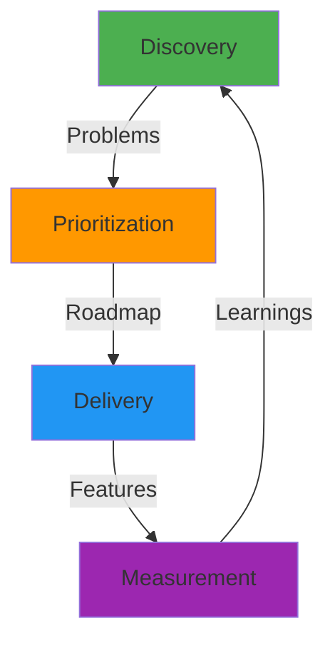
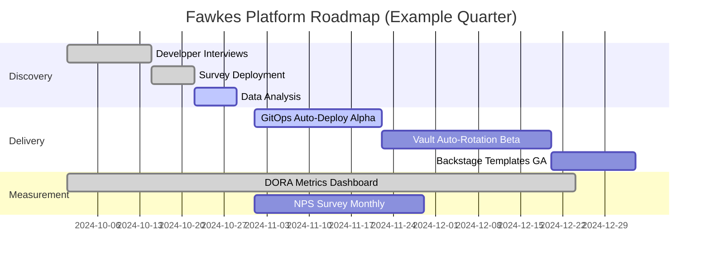

# Product Discovery and Delivery Flow: The IP3dP Concept

## Context

Most internal developer platforms (IDPs) fail not because of technical problems, but because of **product problems**:
- Built features nobody uses
- Solved problems teams don't have
- Ignored the problems teams actually face
- Failed to measure whether the platform improves developer productivity

**The Challenge**: How do you treat your platform like a product when your "customers" (developers) can't choose a competitor and you have no revenue to measure success?

Fawkes introduces the **IP3dP** framework: **Internal Platform Product Discovery and Delivery Process**—a structured methodology for running your platform as a product, not a project.

## The Problem: "Build It and They Will Come" Doesn't Work

### The Traditional IDP Anti-Pattern

**Month 1**: Platform team decides "We need a developer portal!"
**Month 2-6**: Build Backstage, integrate with GitHub, ArgoCD, Jenkins
**Month 7**: Launch with fanfare, send Slack announcement
**Month 8**: 12% adoption. Developers still use `kubectl` and Slack for everything.
**Month 9**: Platform team confused: "Why don't they use it?"

**Root Cause**: Nobody asked developers what problems they actually have.

### The Feature Factory Trap

Platform team operates like a feature factory:
1. Stakeholder requests feature ("We need Vault integration!")
2. Team builds feature
3. Ship feature, move to next request
4. Repeat indefinitely

**Missing**:
- **Discovery**: Is this solving a real pain point?
- **Validation**: Will developers actually use this?
- **Measurement**: Did this improve productivity?
- **Iteration**: How do we make it better?

**Result**: A Frankenstein platform with 50 features, 5 actually used, and developers still frustrated.

### The Metrics Mirage

Platform teams measure the **wrong things**:
- ❌ **Deployment frequency** (platform metric, not developer outcome)
- ❌ **Number of features shipped** (output, not outcome)
- ❌ **Uptime of platform services** (necessary but not sufficient)

**What Should Be Measured**:
- ✅ **Developer productivity** (time from idea to production)
- ✅ **Cognitive load** (how many tools/concepts to learn)
- ✅ **Task success rate** (can devs complete common tasks?)
- ✅ **Developer satisfaction** (Net Promoter Score for internal platform)

## The Solution: IP3dP - Platform as Product

The **IP3dP framework** applies product management principles to platform engineering:



### The Four Phases

#### 1. Discovery: What Problems Do Developers Have?

**Goal**: Deeply understand developer pain points before building anything.

**Methods:**

**User Research (Qualitative)**:
- **Developer Interviews**: 1-on-1 conversations (30-45 min)
  - "Walk me through your last deployment"
  - "What's the most frustrating part of your workflow?"
  - "If you had a magic wand, what would you change?"

- **Shadowing**: Sit with developers, observe their workflow
  - Watch them struggle with `kubectl` copy-pasting from Slack
  - See them waste 20 minutes finding the right config file
  - Notice they rebuild images unnecessarily because unclear when cache invalidated

- **Surveys**: Structured feedback at scale
  - SPACE Framework metrics (Satisfaction, Performance, Activity, Communication, Efficiency)
  - Net Promoter Score: "How likely are you to recommend this platform to a colleague?"

**Data Analysis (Quantitative)**:
- **Platform Analytics**: What features are used? What's ignored?
  - Backstage: 80% use service catalog, 10% use docs, 2% use templates
  - Jenkins: 60% of pipelines copy-pasted from "blessed-pipeline" repo (hint: make template)

- **Support Tickets**: What breaks? What confuses people?
  - 40% of tickets: "How do I deploy to production?" (hint: docs/onboarding problem)
  - 25% of tickets: "My build is slow" (hint: buildpack caching issue)

- **DORA Metrics Correlation**: Does platform usage correlate with team performance?
  - Teams using GitOps: 3x higher deployment frequency
  - Teams not using GitOps: Higher change failure rate

**Jobs-to-be-Done Framework**:

Instead of "What features do you want?", ask "What job are you trying to do?"

| Developer Says | What They Want | Actual Job-to-be-Done | Platform Solution |
|----------------|----------------|----------------------|-------------------|
| "I need a Kubernetes dashboard" | UI to see pods | **Monitor application health** | Grafana dashboard showing SLIs, not low-level K8s resources |
| "I need SSH access to pods" | Debug production | **Troubleshoot application issues** | Structured logs in Loki, traces in Tempo, ephemeral debug containers |
| "I need a faster build" | Reduce CI time | **Deploy changes quickly** | Buildpack layer caching, parallel test execution |

**Example Discovery Insight**:

**Initial Request**: "We need a feature flag service"
**Discovery Conversation**:
- *Why do you need feature flags?*
- "To deploy without breaking production"
- *What breaks today when you deploy?*
- "We push code Friday, it breaks, we roll back"
- *Why Friday? Why not earlier in the week?*
- "Deployment process takes 2 hours, only time we have is end-of-sprint"

**Real Problem**: Deployment is too slow and risky, so teams batch changes and deploy infrequently.
**Solution**: Not feature flags—fix deployment speed and reliability (canary deployments, automated rollback).

#### 2. Prioritization: What Should We Build?

**Goal**: Choose high-impact problems to solve, not just loudest requests.

**Prioritization Framework: RICE**

| Factor | Measurement | Example |
|--------|-------------|---------|
| **Reach** | How many developers affected? | 80% of teams deploy daily (high reach) |
| **Impact** | How much does it improve productivity? | Saves 2 hours/week per developer (high impact) |
| **Confidence** | How certain are we this solves the problem? | Validated via user interviews (80% confidence) |
| **Effort** | How long to build? | 2 sprints (medium effort) |

**RICE Score** = (Reach × Impact × Confidence) / Effort

**Example:**

| Initiative | Reach | Impact | Confidence | Effort | RICE Score | Priority |
|------------|-------|--------|-----------|--------|------------|----------|
| **Auto-deploy on merge** | 200 devs | 3 (high) | 90% | 3 weeks | 180 | **1** |
| **Custom Backstage theme** | 200 devs | 1 (low) | 100% | 1 week | 200 | **2** |
| **Vault auto-rotation** | 50 devs | 3 (high) | 70% | 4 weeks | 26 | **3** |
| **AI code assistant** | 200 devs | 2 (med) | 50% | 8 weeks | 25 | **4** |

**Decision**: Build auto-deploy first (highest impact, reasonable effort).

**Ruthless De-Prioritization**:
- "We won't build feature flags this quarter" (low confidence it solves real problem)
- "We won't support Python 2.7" (reach is 2 legacy apps, sunset them instead)

#### 3. Delivery: Build, Measure, Learn

**Goal**: Ship iteratively, get feedback fast, pivot if needed.

**Lean Delivery Approach:**

**Week 1-2: Spike / Prototype**
- Build minimal proof-of-concept
- Test with 2-3 friendly developer teams
- **Question**: "Does this solve your problem?"

**Week 3-4: Alpha**
- Functional but rough
- 10-20 early adopters
- **Measurement**: Can they complete the task? Where do they struggle?

**Week 5-6: Beta**
- Polished UX, docs, error messages
- Opt-in for all teams
- **Measurement**: Adoption rate, support tickets

**Week 7-8: General Availability**
- Default for new services
- Gradual rollout to existing services
- **Measurement**: DORA metrics, developer satisfaction

**Example: GitOps Rollout**

| Phase | Timeline | Audience | Success Criteria |
|-------|----------|----------|------------------|
| **Prototype** | Week 1-2 | 2 teams | Can deploy via Git commit (manual sync) |
| **Alpha** | Week 3-4 | 10 teams | Auto-sync working, 80% uptime |
| **Beta** | Week 5-8 | 50 teams | Self-service onboarding docs, <5 min to onboard |
| **GA** | Week 9+ | All teams | Default for new services, 99.5% uptime |

**Feedback Loops:**
- **Office Hours**: Weekly drop-in for developers to ask questions
- **Retrospectives**: After each phase, what worked? What didn't?
- **Metrics Dashboard**: Real-time visibility into adoption, errors

#### 4. Measurement: Did It Work?

**Goal**: Quantify impact, not just activity.

**North Star Metric: Developer Productivity**

Operationalized as:
- **Lead Time for Changes** (DORA) - Time from commit to production
- **Deployment Frequency** (DORA) - How often teams deploy
- **Change Failure Rate** (DORA) - % of deployments requiring rollback
- **Time to Restore Service** (DORA) - MTTR for incidents

**SPACE Framework (Developer Experience)**

| Dimension | Metric | Target |
|-----------|--------|--------|
| **S**atisfaction | NPS, survey scores | >40 NPS |
| **P**erformance | DORA metrics | Elite tier (deploy multiple/day, <15% CFR) |
| **A**ctivity | Commits, PRs, deploys | Trending up over time |
| **C**ommunication | Slack messages, support tickets | Trending down (less confusion) |
| **E**fficiency | Time to complete tasks | <5 min to deploy, <30 min to onboard new service |

**Example Dashboard:**

```yaml
Fawkes Platform Health Dashboard

DORA Metrics (This Month):
  Deployment Frequency:     5.2 deploys/day/team  ↑ 30% vs. last month
  Lead Time for Changes:    42 minutes            ↓ 15% vs. last month
  Change Failure Rate:      8%                    → (stable)
  MTTR:                     22 minutes            ↓ 40% vs. last month

Developer Satisfaction:
  NPS Score:                +42                   ↑ 8 points
  Most Loved Feature:       GitOps auto-deploy   (80% positive mentions)
  Most Frustrating:         Vault secret rotation (30% negative mentions)

Platform Adoption:
  Backstage Users:          220 / 250 devs (88%)
  GitOps Enabled:           45 / 60 teams (75%)
  Buildpacks Adoption:      50 / 60 teams (83%)

Support:
  Tickets/Week:             12                    ↓ 40% vs. 3 months ago
  Avg Resolution Time:      4.2 hours             ↓ 20%
```

**What to Do With Data:**

**If metrics improving**: Double down, expand adoption
**If metrics flat**: Investigate (wrong solution? Adoption barriers?)
**If metrics declining**: Pivot or sunset the feature

**Example Decision Tree:**

```
Feature: Buildpacks
Adoption: 83% ✅
DORA Improvement: Lead time ↓25% ✅
Satisfaction: 72% positive ✅
→ Decision: Make default for all new services

Feature: Custom Helm Charts
Adoption: 12% ⚠️
DORA Improvement: Unclear (data insufficient) ⚠️
Satisfaction: 40% say "too complex" ❌
→ Decision: Deprecate in favor of Buildpacks
```

## The Platform Roadmap: Continuous Discovery and Delivery



**Key Principles:**

1. **Always in Discovery**: Continuous conversations with developers
2. **Validate Before Building**: Prototype first, scale later
3. **Measure Outcomes**: Developer productivity, not feature count
4. **Iterate Ruthlessly**: Kill features that don't work

## Trade-Offs: Product Discipline vs. Execution Speed

### What IP3dP Gives You

| Benefit | Impact |
|---------|--------|
| **Build the Right Thing** | Solve actual problems, not imagined ones |
| **Higher Adoption** | Developers use features you validate with them |
| **Better Prioritization** | Focus on high-impact work, not loudest request |
| **Measurable Value** | Quantify platform impact on business outcomes |
| **Developer Trust** | Teams see you listen and respond to feedback |

### What IP3dP Costs You

| Challenge | Mitigation |
|-----------|------------|
| **Slower Initial Delivery** | Discovery takes time before building. **Mitigation**: Better to ship right feature slowly than wrong feature fast |
| **Complexity** | User research, surveys, data analysis. **Mitigation**: Start small (10 interviews vs. 100), scale as you learn |
| **Saying "No"** | Can't build every request. **Mitigation**: Transparent prioritization (RICE scores public) |
| **Measurement Overhead** | Setting up metrics, analyzing results. **Mitigation**: DORA metrics automated, NPS surveys quarterly |

**The Bet**: Spending 20% time on discovery prevents 80% waste on wrong features.

## Practical Examples: IP3dP in Action

### Case Study 1: The "Kubernetes Dashboard" Request

**Request**: "We need a Kubernetes dashboard so developers can see pods"

**Traditional Approach**: Install K8s Dashboard, grant access, done.

**IP3dP Approach**:

1. **Discovery**: Why do they need to see pods?
   - Interview reveals: "Want to know if my app is healthy"
   - Real job-to-be-done: **Monitor application health**

2. **Prioritization**:
   - Reach: All teams (200 devs)
   - Impact: High (currently checking Slack or kubectl)
   - Confidence: Medium (is Grafana better than K8s Dashboard?)
   - Effort: 2 weeks
   - **RICE**: High priority

3. **Delivery**:
   - Prototype: Grafana dashboard showing service SLIs (latency, error rate, throughput)
   - Alpha: 5 teams test, feedback: "This is what we actually need!"
   - Beta: Template for all services
   - GA: Auto-generated Grafana dashboard for every service

4. **Measurement**:
   - Before: 30 `kubectl get pods` per developer per week
   - After: 5 `kubectl get pods` per developer per week (↓83%)
   - NPS: +15 points for "platform helps me understand app health"

**Outcome**: Built Grafana dashboards (right solution) instead of K8s Dashboard (requested solution).

### Case Study 2: The "Faster Builds" Problem

**Request**: "Our builds are too slow, need faster build servers"

**Traditional Approach**: Provision larger Jenkins agents, increase CPU/RAM.

**IP3dP Approach**:

1. **Discovery**: What makes builds slow?
   - Data analysis: 70% of build time is `npm install` (Node.js dependency download)
   - 50% of builds fetch identical dependencies (no caching)

2. **Prioritization**:
   - Reach: 30 teams (Node.js services)
   - Impact: Very high (40 min → 8 min builds)
   - Confidence: High (buildpack caching proven)
   - Effort: 2 weeks
   - **RICE**: Highest priority

3. **Delivery**:
   - Implement buildpack layer caching
   - Alpha: 5 teams, validate caching works
   - Beta: Gradual rollout to all Node.js services

4. **Measurement**:
   - Before: 40 min average build time
   - After: 8 min average build time (↓80%)
   - DORA: Deployment frequency ↑3x (faster builds = more deploys)

**Outcome**: Solved with caching, not more powerful servers (saved $50K/year in infrastructure).

## Related Reading

- **ADR**: [ADR-020: Platform-as-Product Operating Model](../../adr/ADR-020%20Platform-as-Product%20Operating%20Model.md)
- **ADR**: [ADR-018: Developer Experience Measurement Framework (SPACE)](../../adr/ADR-018%20Developer%20Experience%20Measurement%20Framework%20SPACE.md)
- **ADR**: [ADR-019: User Research & Feedback Collection System](../../adr/ADR-019%20UserResearch%20%26%20Feedback%20Collection%20System.md)
- **Tutorial**: [Module 17: Platform as Product](../../dojo/modules/black-belt/module-17-platform-product.md)
- **Reference**: [SPACE Framework](https://queue.acm.org/detail.cfm?id=3454124)
- **Reference**: [Team Topologies (Platform as Product)](https://teamtopologies.com/key-concepts)

## Conclusion

**Internal Platform ≠ Just Infrastructure**—it's a **product** with developers as customers.

The IP3dP framework (Product Discovery and Delivery Process) ensures you:
1. **Discover** real developer problems (not imagined ones)
2. **Prioritize** high-impact solutions (not every request)
3. **Deliver** iteratively (prototype → alpha → beta → GA)
4. **Measure** outcomes (productivity, satisfaction, DORA metrics)

**The Core Insight**: Developers won't use a platform just because you built it. They'll use it if it **solves their problems better than alternatives** (including `kubectl`, manual processes, or shadow IT).

**The Commitment**: Treat developers like customers. Listen, validate, measure, iterate.

**This is Platform as Product.** This is IP3dP.
