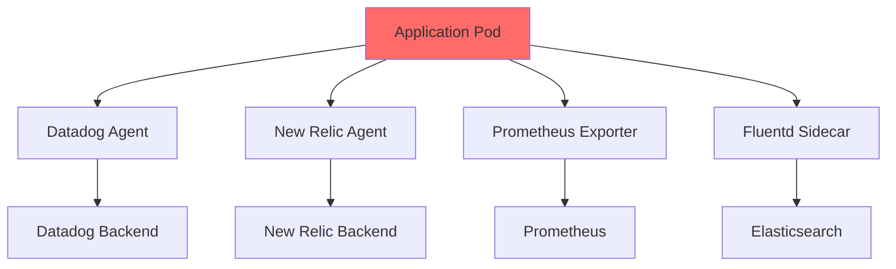
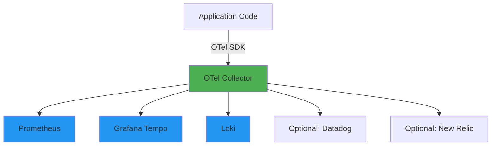

# Unified Telemetry: The OpenTelemetry Standard

## Context

Modern applications emit three types of telemetry data:
- **Metrics** - Numeric measurements (CPU usage, request count, error rate)
- **Logs** - Event records (application logs, audit logs)
- **Traces** - Request flow across services (distributed tracing)

Historically, each observability vendor provided its own agent to collect this data:
- Datadog Agent (proprietary)
- New Relic Agent (proprietary)
- Dynatrace OneAgent (proprietary)
- APM Insight (proprietary)

**The Problem**: Vendor lock-in, duplication, and complexity.

Fawkes adopted **OpenTelemetry (OTel)** as the **single standard** for telemetry collection, replacing vendor-specific agents. This document explains why OpenTelemetry is a strategic architectural decision, not just a tool choice.

## The Problem: Vendor Agent Chaos

### The Old World: One Agent Per Vendor



**What's Wrong Here?**

1. **Resource Duplication**
   - 4 agents per pod = 4x memory/CPU overhead
   - Each agent has its own buffer, config, credentials
   - **Cost**: 200-400MB RAM per pod just for agents

2. **Vendor Lock-In**
   - Proprietary instrumentation libraries
   - Can't switch backends without re-instrumenting code
   - **Risk**: Vendor pricing changes, service degradation, or shutdown

3. **Inconsistent Data**
   - Each vendor collects slightly differently
   - Metric names don't match across tools
   - **Problem**: "Datadog shows 500 req/sec, but New Relic shows 520. Which is right?"

4. **Configuration Sprawl**
   - 4 agents = 4 config files per service
   - Updating sampling rate? Touch all 4 configs
   - **Toil**: Platform team maintains multiple agent configs

5. **Security Surface**
   - Each agent needs credentials to its backend
   - 4 agents = 4 secret rotation processes
   - **Attack Surface**: More agents = more potential vulnerabilities

### Real-World Vendor Lock-In Example

**2019**: Company X uses Datadog, instruments all apps with Datadog APM libraries

**2022**: Datadog raises prices 40%. Company X evaluates alternatives.

**Discovery**: 
- 200 microservices instrumented with `dd-trace` library
- Custom dashboards use Datadog-specific query language
- Alerts depend on Datadog metric names
- **Estimated Migration Cost**: 6 months, $500K+ engineering time

**Outcome**: Stuck with Datadog despite cost increase (lock-in worked as designed)

## The Solution: OpenTelemetry as the Standard

### What is OpenTelemetry?

**OpenTelemetry (OTel)** is a **vendor-neutral, open-source observability framework** that provides:
- **Standardized APIs** - Uniform way to instrument code
- **SDKs for all languages** - Java, Python, Go, Node.js, .NET, Ruby, PHP, etc.
- **Automatic instrumentation** - Zero-code instrumentation for frameworks
- **Collector** - Vendor-agnostic telemetry pipeline
- **Export to any backend** - Prometheus, Grafana, Datadog, Jaeger, etc.

**Created by**: CNCF (merger of OpenTracing and OpenCensus)  
**Status**: CNCF Graduated (highest maturity)  
**Backed by**: Google, Microsoft, AWS, Splunk, Datadog, New Relic, etc.

**The Key Insight**: Get vendors to agree on a **standard**, then compete on **backends**, not agents.

### The OpenTelemetry Architecture



**How It Works:**

1. **Instrument Once**
   - App uses OTel SDK (vendor-neutral)
   - Emits metrics, logs, traces in OTLP format (OpenTelemetry Protocol)

2. **Centralized Collection**
   - OTel Collector receives all telemetry
   - Runs as DaemonSet (one per node) or sidecar

3. **Flexible Export**
   - Collector transforms and forwards to backends
   - Want to switch from Datadog to Prometheus? Change collector config, not app code
   - Want to send to multiple backends? Configure multiple exporters

**Benefits:**
- ✅ **Single agent** - OTel Collector replaces all vendor agents
- ✅ **No vendor lock-in** - Switch backends without code changes
- ✅ **Consistent data** - Same telemetry regardless of backend
- ✅ **Future-proof** - Industry standard, not vendor-specific

### Fawkes Telemetry Stack

**Metrics**: Prometheus (via OTel Collector)  
**Logs**: Loki (via OTel Collector)  
**Traces**: Grafana Tempo (via OTel Collector)  
**Visualization**: Grafana (unified dashboard)

**All data flows through OTel Collector:**
```yaml
# OTel Collector config
receivers:
  otlp:
    protocols:
      grpc:
        endpoint: 0.0.0.0:4317
      http:
        endpoint: 0.0.0.0:4318

processors:
  batch:
    timeout: 10s
    send_batch_size: 1024
  
  # Remove sensitive data
  attributes:
    actions:
      - key: password
        action: delete
      - key: token
        action: delete

exporters:
  prometheus:
    endpoint: "prometheus:9090"
  
  otlp/tempo:
    endpoint: "tempo:4317"
    tls:
      insecure: false
  
  loki:
    endpoint: "http://loki:3100/loki/api/v1/push"

service:
  pipelines:
    metrics:
      receivers: [otlp]
      processors: [batch, attributes]
      exporters: [prometheus]
    
    traces:
      receivers: [otlp]
      processors: [batch, attributes]
      exporters: [otlp/tempo]
    
    logs:
      receivers: [otlp]
      processors: [batch, attributes]
      exporters: [loki]
```

**Effect**: Single configuration controls all telemetry routing.

## Trade-Offs: Standardization vs. Vendor Features

### What OpenTelemetry Gives You

| Benefit | Impact |
|---------|--------|
| **Vendor Neutrality** | Switch backends without re-instrumenting code |
| **Cost Control** | Evaluate vendors on backend merit, not ecosystem lock-in |
| **Single Agent** | Reduce resource overhead by 50-75% (1 collector vs. 4 agents) |
| **Consistent Data Model** | Metrics/logs/traces use same attributes, same naming |
| **Community Support** | CNCF backing means long-term sustainability |
| **Auto-Instrumentation** | Zero-code instrumentation for popular frameworks |
| **Cross-Cloud** | Works on AWS, Azure, GCP, on-prem identically |

### What OpenTelemetry Costs You

| Challenge | Mitigation |
|-----------|------------|
| **Missing Vendor Features** | Vendor agents have proprietary features (e.g., Datadog Live Profiling). **Mitigation**: Use OTel for core observability, add vendor agent only for specific features if justified |
| **Configuration Complexity** | OTel Collector config can be verbose. **Mitigation**: Fawkes provides templates and Helm charts for common patterns |
| **Learning Curve** | New standard to learn vs. familiar vendor tools. **Mitigation**: [Dojo Module 13: Observability](../../dojo/modules/brown-belt/module-13-observability.md) covers OTel |
| **Maturity Gaps** | Some language SDKs less mature than vendor equivalents. **Mitigation**: Java, Go, Python, Node.js are production-ready (Fawkes primary languages) |
| **Backend Performance** | Prometheus/Tempo/Loki may not match Datadog polish initially. **Mitigation**: Acceptable trade-off for avoiding lock-in; Grafana ecosystem rapidly improving |

### When to Use Vendor Agents Anyway

OpenTelemetry is the **default**, but vendor agents allowed for specific use cases:

**Use OTel When (90% of cases):**
- ✅ Standard metrics, logs, traces
- ✅ Application performance monitoring
- ✅ Distributed tracing
- ✅ Custom instrumentation

**Use Vendor Agent When:**
- ⚠️ Need proprietary features (e.g., Datadog Real User Monitoring, synthetic tests)
- ⚠️ Backend vendor requires their agent for full functionality
- ⚠️ Compliance/legal requirement mandates specific vendor

**Hybrid Approach**: Run OTel Collector for core telemetry, add vendor sidecar only where needed.

## Practical Implications

### For Developers

**Q: How do I instrument my application?**

**A: Auto-Instrumentation (Preferred)**

Most frameworks supported automatically:

**Java (Spring Boot, Quarkus, Micronaut):**
```bash
# Download OTel Java agent
curl -L https://github.com/open-telemetry/opentelemetry-java-instrumentation/releases/latest/download/opentelemetry-javaagent.jar -o agent.jar

# Run app with agent
java -javaagent:agent.jar \
  -Dotel.service.name=my-service \
  -Dotel.exporter.otlp.endpoint=http://otel-collector:4317 \
  -jar app.jar
```

**Node.js (Express, Fastify, NestJS):**
```javascript
// tracing.js
const { NodeSDK } = require('@opentelemetry/sdk-node');
const { getNodeAutoInstrumentations } = require('@opentelemetry/auto-instrumentations-node');
const { OTLPTraceExporter } = require('@opentelemetry/exporter-trace-otlp-grpc');

const sdk = new NodeSDK({
  serviceName: 'my-service',
  traceExporter: new OTLPTraceExporter({
    url: 'http://otel-collector:4317'
  }),
  instrumentations: [getNodeAutoInstrumentations()]
});

sdk.start();
```

**Python (Flask, Django, FastAPI):**
```bash
# Install OTel packages
pip install opentelemetry-distro opentelemetry-exporter-otlp

# Auto-instrument
opentelemetry-bootstrap -a install

# Run with instrumentation
opentelemetry-instrument \
  --service_name=my-service \
  --exporter_otlp_endpoint=http://otel-collector:4317 \
  python app.py
```

**No code changes required!** Framework calls automatically traced.

**Q: What if I need custom spans?**

**A: Manual Instrumentation**

```python
from opentelemetry import trace

tracer = trace.get_tracer(__name__)

def process_order(order_id):
    with tracer.start_as_current_span("process_order") as span:
        span.set_attribute("order.id", order_id)
        span.set_attribute("order.amount", order.total)
        
        # Business logic
        validate_order(order_id)
        charge_payment(order_id)
        ship_order(order_id)
        
        span.set_attribute("order.status", "completed")
```

**Result**: Custom span appears in Grafana Tempo with attributes.

### For Platform Engineers

**Q: How do I deploy the OTel Collector?**

**A: DaemonSet (Recommended)**

```yaml
apiVersion: apps/v1
kind: DaemonSet
metadata:
  name: otel-collector
  namespace: observability
spec:
  selector:
    matchLabels:
      app: otel-collector
  template:
    metadata:
      labels:
        app: otel-collector
    spec:
      containers:
        - name: otel-collector
          image: otel/opentelemetry-collector-contrib:0.88.0
          ports:
            - containerPort: 4317  # OTLP gRPC
            - containerPort: 4318  # OTLP HTTP
          volumeMounts:
            - name: config
              mountPath: /etc/otel
          resources:
            requests:
              cpu: 100m
              memory: 128Mi
            limits:
              cpu: 500m
              memory: 512Mi
      volumes:
        - name: config
          configMap:
            name: otel-collector-config
```

**Q: How do I handle high cardinality?**

**A: Sampling and Aggregation**

```yaml
# Tail-based sampling (keep interesting traces)
processors:
  tail_sampling:
    policies:
      - name: errors
        type: status_code
        status_code:
          status_codes: [ERROR]
      
      - name: slow-requests
        type: latency
        latency:
          threshold_ms: 1000
      
      - name: probabilistic
        type: probabilistic
        probabilistic:
          sampling_percentage: 10
```

**Effect**: Keep 100% of errors/slow requests, sample 10% of fast successful requests.

### For Consultants

**Client Question: "Why not just use Datadog/New Relic? It's easier."**

**Response:**

1. **Short-Term vs. Long-Term**
   - *Short-Term*: Vendor agent easier (pre-built dashboards, support)
   - *Long-Term*: Vendor lock-in, pricing pressure, limited flexibility

2. **Cost Control**
   - Datadog pricing: $15-31/host/month + $1.27/million spans
   - 100 hosts, 10M spans/day = **$50K+/year**
   - OTel + Grafana Cloud: $0-8K/year (or self-hosted = $0)

3. **Strategic Flexibility**
   - Want to switch vendors? OTel makes it a config change
   - Vendor raises prices? No re-instrumentation needed
   - Multi-cloud? Same telemetry stack everywhere

4. **Industry Momentum**
   - CNCF Graduated, backed by all major vendors
   - **Even Datadog supports OTel** (they know it's the future)

**Analogy**: "Would you write SQL queries in Oracle PL/SQL or ANSI SQL? ANSI SQL works across databases. OTel is the ANSI SQL of observability."

**Objection Handling:**
- *"OTel is immature"* → Graduated project, 100+ companies contributing
- *"We lose vendor features"* → Hybrid approach: OTel + vendor agent only where needed
- *"Our team knows Datadog"* → Training investment pays off via flexibility

## Historical Context: From Vendor Agents to OTel

### Fawkes 1.0 (2022): Prometheus + Vendor Sprawl

**Metrics**: Prometheus exporters (custom per service)  
**Logs**: Fluentd + Elasticsearch  
**Traces**: Jaeger (limited adoption)

**Problems:**
- Developers didn't instrument traces (too complex)
- Logs disconnected from metrics/traces
- No unified view of system state
- **MTTR**: High (couldn't correlate data across tools)

### Fawkes 2.0 (2023): OpenTelemetry Adoption

**Decision**: Bet on OpenTelemetry as standard

**Migration:**
1. Deploy OTel Collector (DaemonSet)
2. Auto-instrument new services with OTel SDKs
3. Migrate existing services incrementally
4. Sunset Jaeger, direct Prometheus exporters

**Results:**
- **Unified data model**: Metrics, logs, traces use same attributes
- **Correlation**: Trace ID in logs, link from Grafana to Tempo
- **Developer adoption**: Auto-instrumentation = zero friction
- **MTTR**: ⬇️ 40% (faster root cause analysis)
- **Cost**: ⬇️ $30K/year (avoided Datadog expansion)

### Fawkes 3.0 (2024-Present): Grafana LGTM Stack

**Full Observability Stack:**
- **Loki** (Logs)
- **Grafana** (Visualization)
- **Tempo** (Traces)
- **Mimir/Prometheus** (Metrics)

**All powered by OTel Collector as the telemetry ingestion layer.**

## The Mental Model: OTel as the Telemetry Layer

Think of OpenTelemetry like the **OSI Network Model**:

| Layer | Network Model | Telemetry Model |
|-------|---------------|-----------------|
| **Application** | HTTP, gRPC | Business Logic |
| **Presentation** | TLS, Compression | OTel SDK (instrumentation) |
| **Session** | Authentication | Trace Context Propagation |
| **Transport** | TCP, UDP | **OTel Collector** (routing, batching) |
| **Network** | IP | OTLP Protocol |
| **Data Link** | Ethernet | Backend Protocol (Prometheus, Tempo) |
| **Physical** | Cables | Storage (Prometheus TSDB, Tempo blocks) |

**Key Insight**: You don't write TCP socket code to make HTTP requests—you use a library. Similarly, you don't use vendor-specific agents—you use OTel SDK and let the collector handle backend details.

**This is abstraction working as intended.**

## Related Reading

- **How-To**: [Trace Requests with Tempo](../../how-to/observability/trace-request-tempo.md)
- **How-To**: [View DORA Metrics](../../how-to/observability/view-dora-metrics-devlake.md)
- **ADR**: [ADR-013: Distributed Tracing](../../adr/ADR-013%20distributed%20tracing.md)
- **ADR**: [ADR-011: Centralized Log Management](../../adr/ADR-011%20Centralized%20Log%20Management.md)
- **ADR**: [ADR-012: Metrics Monitoring](../../adr/ADR-012%20Metrics%20Monitoring%20and%20Management.md)
- **Tutorial**: [Module 13: Observability](../../dojo/modules/brown-belt/module-13-observability.md)
- **Reference**: [OpenTelemetry Documentation](https://opentelemetry.io/docs/)

## Conclusion

OpenTelemetry is not just a tool—it's a **strategic architectural decision** that prevents vendor lock-in while enabling world-class observability.

**The Core Principle**: Instrument once with a vendor-neutral standard, then send telemetry to any backend. This gives you:
- **Flexibility**: Switch backends without code changes
- **Cost Control**: Vendors compete on backend quality, not ecosystem lock-in
- **Future-Proofing**: Industry standard, backed by CNCF and all major vendors
- **Simplicity**: One agent (OTel Collector) instead of many vendor agents

**The Trade-Off**: You may lose some proprietary vendor features, but you gain strategic independence. For Fawkes, that's the right trade.

**The Future**: As Datadog, New Relic, and others adopt OTel (they already are), the ecosystem converges on the standard. Choosing OTel today means you're ahead of the curve, not behind it.

**Unified Telemetry = OpenTelemetry.** This is the way.
