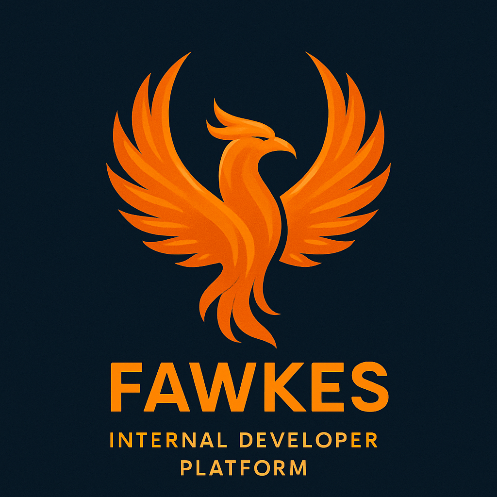
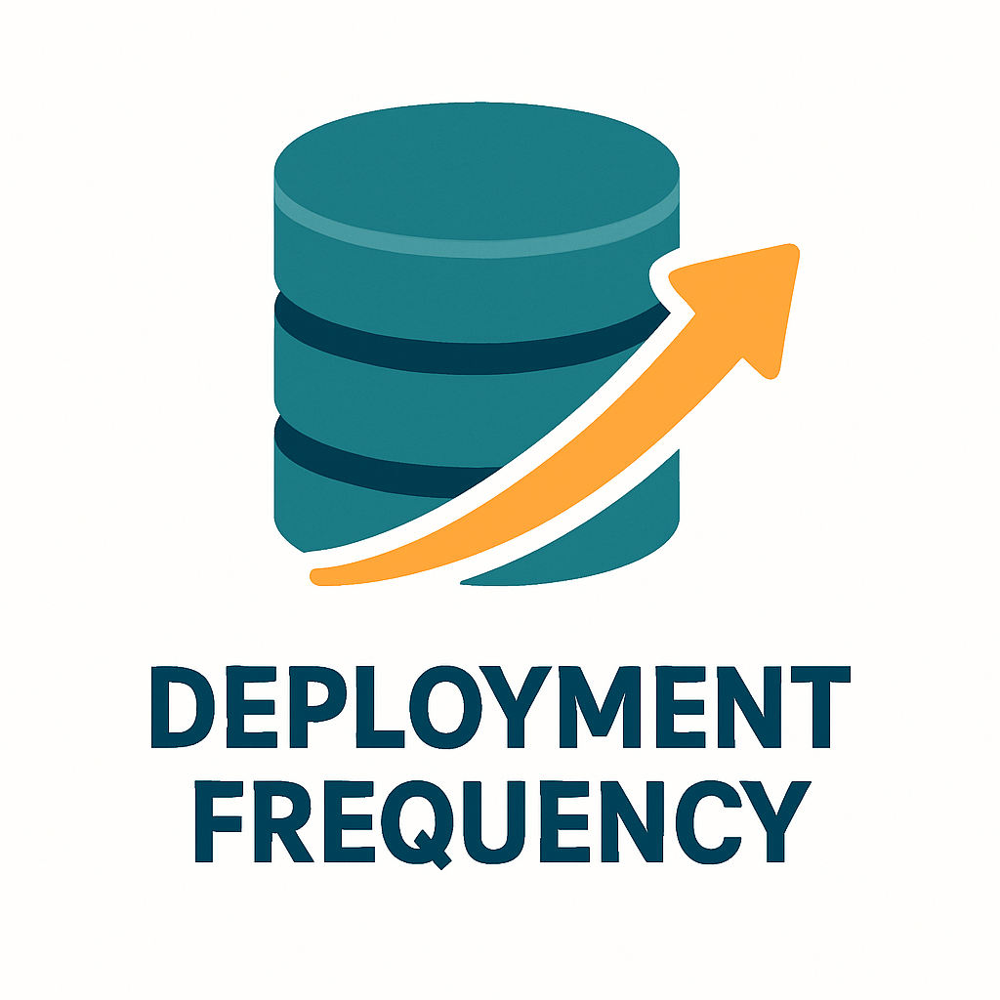
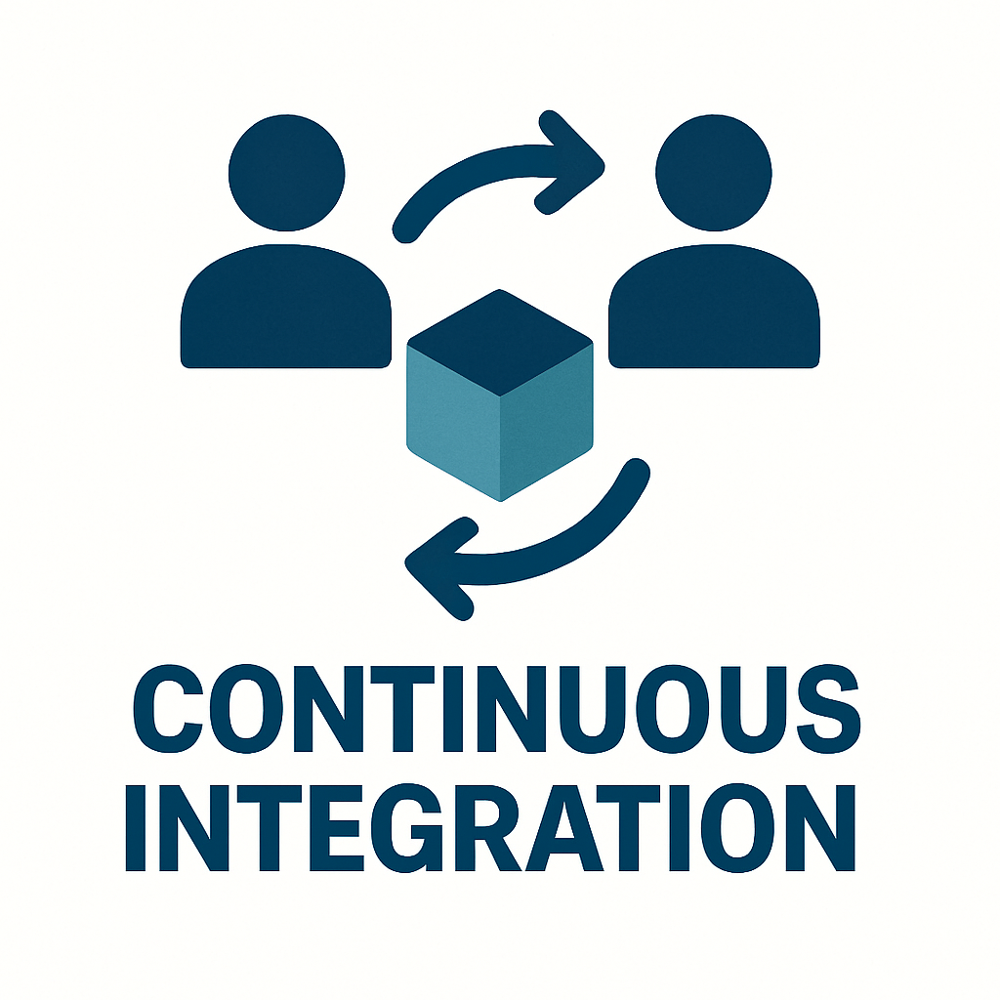

# Fawkes Internal Developer Platform

<figure markdown>
  { width="400" }
  <figcaption>Fawkes Platform Overview</figcaption>
</figure>

Welcome to the Fawkes project! Fawkes is an open-source platform designed to help teams improve their **software delivery performance** by implementing all **24 DORA capabilities** through integrated tooling and practices.

## 🚀 Key Metrics

| Metric | Description |
|--------|-------------|
| { width="24" } **Deployment Frequency** | How often an organization successfully releases to production |
| { width="24" } **Lead Time** | The time it takes to go from code committed to code successfully running in production |
| { width="24" } **Change Failure Rate** | The percentage of changes that result in a failure in production |
| { width="24" } **MTTR** | Mean Time to Restore - The time it takes to recover from a failure in production |

## 🌟 DORA Capabilities

### Fast Flow
| Capability | Purpose | Implementation |
|------------|----------|----------------|
| { width="24" } [Continuous Delivery](patterns/continuous-delivery.md) | Ensuring software is always in a deployable state | [Spinnaker](tools/spinnaker.md), [Flux](tools/flux.md) |
| { width="24" } [Deployment Automation](patterns/deployment-automation.md) | Automating the deployment process | [Jenkins](tools/jenkins.md) |
| { width="24" } Continuous Integration | Frequently merging code changes | GitHub Actions |
| { width="24" } Database Change Management | Managing database changes effectively | Flyway |
| { width="24" } Flexible Infrastructure | Using cloud and infrastructure-as-code | Terraform |
| { width="24" } Loosely Coupled Architecture | Enabling independent team work | Kubernetes |

### Fast Feedback
| Capability | Purpose | Tools |
|------------|----------|-------|
| { width="24" } Monitoring and Observability | Implementing comprehensive monitoring | Prometheus, Grafana |
| { width="24" } Test Automation | Automated testing at all levels | Selenium, JUnit |
| { width="24" } Proactive Failure Management | Testing system resilience | Chaos Mesh |

### Fast Recovery
| Capability | Purpose | Tools |
|------------|----------|-------|
| { width="24" } Shift Left on Security | Early security testing | OWASP ZAP |
| { width="24" } Change Failure Rate Reduction | Improving code quality | SonarQube |
| { width="24" } Time to Restore Service | Quick incident resolution | Grafana |

[Explore Capabilities](capabilities.md){ .md-button .md-button--primary }
[View Tools](tools/index.md){ .md-button }
[Implementation Patterns](patterns/index.md){ .md-button }