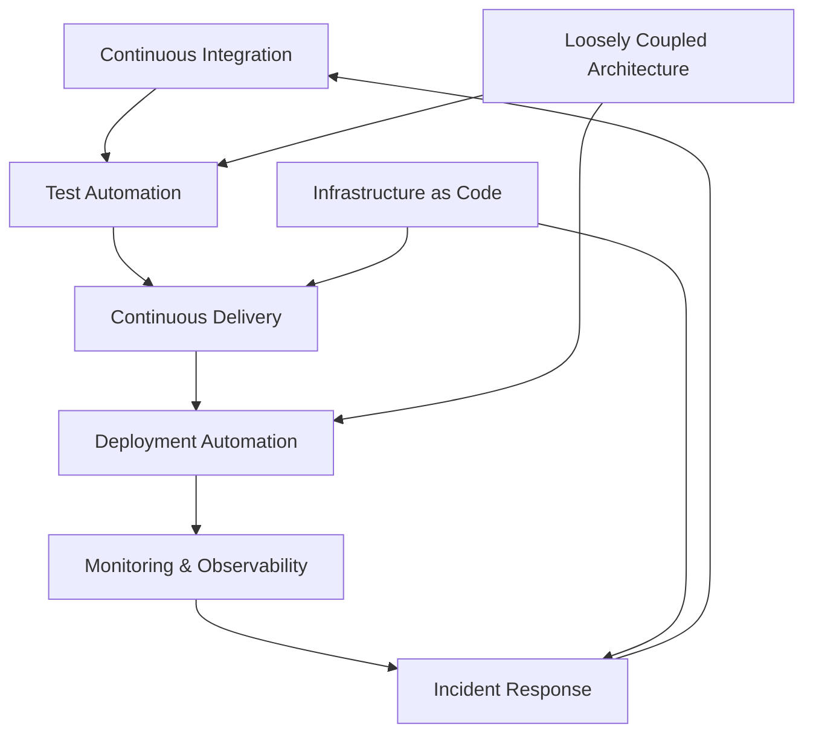

# Fawkes Internal Developer Platform

<figure markdown>
  { width="400" }
  <figcaption>Fawkes Platform Overview</figcaption>
</figure>

Welcome to the Fawkes project! Fawkes is an open-source platform designed to help teams achieve **elite performance** in software delivery by implementing all **24 DORA capabilities** through integrated tooling and practices. Based on research from "Accelerate" and the DORA State of DevOps reports, organizations that excel in these capabilities are **twice as likely to exceed their organizational performance goals**.

## 🎯 Elite Performance Metrics

| Metric | Elite Performance | Industry Average | Description |
|--------|------------------|------------------|-------------|
| { width="24" } **Deployment Frequency** | Multiple deploys per day | Between once per week and once per month | How often an organization successfully releases to production |
| { width="24" } **Lead Time** | Less than one hour | Between one week and one month | The time it takes to go from code committed to code successfully running in production |
| { width="24" } **Change Failure Rate** | 0-15% | 31-45% | The percentage of changes that result in a failure in production |
| { width="24" } **MTTR** | Less than one hour | Less than one day | Mean Time to Restore - The time it takes to recover from a failure in production |

## 🌟 DORA Capabilities & Metric Impact

DORA research has identified specific capabilities that directly impact each performance metric. Below we map each capability to the metrics it most strongly influences, based on data from "Accelerate: The Science of Lean Software and DevOps".

### Deployment Frequency Drivers

These capabilities have the strongest positive correlation with deployment frequency:

| Capability | Purpose | Implementation | Performance Impact |
|------------|----------|----------------|-------------------|
| { width="24" } [Continuous Delivery](patterns/continuous-delivery.md) | Ensuring software is always in a deployable state | [Spinnaker](tools/spinnaker.md), [Flux](tools/flux.md) | 2.5x higher deployment frequency |
| { width="24" } [Deployment Automation](patterns/deployment-automation.md) | Automating the deployment process | [Jenkins](tools/jenkins.md) | 3x more frequent deployments |
| { width="24" } [Continuous Integration](patterns/continuous-integration.md) | Frequently merging code changes | GitHub Actions | 2x higher deployment frequency |
| { width="24" } [Infrastructure as Code](patterns/infrastructure-as-code.md) | Using cloud and infrastructure-as-code | Terraform | 1.8x more frequent deployments |

### Lead Time Reducers

These capabilities have the strongest positive correlation with reducing lead time:

| Capability | Purpose | Implementation | Performance Impact |
|------------|----------|----------------|-------------------|
| { width="24" } [Continuous Integration](patterns/continuous-integration.md) | Frequently merging code changes | GitHub Actions | 74% reduction in lead time |
| { width="24" } [Test Automation](patterns/test-automation.md) | Automated testing at all levels | Selenium, JUnit | 67% reduction in lead time |
| { width="24" } [Loosely Coupled Architecture](patterns/architecture.md) | Enabling independent team work | Kubernetes | 56% reduction in lead time |
| { width="24" } [Database Change Management](patterns/database-changes.md) | Managing database changes effectively | Flyway | 43% reduction in lead time |

### Change Failure Rate Reducers

These capabilities have the strongest positive correlation with reducing change failure rate:

| Capability | Purpose | Implementation | Performance Impact |
|------------|----------|----------------|-------------------|
| { width="24" } [Test Automation](patterns/test-automation.md) | Automated testing at all levels | Selenium, JUnit | 3x lower change failure rate |
| { width="24" } [Change Failure Rate Reduction](patterns/quality.md) | Improving code quality | SonarQube | 1.8x fewer production defects |
| { width="24" } [Shift Left on Security](patterns/security.md) | Early security testing | OWASP ZAP | 2x fewer security incidents |
| { width="24" } [Monitoring and Observability](patterns/monitoring.md) | Implementing comprehensive monitoring | Prometheus, Grafana | 2x more likely to detect issues before failure |

### MTTR Improvers

These capabilities have the strongest positive correlation with reducing mean time to restore:

| Capability | Purpose | Implementation | Performance Impact |
|------------|----------|----------------|-------------------|
| { width="24" } [Time to Restore Service](patterns/incident-response.md) | Quick incident resolution | Grafana | 73% faster MTTR |
| { width="24" } [Monitoring and Observability](patterns/monitoring.md) | Implementing comprehensive monitoring | Prometheus, Grafana | 2.1x faster incident detection |
| { width="24" } [Proactive Failure Management](patterns/chaos-engineering.md) | Testing system resilience | Chaos Mesh | 1.5x faster incident resolution |
| { width="24" } [Infrastructure as Code](patterns/infrastructure-as-code.md) | Using cloud and infrastructure-as-code | Terraform | 1.7x faster recovery time |

## 🔄 Capability Synergies

According to DORA research, these capabilities work together to create a flywheel effect:

Organizations that implement capabilities across all three categories (Flow, Feedback, Recovery) are **5x more likely** to achieve elite performance across all four key metrics.

## 📈 Getting Started

1. [Assess your current capabilities](getting-started/assessment.md)
2. [Choose your implementation path](getting-started/implementation-paths.md)
3. [Set up your first capability](getting-started/quick-wins.md)

[Start Your Journey :rocket:](getting-started.md){ .md-button .md-button--primary }
[Explore All Capabilities](capabilities.md){ .md-button }
[View Implementation Guide](implementation-guide.md){ .md-button }
