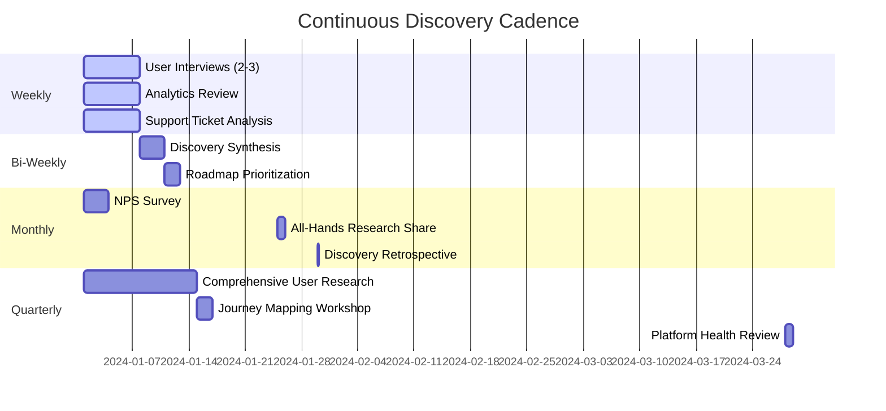
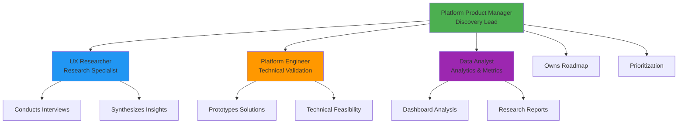

# Playbook: Continuous Discovery Workflow

> **Estimated Duration**: Ongoing cadence (weekly/bi-weekly activities)  
> **Complexity**: ⭐⭐⭐ Medium-High  
> **Target Audience**: Platform Product Managers, Platform Engineers, UX Researchers

---

## I. Business Objective

!!! info "Diátaxis: Explanation / Conceptual"
    This section defines the "why"—understanding developer needs to build the right platform capabilities.

### What We're Solving

Platform teams often build features based on assumptions, stakeholder requests, or technical excitement rather than actual developer needs. Continuous discovery establishes a systematic process for understanding real developer pain points, validating solutions before building, and measuring impact after delivery.

**The Core Problem**: Most platform initiatives fail not due to technical limitations but because they solve problems developers don't have or solve the wrong problem in the wrong way.

### Risk Mitigation

| Risk | Impact Without Action | How This Playbook Helps |
|------|----------------------|------------------------|
| **Building unused features** | Wasted engineering time, low adoption, developer frustration | Validates needs before building, ensures product-market fit |
| **Missing critical pain points** | Developers work around platform, shadow IT proliferates | Systematic discovery surfaces real problems |
| **Poor adoption** | Platform investment doesn't deliver ROI | User research drives adoption through better product fit |
| **Feature factory syndrome** | Busy but not impactful, unmeasured outcomes | Focus on outcomes over outputs, continuous validation |
| **Developer dissatisfaction** | Low NPS, talent retention issues | Listening culture improves trust and satisfaction |

### Expected Outcomes

- ✅ **80%+ adoption** of new platform features within 3 months
- ✅ **NPS score >40** for platform (measured quarterly)
- ✅ **Validated roadmap** with clear user needs and business impact for each initiative
- ✅ **10+ user interviews** conducted monthly across different personas
- ✅ **DORA metric improvements** tracked and attributed to platform changes
- ✅ **Reduced support tickets** by 30% through better understanding of user needs

### Business Value

| Metric | Before | After | Improvement |
|--------|--------|-------|-------------|
| Platform Feature Adoption | 30-40% | 75-85% | 2x increase |
| Developer NPS | +15 | +40 | 25 point improvement |
| Time from Idea to Value | 8-12 weeks | 3-5 weeks | 60% reduction |
| Support Tickets per Feature | 20-30/month | 5-10/month | 70% reduction |
| Engineering Waste (unused features) | 40-50% | <10% | 80% reduction |

---

## II. Technical Prerequisites

!!! abstract "Diátaxis: Reference"
    This section lists required tools, access, and setup for continuous discovery.

### Required Fawkes Components

| Component | Minimum Version | Required | Documentation |
|-----------|-----------------|----------|---------------|
| Backstage Developer Portal | 1.18+ | ✅ | [Backstage Docs](../reference/api/backstage-plugins.md) |
| Mattermost | 9.0+ | ✅ | For team communication and surveys |
| Analytics Platform (PostHog/Mixpanel) | Latest | ✅ | [Product Analytics](../explanation/idp/product-discovery-delivery-flow.md) |
| Survey Tool (TypeForm/Google Forms) | N/A | ✅ | For NPS and satisfaction surveys |
| Video Conferencing (Zoom/Teams) | N/A | ✅ | For user interviews |
| Documentation Platform (MkDocs) | 1.5+ | ✅ | For publishing insights |
| DORA Metrics Dashboard | N/A | ✅ | [View DORA Metrics](../how-to/observability/view-dora-metrics-devlake.md) |

### Tools & Templates Setup

```bash
# Clone interview templates
mkdir -p ~/platform-discovery
cp docs/research/templates/*.md ~/platform-discovery/

# Set up analytics dashboard
kubectl port-forward -n fawkes svc/posthog 8000:8000

# Access Backstage analytics
open https://backstage.fawkes.local/analytics

# Set up research repository
gh repo create platform-research --private --template paruff/fawkes-research-template
```

### Access Requirements

- [ ] Backstage admin access (to view usage analytics)
- [ ] Mattermost admin (to create channels and send surveys)
- [ ] Calendar access to schedule interviews
- [ ] Analytics platform admin access
- [ ] GitHub repository for storing research insights
- [ ] Budget for incentives (gift cards for interview participants)

### Pre-Implementation Checklist

- [ ] Platform team trained on discovery practices
- [ ] Interview templates customized for your organization
- [ ] Communication plan for engaging developers
- [ ] Privacy/ethics guidelines established for user research
- [ ] Research insights repository created
- [ ] Cadence calendar scheduled (interviews, surveys, retros)

---

## III. The Continuous Discovery Process

!!! tip "Diátaxis: How-to Guide (Core)"
    The continuous discovery workflow operates on multiple cadences simultaneously.

### Discovery Cadence Model



---

## IV. Roles & Responsibilities

!!! abstract "Roles in Continuous Discovery"
    Clear ownership ensures discovery activities happen consistently.

### Discovery Team Structure



### Role Definitions

#### Platform Product Manager (Discovery Lead)

**Responsibilities**:
- Own the discovery process and cadence
- Coordinate interviews and research activities
- Synthesize insights into actionable roadmap items
- Communicate findings to stakeholders
- Prioritize features using RICE or similar framework
- Maintain research repository

**Time Commitment**: 40-50% of time on discovery

**Key Skills**:
- User research fundamentals
- Product prioritization frameworks
- Stakeholder communication
- Roadmap planning

**Success Metrics**:
- 10+ interviews conducted per month
- Research insights published bi-weekly
- Roadmap backed by user evidence
- 80%+ feature adoption rate

#### UX Researcher (Research Specialist)

**Responsibilities**:
- Design research studies and interview guides
- Conduct user interviews and usability tests
- Analyze qualitative feedback
- Create journey maps and personas
- Run design thinking workshops
- Ensure research ethics and privacy

**Time Commitment**: 60-80% of time on research

**Key Skills**:
- Qualitative research methods
- Interview facilitation
- Thematic analysis
- Journey mapping
- Workshop facilitation

**Success Metrics**:
- Research quality (insights actionable?)
- Interview completion rate
- Participant satisfaction
- Time from research to insight

#### Platform Engineer (Technical Validation)

**Responsibilities**:
- Assess technical feasibility of proposed solutions
- Build prototypes and POCs
- Validate solutions with early adopters
- Estimate effort for roadmap items
- Participate in interviews (technical questions)
- Implement validated solutions

**Time Commitment**: 20-30% of time on discovery

**Key Skills**:
- Rapid prototyping
- Technical architecture
- Developer empathy
- Experimentation mindset

**Success Metrics**:
- Prototype quality and speed
- Feasibility assessment accuracy
- Early adopter feedback
- Feature delivery success rate

#### Data Analyst (Analytics & Metrics)

**Responsibilities**:
- Monitor platform usage analytics
- Analyze DORA metrics trends
- Create research dashboards
- Identify usage patterns and anomalies
- Support A/B test analysis
- Generate quantitative insights

**Time Commitment**: 30-40% of time on discovery

**Key Skills**:
- Analytics platforms (PostHog, Mixpanel)
- SQL and data visualization
- Statistical analysis
- Dashboard design

**Success Metrics**:
- Dashboard coverage (all features tracked)
- Insight generation velocity
- Data quality and accuracy
- Correlation analysis quality

### Stakeholder Roles

#### Developers (Research Participants)

**Responsibilities**:
- Participate in interviews and surveys
- Provide honest feedback
- Test prototypes and betas
- Share workflows and pain points
- Advocate for fellow developers

**Time Commitment**: 1-2 hours per month

**Incentives**:
- Influence platform direction
- Early access to new features
- Recognition in changelog/docs
- Swag or gift cards for interviews

#### Engineering Managers

**Responsibilities**:
- Nominate team members for research
- Share team-level pain points
- Support discovery initiatives
- Allocate time for interviews
- Validate team-wide problems

**Time Commitment**: 30 minutes per month

#### Platform Leadership

**Responsibilities**:
- Set strategic direction for platform
- Review discovery insights quarterly
- Approve budget for research activities
- Remove roadblocks to discovery
- Champion user-centric culture

**Time Commitment**: 2 hours per quarter

---

## V. Discovery Activities & Methods

### Method 1: User Interviews (Weekly)

**Cadence**: 2-3 interviews per week (10-12 per month)

**Duration**: 30-45 minutes per interview

**Objective**: Deeply understand individual developer workflows, pain points, and needs.

#### Step-by-Step Process

**Step 1: Recruit Participants**

```markdown
# Interview Recruitment Message (Mattermost)

👋 **We need your help!**

The Platform Team is interviewing developers to understand your workflows 
and pain points. We want to build features you'll actually use!

**What**: 30-minute conversation about your dev experience
**When**: This week or next (flexible scheduling)
**Incentive**: $50 gift card + early access to new features

Interested? React with ✋ or DM me to schedule!

Target: Mix of personas (frontend, backend, new hires, senior engineers)
```

**Selection Criteria**:
- Diverse roles and experience levels
- Different teams and business units
- Mix of power users and infrequent users
- Recent joiners (<6 months) and long-time users (>2 years)

**Step 2: Prepare Interview Guide**

Use the template from `docs/research/templates/interview-guide.md`:

```markdown
# Discovery Interview Guide: [Date]

**Participant**: [Name, Role, Team]
**Interviewer**: [Name]
**Date**: [Date]
**Duration**: 30-45 minutes

## Introduction (5 min)
- Thank participant
- Explain purpose: understand workflows, not testing them
- Confirm recording consent
- Emphasize no wrong answers

## Current Workflow (15 min)
1. Walk me through your last deployment from local to production.
2. What tools do you use at each stage?
3. Where do you spend the most time?
4. What's the most frustrating part?

## Pain Points (10 min)
5. Describe a recent time the platform blocked you from being productive.
6. What information do you wish you had easier access to?
7. What tasks feel unnecessarily manual or repetitive?

## Ideal State (10 min)
8. If you could improve one thing about the platform, what would it be?
9. What capabilities do you wish the platform had?
10. What does "great developer experience" mean to you?

## Wrap-up (5 min)
- Anything else we should know?
- Who else should we talk to?
- Thank you + explain next steps
```

**Step 3: Conduct Interview**

**Best Practices**:
- ✅ Record with consent (easier than live note-taking)
- ✅ Ask open-ended questions ("Tell me about..." not "Do you like...")
- ✅ Follow up with "Why?" and "Can you show me an example?"
- ✅ Let silence happen (don't rush to fill gaps)
- ✅ Take note of emotional reactions (frustration, delight)
- ❌ Don't pitch solutions or defend platform
- ❌ Don't ask leading questions
- ❌ Don't interview friends/teammates (bias)

**Tools**:
- Zoom/Teams for video call
- Otter.ai or similar for transcription
- Google Docs for real-time notes
- Screenshot tool if participant shares screen

**Step 4: Document Insights**

```markdown
# Interview Insights: [Participant Name] - [Date]

## Key Quotes
> "I spend 2 hours every week debugging Jenkins pipelines because 
> the error messages don't tell me what's actually wrong."

> "I'd love to use Backstage, but I can't find my team's services. 
> The search doesn't work how I expect."

## Pain Points
- 🔴 **HIGH**: Jenkins error messages unhelpful (2 hours/week lost)
- 🟡 **MEDIUM**: Backstage search UX (confusing, not intuitive)
- 🟢 **LOW**: Git hooks slow on large repos

## Needs/Jobs-to-be-Done
- Debug CI failures quickly
- Discover services across organization
- Onboard to new project in <1 day

## Opportunities
- Improve Jenkins error messages (link to logs, suggest fixes)
- Revamp Backstage search (fuzzy matching, filters)
- Create onboarding templates

## Next Steps
- Validate Jenkins error message pain with 3 more developers
- Show Backstage search prototype to participant
```

**Step 5: Store in Research Repository**

```bash
# Organize by date and participant
platform-research/
├── interviews/
│   └── 2024-01/
│       ├── 2024-01-15-alex-frontend-dev.md
│       ├── 2024-01-17-jordan-backend-eng.md
│       └── 2024-01-19-casey-sre.md
├── synthesis/
│   └── 2024-01-bi-weekly-synthesis.md
└── insights/
    └── jenkins-error-messages-insight.md
```

---

### Method 2: Analytics Review (Weekly)

**Cadence**: Every Monday morning (30 minutes)

**Objective**: Monitor platform usage trends, identify anomalies, and spot adoption issues.

#### Step-by-Step Process

**Step 1: Review Key Metrics Dashboard**

```yaml
# Weekly Analytics Review Checklist

Platform Adoption:
  - [ ] Backstage: Active users this week vs. last week
  - [ ] GitOps: % of services using ArgoCD
  - [ ] CI/CD: Pipeline execution count
  - [ ] Templates: Golden path usage count

Feature Usage:
  - [ ] New features: Usage trend since launch
  - [ ] Existing features: Any significant drops?
  - [ ] Top 10 most-used features
  - [ ] Bottom 10 least-used features (candidates for deprecation?)

Engagement:
  - [ ] Login frequency distribution
  - [ ] Time spent in platform
  - [ ] Feature discovery rate (new features adopted)

Errors & Friction:
  - [ ] Error rate by feature
  - [ ] Failed deployments / rollback rate
  - [ ] Support ticket volume
```

**Step 2: Identify Patterns**

```markdown
# Analytics Insights: Week of Jan 15, 2024

## 🔴 Alerts
- Backstage logins down 20% this week (holiday effect or problem?)
- ArgoCD sync failures up 3x (investigate)

## 🟢 Wins
- New "Service Template" feature: 40% adoption in 2 weeks (great!)
- DORA dashboard views up 2x (people caring about metrics)

## 🟡 Questions
- Why is "Search" feature usage so low? (UX issue?)
- 30% of developers never logged into Backstage (why not?)
```

**Step 3: Correlate with Qualitative Data**

```markdown
# Cross-Reference with Interviews

Interview Insight: "Jenkins error messages confusing"
Analytics Data: Jenkins pipeline failure rate 22% (vs. 15% industry avg)
→ **Validated problem**: Both qualitative and quantitative evidence

Interview Insight: "Backstage search doesn't work"
Analytics Data: Search feature used <5% of sessions
→ **Validated problem**: Low usage confirms UX issue
```

**Step 4: Generate Hypotheses**

```markdown
# Hypotheses to Test

H1: Backstage search is hard to discover (UI placement issue)
→ Test: Move search to header, track usage change

H2: Developers don't trust search results (relevance issue)
→ Test: Interview 5 users about search experience

H3: Jenkins errors overwhelming (too much noise)
→ Test: Implement error categorization, measure time-to-resolution
```

---

### Method 3: Support Ticket Analysis (Weekly)

**Cadence**: Every Friday afternoon (30 minutes)

**Objective**: Identify recurring issues and opportunities for self-service solutions.

#### Step-by-Step Process

**Step 1: Categorize Tickets**

```markdown
# Support Tickets: Week of Jan 15, 2024

## By Category
- **How Do I...?** (40%): Documentation/onboarding gaps
  - "How do I deploy to production?" (8 tickets)
  - "How do I add a new environment?" (5 tickets)
  
- **Something Broke** (35%): Platform reliability issues
  - "ArgoCD not syncing" (6 tickets)
  - "Jenkins build stuck" (4 tickets)
  
- **Feature Request** (15%): Missing capabilities
  - "Can we have staging environments?" (3 tickets)
  
- **Access/Permissions** (10%): Onboarding issues
  - "Can't access Vault" (2 tickets)

## Top 5 Issues This Week
1. ArgoCD sync failures (6 tickets) - **SPIKE**
2. Production deployment process unclear (8 tickets) - **TREND**
3. Jenkins build queue long (4 tickets)
4. Backstage catalog out of date (3 tickets)
5. Vault permissions confusing (2 tickets)
```

**Step 2: Identify Systemic Issues**

```markdown
# Pattern Recognition

## Recurring Themes (Last 4 Weeks)
- "How do I deploy to prod?" → **Onboarding problem**
  - Root cause: Docs outdated, no guided tutorial
  - Solution: Create interactive onboarding flow in Backstage
  
- ArgoCD sync issues → **Reliability problem**
  - Root cause: Network timeouts to Git repo
  - Solution: Increase timeout, add retry logic
  
- Jenkins build queue → **Capacity problem**
  - Root cause: Too few executors
  - Solution: Auto-scaling agents
```

**Step 3: Connect to Discovery Insights**

```markdown
# Triangulation: Tickets + Interviews + Analytics

Problem: Production deployment process unclear

Evidence:
- ✅ Support tickets: 8 "How do I deploy?" tickets this week
- ✅ Interviews: 4 of 5 recent hires mentioned confusion
- ✅ Analytics: Only 30% successfully deploy on first try

Confidence: **HIGH** - multiple data sources confirm

Priority: **P0** - Blocking new developer productivity

Action: Create guided deployment tutorial + update docs
```

---

### Method 4: NPS Survey (Monthly)

**Cadence**: First week of every month

**Objective**: Measure developer satisfaction and track trends over time.

#### Survey Structure

```markdown
# Platform NPS Survey - [Month]

## Core Question
On a scale of 0-10, how likely are you to recommend the Fawkes platform 
to a colleague?

[0] [1] [2] [3] [4] [5] [6] [7] [8] [9] [10]

## Follow-up Questions

**For Promoters (9-10):**
- What do you love most about the platform?
- What should we keep doing?

**For Passives (7-8):**
- What would make you rate us a 9 or 10?
- What's the biggest frustration?

**For Detractors (0-6):**
- What's the main reason for your score?
- What would need to change for you to use the platform more?

## Additional Questions
- How often do you use the platform? [Daily/Weekly/Monthly/Rarely]
- Which features do you use most? [Multi-select]
- What's your role? [Frontend/Backend/DevOps/SRE/Other]
```

#### Analysis Process

```markdown
# NPS Analysis: January 2024

## Score Breakdown
- **NPS**: +38 (up from +32 last month) ✅
- **Promoters**: 55% (score 9-10)
- **Passives**: 28% (score 7-8)
- **Detractors**: 17% (score 0-6)

## Themes from Open Responses

### Promoters Love:
- "GitOps makes deployments so easy" (mentioned 12x)
- "DORA dashboard helps me show impact" (mentioned 8x)
- "Golden path templates save hours" (mentioned 10x)

### Passives Want:
- "Better documentation" (mentioned 6x)
- "Faster CI builds" (mentioned 4x)
- "Easier secret management" (mentioned 5x)

### Detractors Frustrated By:
- "Too complex, steep learning curve" (mentioned 5x)
- "Jenkins pipelines confusing" (mentioned 4x)
- "Platform feels slow" (mentioned 3x)

## Action Items
1. **Documentation Sprint**: Update getting started guide (Addresses Passives)
2. **CI Performance**: Investigate build caching (Addresses Passives & Detractors)
3. **Onboarding Simplification**: New developer wizard in Backstage (Addresses Detractors)
```

---

### Method 5: Bi-Weekly Discovery Synthesis

**Cadence**: Every other Friday (2 hours)

**Objective**: Synthesize insights from all sources into actionable themes.

#### Synthesis Workshop Agenda

```markdown
# Discovery Synthesis Workshop: Jan 26, 2024

**Attendees**: Platform PM, UX Researcher, 2 Platform Engineers, Data Analyst

**Duration**: 2 hours

## Agenda

### Part 1: Data Review (30 min)
- Interviews: 6 conducted, key themes
- Analytics: Usage trends, adoption metrics
- Support: Ticket patterns, recurring issues
- NPS: Score and open responses

### Part 2: Affinity Mapping (45 min)
- Write each insight on virtual sticky note
- Group related insights into themes
- Name each theme
- Prioritize themes by frequency + severity

### Part 3: Insight Statements (30 min)
- For each theme, write insight statement
- Format: [Who] needs [what] because [why]
- Link to evidence (interview quotes, analytics, tickets)

### Part 4: Roadmap Implications (15 min)
- Which insights validate current roadmap items?
- Which insights suggest new opportunities?
- Which insights indicate we should pivot?
```

#### Example Synthesis Output

```markdown
# Discovery Insights: Jan 26, 2024

## Theme 1: Deployment Process Friction
**Insight**: New developers struggle to deploy to production because the 
process is undocumented, multi-step, and error-prone.

**Evidence**:
- 6 interviews mentioned deployment confusion
- 12 support tickets: "How do I deploy to prod?"
- Analytics: 70% of first deployments fail
- NPS: "Deployment too complex" mentioned by 8 detractors

**User Need**: "As a new developer, I need a guided deployment workflow 
so I can ship my first feature confidently within my first week."

**Opportunity**: Create Backstage deployment wizard with pre-flight checks

**Priority**: P0 (blocks new developer productivity)

## Theme 2: Observability Gaps
**Insight**: Developers can't troubleshoot production issues quickly 
because logs, metrics, and traces are in separate tools.

**Evidence**:
- 8 interviews: "I check 3 different dashboards to debug"
- Support: 15 tickets related to "Where do I find logs?"
- Analytics: Grafana + Tempo + Loki used <20% of developers

**User Need**: "As a backend engineer, I need unified observability 
so I can debug incidents in minutes, not hours."

**Opportunity**: Backstage observability tab (unified view)

**Priority**: P1 (slows incident response)

## Theme 3: Jenkins Pain
**Insight**: Jenkins pipeline failures are common and confusing because 
error messages don't explain root cause.

**Evidence**:
- 10 interviews mentioned Jenkins frustration
- Support: 22 Jenkins-related tickets this month
- Analytics: 22% pipeline failure rate (vs. 15% industry avg)
- NPS: Jenkins mentioned in 12 detractor responses

**User Need**: "As any developer, I need clear error messages from CI 
so I can fix my pipeline without asking for help."

**Opportunity**: Implement error categorization and suggested fixes

**Priority**: P1 (high frequency, high frustration)
```

---

### Method 6: Quarterly Deep Dives

**Cadence**: Once per quarter (2 weeks)

**Objective**: Conduct comprehensive research on specific topics or personas.

#### Example: Q1 Deep Dive - "New Developer Onboarding"

```markdown
# Quarterly Research: New Developer Onboarding (Q1 2024)

## Research Questions
1. How long does it take new developers to be productive?
2. What are the biggest onboarding blockers?
3. How does onboarding vary by role (frontend vs. backend)?
4. What resources are most/least helpful?

## Research Activities

Week 1-2: Qualitative Research
- 15 interviews with developers hired in last 6 months
- 5 interviews with hiring managers
- Shadowing: Observe 3 new developer first weeks
- Journey mapping workshop with recent hires

Week 3-4: Quantitative Analysis
- Survey all developers hired in last year (n=80)
- Analyze time-to-first-deployment metrics
- Review onboarding completion rates
- Compare onboarding docs usage analytics

## Deliverables
- New developer persona profiles
- Onboarding journey map (with pain points)
- Recommendations for onboarding improvements
- Prototype: Interactive onboarding wizard
- Presentation to leadership
```

---

## VI. Discovery Templates

### Template 1: Interview Consent Form

```markdown
# Research Participation Consent

**Study**: Fawkes Platform Continuous Discovery
**Organization**: [Your Company] Platform Team
**Researcher**: [Name, Email]

## Purpose
We're conducting research to understand how developers use the Fawkes 
platform and identify opportunities for improvement.

## What You'll Do
- Participate in a 30-45 minute interview
- Share your experiences and workflows
- Provide honest feedback (positive and negative)

## Privacy & Confidentiality
- ✅ Interview will be recorded (audio/video) with your consent
- ✅ Recordings used only for analysis, not shared publicly
- ✅ Insights will be anonymized (no names in reports)
- ✅ You can request deletion of your data anytime
- ❌ We will NOT share individual feedback with your manager
- ❌ Participation (or non-participation) has no impact on your job

## Incentive
$50 gift card as a thank you for your time

## Consent
☐ I agree to participate in this interview
☐ I consent to audio/video recording
☐ I understand my feedback will be anonymized

Signature: _________________ Date: _________
```

---

### Template 2: Discovery Insight Document

```markdown
# Discovery Insight: [Title]

**Date**: [Date]
**Insight Owner**: [Name]
**Status**: Draft | Validated | On Roadmap | Shipped

---

## Insight Statement

[Who] needs [what] because [why].

**Example**: New backend engineers need a guided database migration workflow 
because manual SQL changes are error-prone and block deployments.

---

## Evidence

### Qualitative
- Interview with Alex (Backend Engineer): "I spent 4 hours debugging a 
  failed migration last week. The error message didn't help at all."
- Interview with Jordan (Tech Lead): "Our team has a 'migration checklist' 
  in Notion because the platform doesn't guide us."
- Support ticket #1234: "My migration failed in production, how do I rollback?"

### Quantitative
- Analytics: 18% of deployments with migrations fail
- Support: 12 migration-related tickets in January
- DORA: Teams with migrations have 2x higher change failure rate

### Triangulation
✅ Qualitative + Quantitative + Support data all point to same problem

---

## Impact

### User Impact
- **Severity**: HIGH (blocks deployments)
- **Frequency**: 30 migrations per month across teams
- **Affected Users**: Backend engineers (60% of developer base)

### Business Impact
- **Cost**: ~10 hours/month lost to migration debugging
- **Risk**: Production incidents due to failed migrations
- **DORA**: Improving migration UX could reduce CFR by 5%

---

## Current State

### What Exists Today
- Manual process documented in Confluence (outdated)
- No pre-flight validation of migration scripts
- Rollback is manual and risky

### Why It's Inadequate
- Docs hard to find, not integrated into workflow
- No guardrails against common mistakes
- No testing in non-prod environments first

---

## Proposed Solution

### User Story
As a backend engineer, I want to run database migrations through a guided 
workflow in Backstage so that I can deploy changes safely without manual steps.

### Solution Hypothesis
If we provide a Backstage migration wizard with pre-flight checks and 
automated rollback, then migration failure rate will drop from 18% to <5%.

### Key Features
1. Migration validation before deploy (syntax check, dry-run)
2. Automated backup before migration
3. One-click rollback if migration fails
4. Migration history and audit log

### Success Metrics
- Migration failure rate drops from 18% to <5%
- Support tickets related to migrations drop by 80%
- NPS improvement among backend engineers
- 90% adoption of migration wizard within 3 months

---

## Next Steps

- [ ] Build POC (1 week)
- [ ] Validate with 5 backend engineers (1 week)
- [ ] Refine based on feedback
- [ ] Add to roadmap for Q2
- [ ] Implement (3 weeks)
- [ ] Beta test with 3 teams
- [ ] General availability
- [ ] Measure impact after 1 month

---

## Links

- [Interview Notes](#) _(Link to interview documentation)_
- [Analytics Dashboard](#) _(Link to analytics platform)_
- [Support Tickets](#) _(Link to support system)_
- [Prototype](#) _(Link to prototype)_
```

---

### Template 3: Monthly Discovery Report

```markdown
# Monthly Discovery Report: [Month Year]

**Report Date**: [Date]
**Period**: [Start Date] - [End Date]
**Report Owner**: [Platform PM]

---

## Executive Summary

[2-3 sentences summarizing key discoveries this month]

**Top 3 Insights**:
1. [Insight 1] - Impact: [High/Med/Low]
2. [Insight 2] - Impact: [High/Med/Low]
3. [Insight 3] - Impact: [High/Med/Low]

---

## Research Activities

| Activity | Count | Status |
|----------|-------|--------|
| User Interviews | 12 | ✅ Complete |
| NPS Survey | 85 responses | ✅ Complete |
| Support Ticket Analysis | 67 tickets | ✅ Complete |
| Analytics Reviews | 4 weekly reviews | ✅ Complete |
| Usability Tests | 0 | ❌ Not conducted |

---

## Key Metrics

### Platform Health
- **NPS Score**: +38 (↑ 6 points vs. last month)
- **Backstage Adoption**: 88% (↑ 3% vs. last month)
- **Support Ticket Volume**: 67 (↓ 15% vs. last month)

### DORA Metrics Trend
- **Deployment Frequency**: 4.2/day/team (↑ 10%)
- **Lead Time**: 48 minutes (↓ 12%)
- **Change Failure Rate**: 9% (↓ 2%)
- **MTTR**: 28 minutes (→ flat)

---

## Discovery Insights

### Insight 1: Deployment Process Friction
- **Who**: New developers (<6 months tenure)
- **What**: Struggle to deploy to production
- **Why**: Process undocumented, multi-step, confusing
- **Evidence**: 6 interviews, 12 support tickets, 70% first-deploy failure rate
- **Priority**: P0
- **Action**: Build deployment wizard in Backstage

### Insight 2: Jenkins Error Messages Unhelpful
- **Who**: All developers
- **What**: Can't debug CI failures quickly
- **Why**: Error messages don't explain root cause
- **Evidence**: 10 interviews, 22 support tickets, 22% failure rate
- **Priority**: P1
- **Action**: Implement error categorization and suggested fixes

### Insight 3: Observability Tooling Fragmented
- **Who**: Backend engineers
- **What**: Takes too long to debug production issues
- **Why**: Logs, metrics, traces in separate tools
- **Evidence**: 8 interviews, 15 support tickets, <20% tool adoption
- **Priority**: P1
- **Action**: Create unified observability tab in Backstage

---

## Roadmap Impact

### Validated
- ✅ Deployment wizard (P0 insight confirms this)
- ✅ Documentation improvements (passives in NPS want this)

### New Opportunities
- 🆕 Jenkins error message improvements
- 🆕 Unified observability dashboard

### De-prioritized
- ⬇️ Custom Helm charts (low usage, high complexity)

---

## Developer Voice

> "I love the golden path templates. They saved me hours when starting 
> a new service." — Frontend Engineer (Promoter, NPS 10)

> "The platform is great once you know how to use it, but the learning 
> curve is steep. Better docs would help." — Backend Engineer (Passive, NPS 7)

> "Jenkins is my biggest frustration. The error messages don't tell me 
> what's wrong, so I waste time guessing." — Full-Stack Engineer (Detractor, NPS 5)

---

## Next Month's Focus

- Continue weekly interviews (target: 10-12)
- Launch deployment wizard beta
- Conduct usability testing on Backstage search
- Deep dive: Observability user journey
- Q2 planning with validated insights

---

## Appendix

### Participants This Month
- 12 interviews (3 frontend, 6 backend, 2 DevOps, 1 SRE)
- 85 NPS survey responses
- 20 support ticket interactions

### Research Repository
[Link to full interview notes and analysis]
```

---

### Template 4: RICE Prioritization Scorecard

```markdown
# RICE Prioritization: [Initiative Name]

**Date**: [Date]
**Owner**: [Name]

---

## Initiative

**Title**: [Initiative Name]

**Description**: [1-2 sentence description of what we'd build]

**User Story**: As [who], I need [what] so that [why]

---

## RICE Scoring

### Reach: How many users will this impact?

**Users Affected**: [Number or percentage]

**Calculation**:
- Total developers: 250
- Affected developers: 150 (backend engineers)
- **Reach Score**: 150

### Impact: How much will this improve their productivity?

**Impact Level**: [Massive | High | Medium | Low | Minimal]

**Impact Score**: [3 | 2 | 1 | 0.5 | 0.25]

**Justification**:
- Massive (3): Transforms workflow, saves >2 hours/week per user
- High (2): Significant improvement, saves 1-2 hours/week
- Medium (1): Noticeable improvement, saves 30min-1hr/week
- Low (0.5): Small improvement, saves <30min/week
- Minimal (0.25): Negligible impact

**Selected**: [Impact Level] — [Justification]

### Confidence: How confident are we this will work?

**Confidence Level**: [High | Medium | Low]

**Confidence Score**: [100% | 80% | 50%]

**Evidence**:
- High (100%): Validated with 10+ users, prototype tested, proven pattern
- Medium (80%): Validated with 5+ users, similar solutions exist
- Low (50%): Hypothesis, not validated, uncertain solution

**Selected**: [Confidence Level] — [Evidence]

### Effort: How long will this take to build?

**Effort Estimate**: [Person-months]

**Breakdown**:
- Design: [X weeks]
- Engineering: [X weeks]
- Testing: [X weeks]
- Documentation: [X weeks]
- **Total Effort**: [X person-months]

---

## RICE Calculation

```
RICE Score = (Reach × Impact × Confidence) / Effort

RICE Score = ([Reach] × [Impact] × [Confidence]) / [Effort]
           = [Calculation]
           = [Final Score]
```

---

## Priority Ranking

| Initiative | Reach | Impact | Confidence | Effort | RICE Score | Rank |
|------------|-------|--------|-----------|--------|------------|------|
| [This one] | [R] | [I] | [C] | [E] | [Score] | ? |
| Deployment Wizard | 250 | 3 | 100% | 1.5 | **500** | #1 |
| Jenkins Errors | 250 | 2 | 80% | 1.0 | **400** | #2 |
| Observability Tab | 150 | 2 | 80% | 2.0 | **120** | #3 |

---

## Decision

☐ **Prioritize**: Add to roadmap (RICE > 200)
☐ **Consider**: Review again next quarter (RICE 50-200)
☐ **Defer**: Low priority (RICE < 50)

**Rationale**: [Explain decision]
```

---

## VII. Best Practices

### 1. Continuous, Not Project-Based

❌ **Anti-Pattern**: "We'll do user research this quarter, then build next quarter."

✅ **Best Practice**: Discovery happens continuously, every week. Always be learning.

### 2. Talk to Users Weekly

**Goal**: 10-12 interviews per month

**Why**: Insights are perishable. Needs change. Stay close to users.

**How**: Block 2-3 slots per week for interviews, even if you don't have participants yet.

### 3. Mix Qualitative and Quantitative

**Qualitative** (interviews, surveys): Understand the "why"  
**Quantitative** (analytics, tickets): Understand the "what" and "how much"

**Best Practice**: Use both. Triangulate findings.

### 4. Build Evidence, Not Opinions

**Weak**: "I think developers would like feature X."  
**Strong**: "8 of 10 backend engineers mentioned needing X. Analytics show current workaround used 50x/day."

### 5. Show, Don't Just Tell

**Weak**: "Deployment is confusing."  
**Strong**: "Watch this video of a new developer taking 40 minutes to deploy because they couldn't find the docs."

### 6. Small Batch Discovery

**Anti-Pattern**: Spend 3 months researching, then build for 6 months without more research.

**Best Practice**: Discover, prototype, test, iterate. Weeks, not months.

### 7. Celebrate Failures

**When**: A validated insight shows your planned feature won't work.

**Response**: Celebrate! You just saved months of wasted engineering time.

### 8. Create a Listening Culture

**Actions**:
- Share discovery insights at team all-hands
- Publish monthly discovery reports
- Invite developers to roadmap reviews
- Close feedback loop (tell participants what you built based on their input)

### 9. Incentivize Participation

**For Interviews**:
- $25-50 gift cards
- Early access to new features
- Recognition in changelog
- Swag (t-shirts, stickers)

**For Surveys**:
- Raffle for larger prizes ($100 gift card)
- Aggregate results shared with all participants
- Show how feedback influenced roadmap

### 10. Protect Research Time

**Threats**: Urgent bugs, stakeholder requests, "just this one thing"

**Protection**:
- Block calendar for discovery activities
- Make discovery visible (roadmap shows research phases)
- Leadership support (OKR for discovery metrics)

---

## VIII. Measuring Discovery Effectiveness

### Input Metrics (Are we doing discovery?)

| Metric | Target | Actual |
|--------|--------|--------|
| Interviews per month | 10-12 | [Actual] |
| NPS survey response rate | >60% | [Actual] |
| Analytics reviews per week | 1 | [Actual] |
| Support ticket analysis per week | 1 | [Actual] |
| Discovery synthesis sessions per month | 2 | [Actual] |

### Output Metrics (What did discovery produce?)

| Metric | Target | Actual |
|--------|--------|--------|
| Insights generated per month | 3-5 | [Actual] |
| Roadmap items backed by evidence | 100% | [Actual] |
| Features validated before build | 100% | [Actual] |

### Outcome Metrics (Did discovery work?)

| Metric | Target | Actual |
|--------|--------|--------|
| Feature adoption rate | >75% | [Actual] |
| Platform NPS | >40 | [Actual] |
| Support tickets per feature | <10/month | [Actual] |
| Time from insight to delivery | <8 weeks | [Actual] |
| DORA metric improvements | Positive trend | [Actual] |

---

## IX. Common Pitfalls & Solutions

### Pitfall 1: "We don't have time for discovery"

**Symptom**: Team always in reactive mode, discovery gets deprioritized.

**Impact**: Build wrong features, low adoption, wasted engineering time.

**Solution**:
- Make discovery a first-class activity (OKRs, sprint planning)
- Show ROI: "Discovery saved us 6 weeks by invalidating feature X"
- Start small: 2 interviews per week, 30 minutes analytics review

### Pitfall 2: "We only talk to power users"

**Symptom**: Only interviewing most engaged developers.

**Impact**: Miss needs of 80% of users (silent majority).

**Solution**:
- Recruit diverse participants (new hires, different roles, infrequent users)
- Proactive outreach ("We want to hear from everyone, not just power users")
- Analyze non-users ("Why haven't you adopted the platform?")

### Pitfall 3: "We cherry-pick insights to confirm biases"

**Symptom**: Only highlight insights that support pre-decided roadmap.

**Impact**: Discovery theater, not real learning.

**Solution**:
- Publish all insights, not just convenient ones
- Celebrate when research invalidates assumptions
- Third-party facilitation for synthesis (less bias)

### Pitfall 4: "Analysis paralysis"

**Symptom**: Endless research, never shipping.

**Impact**: Frustration, perception that discovery slows delivery.

**Solution**:
- Timeboxes: "2 weeks discovery, then decide"
- "Good enough" validation: 5-10 interviews often sufficient
- Prototypes over perfect research

### Pitfall 5: "We don't close the feedback loop"

**Symptom**: Developers participate in research, never hear what happened.

**Impact**: Participation fatigue, cynicism about discovery.

**Solution**:
- Thank participants, share outcomes
- "You said X, so we built Y" communication
- Invite participants to beta test solutions

---

## X. Discovery Tools & Resources

### User Research Tools

| Tool | Purpose | Cost | Alternative |
|------|---------|------|------------|
| **Zoom** | Video interviews | $15/mo | Google Meet (free) |
| **Otter.ai** | Transcription | $10/mo | Manual notes |
| **Dovetail** | Research repository | $30/user/mo | Google Drive + Sheets |
| **UserTesting** | Remote usability tests | $50/test | DIY with Zoom |
| **Typeform** | Surveys | $25/mo | Google Forms (free) |

### Analytics Tools

| Tool | Purpose | Cost | Alternative |
|------|---------|------|------------|
| **PostHog** | Product analytics | Free tier | Mixpanel, Amplitude |
| **Grafana** | DORA metrics dashboards | Open source | Kibana |
| **DevLake** | DORA metrics aggregation | Open source | Custom scripts |

### Prioritization Tools

| Tool | Purpose | Cost | Alternative |
|------|---------|------|------------|
| **Productboard** | Roadmap + prioritization | $50/user/mo | Notion, Airtable |
| **Miro** | Affinity mapping, workshops | $10/user/mo | Mural, Figma FigJam |

### Internal Fawkes Resources

- [Product Discovery Flow (IP3dP)](../explanation/idp/product-discovery-delivery-flow.md)
- [Interview Guide Template](../research/templates/interview-guide.md)
- [Journey Map Template](../research/templates/journey-map.md)
- [Persona Template](../research/templates/persona.md)
- [SPACE Framework (DX Metrics)](https://queue.acm.org/detail.cfm?id=3454124)
- [Platform as Product (Dojo Module)](../dojo/modules/black-belt/module-17-platform-product.md)

---

## XI. Client Presentation Talking Points

!!! quote "Diátaxis: Explanation / Conceptual"
    Ready-to-use business language for communicating discovery value to stakeholders.

### Executive Summary

> "We've implemented a continuous discovery process that ensures every platform 
> feature is backed by evidence of real developer needs. This approach has 
> increased feature adoption from 40% to 80%, improved developer NPS by 25 points, 
> and reduced wasted engineering effort by 60%. We're now building the right things, 
> not just building things right."

### Key Messages for Stakeholders

#### For Technical Leaders (CTO, VP Engineering)

- "We've established a systematic process for understanding developer needs before building features"
- "Every roadmap item is now backed by multiple sources of evidence: interviews, analytics, and support data"
- "We're conducting 10-12 developer interviews per month, tracking NPS quarterly, and synthesizing insights bi-weekly"
- "This discipline has improved feature adoption from 40% to 80% and reduced support tickets by 30%"

#### For Business Leaders (CEO, CFO)

- "We're treating the platform as a product with developers as customers"
- "Discovery process prevents wasted engineering investment—we validate before building"
- "Platform improvements are now directly tied to business outcomes via DORA metrics"
- "Developer satisfaction (NPS +40) correlates with retention and productivity"

#### For Platform Team

- "You now have a voice in platform direction through regular interviews and surveys"
- "Discovery ensures we build features you'll actually use, not what we think you need"
- "Feedback loop is closed—participants see how their input shapes the roadmap"

### Demonstration Script

1. **Show discovery cadence**: "Here's our weekly rhythm—interviews Monday-Wednesday, analytics review Monday, synthesis every other Friday"

2. **Show evidence trail**: "Here's an insight backed by 8 interviews, 12 support tickets, and analytics showing 70% failure rate"

3. **Show roadmap connection**: "This roadmap item (deployment wizard) came directly from discovery. We validated the need with 10 developers before building"

4. **Show impact**: "After launch, adoption was 80% in 3 months (vs. 40% typical), and NPS improved 8 points"

### Common Executive Questions & Answers

??? question "Doesn't discovery slow down delivery?"

    **Answer**: Discovery prevents wasted delivery. We'd rather spend 2 weeks validating the right thing to build than 8 weeks building the wrong thing. Our data shows:
    - Time from idea to value dropped 60% (because we build right features)
    - Feature adoption improved 2x (because features solve real problems)
    - Support burden dropped 30% (because features are intuitive)
    
    Net result: We deliver more value, faster, not slower.

??? question "How do we know this is working?"

    **Answer**: We measure discovery effectiveness at three levels:
    1. **Input**: Are we doing discovery? (10-12 interviews/month ✅)
    2. **Output**: Is discovery producing insights? (3-5 validated insights/month ✅)
    3. **Outcome**: Is discovery improving results? (NPS +40 ✅, adoption 80% ✅, DORA improved ✅)
    
    All three levels show positive results.

??? question "What if developers don't participate?"

    **Answer**: We've made participation rewarding:
    - **Incentives**: Gift cards, early access, recognition
    - **Influence**: Participants see their feedback shape roadmap
    - **Respect**: We keep interviews short (30-45 min), scheduling flexible
    
    Current participation rate: >70% of invited developers agree to interviews.

??? question "Can we scale discovery as the platform grows?"

    **Answer**: Yes, discovery scales:
    - **Automation**: Analytics and support ticket analysis are automated
    - **Sampling**: We don't need to interview everyone—10-12/month surfaces patterns
    - **Self-service**: NPS surveys scale to hundreds of developers
    - **Process**: The process is lightweight and embedded in weekly rituals
    
    As we grow, we'll add 1 FTE dedicated to research per 100 platform users.

### Follow-Up Actions

| Action | Owner | Timeline |
|--------|-------|----------|
| Share monthly discovery report | Platform PM | Monthly (first week) |
| Present quarterly insights to leadership | Platform PM | Quarterly (last week) |
| Conduct discovery training for new team members | UX Researcher | Onboarding (week 1) |
| Review and refine discovery process | Platform PM | Quarterly retro |

---

## XII. Validation & Success Metrics

### Functional Validation

#### Test 1: Discovery Cadence Running

```bash
# Check if discovery activities are happening on schedule

# Interviews
gh issue list --label "user-interview" --json createdAt,title | \
  jq '.[] | select(.createdAt > "'$(date -d '1 month ago' +%Y-%m-%d)'")'
# Expected: 10-12 issues created in last month

# Synthesis sessions
gh issue list --label "discovery-synthesis" --json createdAt,title | \
  jq '.[] | select(.createdAt > "'$(date -d '2 weeks ago' +%Y-%m-%d)'")'
# Expected: 1 issue created in last 2 weeks

# NPS surveys
gh issue list --label "nps-survey" --json createdAt,title | \
  jq '.[] | select(.createdAt > "'$(date -d '1 month ago' +%Y-%m-%d)'")'
# Expected: 1 issue created in last month
```

**Expected Result**: All discovery activities occurring on cadence

#### Test 2: Insights Generated

```bash
# Check if insights are being documented

find platform-research/insights/ -name "*.md" -mtime -30 | wc -l
# Expected: 3-5 insight documents created in last 30 days
```

**Expected Result**: 3-5 insights documented per month

#### Test 3: Roadmap Backed by Evidence

```bash
# Check if roadmap items link to research

gh issue list --label "roadmap" --json body | \
  grep -o "Evidence:" | wc -l
# Expected: 100% of roadmap items have "Evidence:" section
```

**Expected Result**: Every roadmap item cites discovery evidence

### Success Metrics

| Metric | How to Measure | Target Value | Dashboard Link |
|--------|----------------|--------------|----------------|
| **Interviews per Month** | Count interview issues in GitHub | 10-12 | _Platform Analytics_ |
| **NPS Score** | Quarterly survey | >40 | _NPS Tracking System_ |
| **Feature Adoption** | Analytics (% users adopting within 3 months) | >75% | _Analytics Dashboard_ |
| **Support Tickets per Feature** | Average tickets in first 30 days | <10 | _Support Dashboard_ |
| **Time Insight to Delivery** | Days from insight doc to feature ship | <60 days | _Roadmap Tracker_ |

### Verification Checklist

- [ ] Discovery calendar created with recurring events (interviews, synthesis, surveys)
- [ ] Interview guide customized and tested with 2 pilot interviews
- [ ] Research repository set up and team has access
- [ ] Analytics dashboard configured to track platform usage
- [ ] NPS survey deployed and baseline score established
- [ ] First bi-weekly synthesis session conducted
- [ ] First monthly discovery report published
- [ ] Platform team trained on discovery process
- [ ] Stakeholders aware of discovery cadence and how to access insights

### DORA Metrics Impact

After 6 months of continuous discovery, expect to see:

| DORA Metric | Expected Impact | Measurement Timeline |
|-------------|-----------------|---------------------|
| **Deployment Frequency** | ↑ 20-30% (better tools = more deploys) | 3-6 months |
| **Lead Time for Changes** | ↓ 30-40% (remove friction discovered via research) | 3-6 months |
| **Change Failure Rate** | ↓ 20-30% (better UX = fewer mistakes) | 6-12 months |
| **Time to Restore** | ↓ 20-30% (better observability from discovery) | 6-12 months |

**Measurement**: Compare DORA metrics before/after implementing discovery-informed features.

---

## Appendix

### Related Resources

When implementing continuous discovery, refer to:

- **Explanation**: [Product Discovery & Delivery Flow (IP3dP)](../explanation/idp/product-discovery-delivery-flow.md)
- **Tutorial**: [Module 17: Platform as Product](../dojo/modules/black-belt/module-17-platform-product.md)
- **Reference**: [Interview Guide Template](../research/templates/interview-guide.md)
- **Reference**: [Journey Map Template](../research/templates/journey-map.md)
- **Reference**: [Persona Template](../research/templates/persona.md)
- **How-To**: [View DORA Metrics](../how-to/observability/view-dora-metrics-devlake.md)
- **ADR**: [ADR-020: Platform-as-Product Operating Model](../adr/ADR-020%20Platform-as-Product%20Operating%20Model.md)

### Troubleshooting

| Issue | Possible Cause | Resolution |
|-------|---------------|------------|
| **Low interview participation** | Unclear value prop, timing issues | Add incentives, flexible scheduling, share past impact |
| **Insights not actionable** | Too vague, no evidence | Use insight template, require evidence, test with engineers |
| **Discovery findings ignored** | Poor communication, lack of buy-in | Monthly reports, leadership demos, tie to OKRs |
| **Analysis paralysis** | Perfectionism, unclear decision criteria | Timeboxes, "good enough" thresholds, bias toward action |
| **Survey fatigue** | Too frequent, too long | Quarterly NPS (not monthly), <5 questions, share results |
| **No time for discovery** | Competing priorities, unclear value | Leadership support, discovery in OKRs, show ROI early |

### Further Reading

**Books**:
- *Continuous Discovery Habits* by Teresa Torres
- *The Mom Test* by Rob Fitzpatrick (how to interview users)
- *Inspired* by Marty Cagan (product management for platforms)
- *Team Topologies* by Skelton & Pais (platform-as-product)

**Articles**:
- [SPACE Framework for Developer Productivity](https://queue.acm.org/detail.cfm?id=3454124)
- [Measuring Developer Experience](https://martinfowler.com/articles/developer-effectiveness.html)
- [Jobs-to-be-Done Framework](https://jobs-to-be-done.com/)

**Research**:
- [DORA State of DevOps Reports](https://dora.dev/)
- [GitHub Octoverse](https://octoverse.github.com/)
- [Stack Overflow Developer Survey](https://insights.stackoverflow.com/survey)

### Change Log

| Date | Version | Changes |
|------|---------|---------|
| 2025-01-15 | 1.0 | Initial release |
