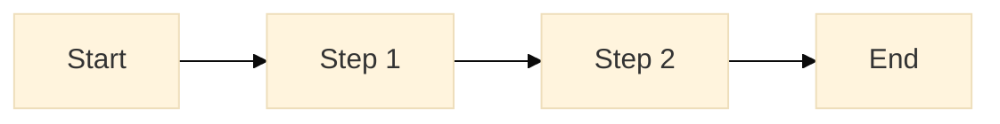

# Research Assets

This directory contains media files and visual artifacts supporting user research.

## Directory Structure

```
assets/
├── images/          # Screenshots, photos, diagrams
├── videos/          # Video recordings (tracked with Git LFS)
├── audio/           # Audio recordings (tracked with Git LFS)
└── diagrams/        # Workflow diagrams, wireframes, flowcharts
```

## Images (`images/`)

**Purpose**: Visual documentation of user research.

**Contents**:
- Screenshots from user testing sessions
- Photos from workshops and interviews (with consent)
- Exported diagrams and wireframes
- Infographics and data visualizations
- UI mockups shown to users

**Formats**: PNG (preferred for screenshots), JPG (for photos), SVG (for vector graphics)

**Naming Convention**: `YYYY-MM-DD-{type}-{description}.{ext}`
- Example: `2025-12-23-screenshot-deployment-workflow.png`
- Example: `2025-12-23-workshop-journey-map-board.jpg`

**Guidelines**:
- Compress images to reasonable size (< 2MB)
- Use descriptive filenames
- Include alt text in markdown when referencing
- Remove any PII from screenshots (blur names, emails)
- Get consent before photographing people

## Videos (`videos/`)

**Purpose**: Video recordings of research sessions.

**Contents**:
- User testing session recordings
- Demo videos for stakeholder presentations
- Prototype walkthroughs
- Workshop recordings

**Formats**: MP4 (preferred), MOV

**Tracked with Git LFS**: ✅ Videos are automatically tracked by Git LFS (see `.gitattributes`)

**Naming Convention**: `YYYY-MM-DD-{type}-{participant-role}.{ext}`
- Example: `2025-12-23-usability-test-platform-engineer.mp4`
- Example: `2025-12-23-workshop-persona-creation.mp4`

**Guidelines**:
- Obtain explicit consent before recording
- Anonymize filenames (use role, not name)
- Keep files under 100MB when possible
- Compress videos for web (e.g., H.264 codec)
- Store sensitive recordings in secure location (not Git)
- Include brief description in commit message

**Privacy Note**:
- Only commit recordings without identifiable information
- For sensitive recordings, store in secure drive and link in docs
- Delete recordings after 1 year or per policy

## Audio (`audio/`)

**Purpose**: Audio recordings of interviews and discussions.

**Contents**:
- Interview recordings
- Podcast-style research summaries
- Workshop audio

**Formats**: MP3 (preferred), M4A, WAV

**Tracked with Git LFS**: ✅ Audio files are automatically tracked by Git LFS

**Naming Convention**: `YYYY-MM-DD-{type}-{participant-role}.{ext}`
- Example: `2025-12-23-interview-platform-engineer.mp3`
- Example: `2025-12-23-feedback-session-team-lead.m4a`

**Guidelines**:
- Obtain consent before recording
- Anonymize filenames
- Compress to reduce file size (64-128 kbps for speech)
- Transcribe and anonymize before widely sharing
- Store raw recordings securely, outside Git if identifiable

## Diagrams (`diagrams/`)

**Purpose**: Visual representations of processes, systems, and flows.

**Contents**:
- Workflow diagrams
- System architecture diagrams shown to users
- Wireframes from design sessions
- Process flowcharts
- Concept maps

**Formats**:
- Mermaid (`.mmd`) - preferred for version control
- SVG - for exported diagrams
- PNG - for imported or screenshot diagrams

**Naming Convention**: `{type}-{description}.{ext}`
- Example: `workflow-deployment-process.mmd`
- Example: `wireframe-service-catalog-page.svg`

**Guidelines**:
- Use Mermaid for diagrams when possible (text-based, version-friendly)
- Export to PNG/SVG for presentations
- Include source files (e.g., `.drawio`, `.sketch`) if applicable
- Keep diagrams up to date as processes change

## Git LFS Usage

Large files are tracked with Git LFS to keep the repository size manageable.

### LFS-Tracked File Types

Automatically tracked (configured in `.gitattributes`):
- Videos: `*.mp4`, `*.mov`, `*.avi`, `*.mkv`, `*.webm`
- Audio: `*.mp3`, `*.wav`, `*.m4a`, `*.aac`, `*.flac`
- Large images: `*.psd`, `*.ai`, `*.sketch`

### Working with LFS Files

**Initial Setup**:
```bash
# Install Git LFS (one time)
git lfs install

# Clone repository (LFS files downloaded automatically)
git clone https://github.com/paruff/fawkes.git
```

**Pulling LFS Files**:
```bash
# Pull all LFS objects
git lfs pull

# Check LFS status
git lfs status

# List tracked files
git lfs ls-files
```

**Adding LFS Files**:
```bash
# Add file (automatically tracked by LFS based on extension)
git add assets/videos/2025-12-23-demo.mp4

# Commit
git commit -m "Add user testing demo video"

# Push (pushes both Git and LFS objects)
git push
```

### LFS Best Practices

✅ **Do:**
- Keep individual files under 100MB
- Compress videos and audio before committing
- Use descriptive filenames
- Delete unused large files

❌ **Don't:**
- Commit extremely large files (> 500MB)
- Repeatedly commit small changes to large files (creates versions)
- Forget to pull LFS objects after clone

## File Size Guidelines

| Asset Type | Recommended Max Size | Notes |
|------------|----------------------|-------|
| Screenshots (PNG) | 2 MB | Compress if larger |
| Photos (JPG) | 1 MB | Resize and compress |
| SVG Diagrams | 500 KB | Usually much smaller |
| Video (MP4) | 100 MB | Use H.264, compress for web |
| Audio (MP3) | 10 MB | 64-128 kbps for speech |

## Privacy and Consent

### Before Recording

- [ ] Obtain explicit consent to record
- [ ] Explain how recordings will be used
- [ ] Clarify who will have access
- [ ] Offer option to decline recording
- [ ] Provide consent form (signed or email confirmation)

### After Recording

- [ ] Anonymize filenames (use role, not name)
- [ ] Remove or blur PII from videos/screenshots
- [ ] Store identifiable recordings securely (not in Git)
- [ ] Set retention policy (e.g., delete after 1 year)
- [ ] Restrict access to research team only

## Referencing Assets

### In Markdown

**Images**:
```markdown

```

**Videos** (link, not embed):
```markdown
[User testing video](assets/videos/2025-12-23-usability-test-demo.mp4)
```

**Diagrams**:


Or reference diagram file:
```markdown
See workflow diagram: [Deployment Process](assets/diagrams/workflow-deployment-process.png)
```

## Best Practices

✅ **Do:**
- Get consent before recording people
- Anonymize filenames and content
- Compress files to reasonable sizes
- Use descriptive naming conventions
- Delete unused assets
- Link assets in research documents
- Keep assets organized by date and type

❌ **Don't:**
- Commit recordings with PII
- Use generic names (e.g., `video1.mp4`)
- Store extremely large files
- Forget to pull LFS objects
- Skip compression
- Leave old, unused files

## Resources

- [Main Research README](../README.md)
- [Git LFS Documentation](https://git-lfs.github.com/)
- [Mermaid Live Editor](https://mermaid.live/)
- [Image Compression Tools](https://tinypng.com/)
- [Video Compression Tools](https://handbrake.fr/)
