# Journey Map: Developer Onboarding to Fawkes Platform

## Document Information

**Version**: 1.0  
**Last Updated**: December 2025  
**Status**: Active  
**Owner**: Product Team  
**Based on**: User interviews and onboarding observations (Nov-Dec 2025)  
**Related Personas**: [Application Developer](../personas/application-developer.md)

---

## 1. Persona and Scenario

**Persona**: Maria Rodriguez - Application Developer (New Team Member)

**Scenario**: Maria joins the company and needs to learn the Fawkes platform to deploy and manage her team's payment services

**Context**: First week at the company. Has strong Java/Spring Boot experience but limited Kubernetes and platform engineering knowledge. Expected to be productive within 2 weeks.

**Frequency**: Every new developer hire (2-3 per quarter per team)

**Business Value**: Fast onboarding reduces time-to-productivity and improves developer satisfaction. Poor onboarding leads to frustration, errors, and attrition.

---

## 2. Detailed Journey Stages

### Stage 1: Initial Access & Discovery (Day 1, 2 hours)

**Actions**:
1. Receives welcome email with platform access links
2. Sets up laptop with IT department (VPN, SSO credentials)
3. Tries to access Backstage portal - login works
4. Browses Backstage catalog - overwhelmed by number of services
5. Searches for "getting started" - finds multiple conflicting docs
6. Joins platform team's Mattermost channel
7. Attends team onboarding meeting - gets overview but too much info at once

**Thoughts**:
- "Where do I even start?"
- "There are so many services - which ones are mine?"
- "Is this documentation current?"
- "I don't want to bother my teammates with basic questions"

**Emotions**: Overwhelmed 😟 (Intensity: 4/5)

**Pain Points**:
- No clear starting point or guided onboarding path
- Backstage shows all 200+ services without filtering
- Documentation scattered across Confluence, Backstage, GitHub
- Unclear which docs are current vs outdated
- Information overload in first team meeting

**Opportunities**:
- Personalized onboarding checklist based on role
- Smart Backstage filtering (show only team's services initially)
- Single source of truth for documentation
- Interactive tutorial or guided tour
- Onboarding buddy system (explicit assignment)
- Progressive disclosure (learn as you go, not all at once)

**Touchpoints**:
- Email (welcome message)
- Backstage (portal discovery)
- Confluence (documentation)
- Mattermost (team channel)
- Zoom (team meeting)

---

### Stage 2: Environment Setup (Day 1-2, 4 hours)

**Actions**:
1. Follows "Developer Setup" doc in Confluence (last updated 8 months ago)
2. Installs Docker Desktop, kubectl, helm
3. Gets stuck on VPN + kubectl connection - firewall blocks traffic
4. Asks in team channel - teammate shares workaround
5. Clones first repository from GitHub
6. Tries to run service locally - fails due to missing dependencies
7. Spends 30 minutes debugging local environment
8. Discovers some services don't run well locally
9. Teammate suggests using dev environment instead

**Thoughts**:
- "Why isn't this working?"
- "Am I missing something obvious?"
- "How does everyone else do this?"
- "I've wasted half a day on setup"

**Emotions**: Frustrated 😟 (Intensity: 5/5)

**Pain Points**:
- Outdated setup documentation
- Network/firewall issues not documented
- Unclear which services need local dev vs remote
- Dependency management complexity
- No automated setup script or environment validation
- Trial and error approach wastes time

**Opportunities**:
- Automated environment setup script (brew bundle, etc.)
- Pre-flight check that validates connectivity and tools
- Dev containers or Codespaces for consistent environments
- Clear decision tree: when to use local vs remote dev
- Setup documentation as code (tested in CI)
- Video walkthrough of setup process

**Touchpoints**:
- Confluence (setup docs)
- GitHub (code repositories)
- Docker Desktop (local development)
- kubectl (cluster access)
- Mattermost (asking for help)
- Terminal (debugging)

---

### Stage 3: Learning Platform Concepts (Day 2-5, 6 hours total)

**Actions**:
1. Reads through "Platform Architecture" doc - many unfamiliar terms
2. Watches recorded demo of platform features (45 minutes, info-dense)
3. Explores Jenkins - unclear which pipelines are relevant
4. Looks at ArgoCD - confusing visualization, doesn't understand GitOps yet
5. Attends "Platform 101" training session (3 hours)
6. Takes notes but struggles to connect concepts to actual work
7. Shadows senior developer during a deployment
8. Asks clarifying questions - finally starts to understand

**Thoughts**:
- "What's the difference between ArgoCD and Jenkins?"
- "Why do we need both Kubernetes and Helm?"
- "I understand the concepts but not how to apply them"
- "Watching someone do it is way more helpful than reading"

**Emotions**: Confused → Learning 😐 → 😊 (Intensity: 4/5 → 2/5)

**Pain Points**:
- Assumes too much prior knowledge (Kubernetes, GitOps, observability)
- Abstract explanations without concrete examples
- Terminology overload (pods, deployments, releases, sync, etc.)
- No hands-on practice immediately after concepts
- Long training session without breaks
- Unclear how concepts apply to daily work

**Opportunities**:
- Progressive learning path (basics → intermediate → advanced)
- Hands-on labs after each concept section
- Glossary of terms with simple explanations
- Real-world examples from actual team services
- Short video snippets (5-10 min) instead of long recordings
- Interactive sandbox environment for experimentation
- Concept map showing how pieces fit together
- Dojo learning modules with self-paced progression

**Touchpoints**:
- Backstage (documentation)
- Jenkins (CI/CD exploration)
- ArgoCD (GitOps exploration)
- Zoom (training session)
- Colleague shadowing (pair learning)

---

### Stage 4: First Hands-On Task (Week 2, Day 1-3, 8 hours)

**Actions**:
1. Assigned first task: update configuration value in existing service
2. Finds service in Backstage catalog
3. Reads service README - unclear where config is managed
4. Discovers config in multiple places (env vars, ConfigMap, secrets)
5. Makes change and creates PR
6. CI pipeline runs - all tests pass
7. Deploys to dev environment via Jenkins
8. Verifies change in dev - works!
9. Gets code review from tech lead - learns about platform conventions
10. Deploys to staging and production with guidance
11. Feels accomplished after successful deployment

**Thoughts**:
- "Finally doing real work!"
- "There are so many files - which one do I change?"
- "Did I break anything?"
- "That actually worked!"
- "I'm starting to get it"

**Emotions**: Nervous → Accomplished 😟 → 😊 (Intensity: 4/5 → 1/5)

**Pain Points**:
- Configuration scattered across multiple files/locations
- Unclear conventions for naming and structure
- No clear indicator of impact/risk of changes
- Nervous about breaking things
- Deployment process still requires hand-holding
- Lack of confidence in changes

**Opportunities**:
- Configuration consolidation or clear documentation of where things live
- Template or schema validation for configuration
- Pre-deployment checks and impact analysis
- Staged rollout with automatic rollback
- "Beginner-friendly" tasks tagged in backlog
- Celebration/recognition of first successful deployment
- Post-deployment health dashboard

**Touchpoints**:
- Backstage (service catalog)
- GitHub (code and PR)
- Jenkins (CI/CD)
- ArgoCD (deployment status)
- Code review (learning conventions)
- Grafana (verification)

---

### Stage 5: Building Confidence (Week 2-4, ongoing)

**Actions**:
1. Takes on increasingly complex tasks
2. Deploys first feature (not just config change)
3. Independently troubleshoots a dev environment issue
4. Asks fewer basic questions, more advanced ones
5. Starts answering questions for newer team members
6. Discovers and uses advanced platform features (tracing, canary)
7. Provides feedback on documentation gaps
8. Feels like a productive team member

**Thoughts**:
- "I can do this on my own now"
- "I remember when this seemed impossible"
- "There's still a lot to learn but I have the foundations"
- "I can help others now"

**Emotions**: Confident 😊 (Intensity: 1/5)

**Pain Points**:
- Still discovering features that would have helped earlier
- Wish I had known about X sooner
- Some advanced concepts still unclear
- Documentation doesn't cover edge cases I encounter

**Opportunities**:
- "Advanced platform features" discovery session
- Monthly platform office hours for Q&A
- Documentation contribution flow (easy to suggest edits)
- Peer learning sessions (brown bags)
- Progressive feature discovery (tips and tricks notifications)
- Mentorship program (formalize the buddy system)

**Touchpoints**:
- Daily development workflow
- Backstage (regular use)
- Jenkins, ArgoCD (confident usage)
- Platform team (occasional questions)
- Documentation (reference and contribution)

---

## 3. Journey Map Visualization

```mermaid
graph TB
    Start([Day 1: Join Company]) --> Stage1[Stage 1: Initial Access & Discovery]
    
    Stage1 --> Stage2[Stage 2: Environment Setup]
    Stage2 --> SetupSuccess{Setup Works?}
    
    SetupSuccess -->|No| Debug1[Debug Environment Issues]
    Debug1 --> AskHelp1[Ask Team for Help]
    AskHelp1 --> Stage2
    
    SetupSuccess -->|Yes| Stage3[Stage 3: Learning Platform Concepts]
    Stage3 --> Training[Attend Platform Training]
    Training --> Shadow[Shadow Senior Dev]
    Shadow --> Stage4[Stage 4: First Hands-On Task]
    
    Stage4 --> FirstDeploy{First Deployment Success?}
    FirstDeploy -->|No| Debug2[Debug with Guidance]
    Debug2 --> Stage4
    
    FirstDeploy -->|Yes| Celebrate[Celebrate First Win! 🎉]
    Celebrate --> Stage5[Stage 5: Building Confidence]
    Stage5 --> Independent[Independent & Productive]
    Independent --> End([Fully Onboarded])
    
    Stage1 -.->|Pain| Pain1["Information overload<br/>No clear path"]
    Stage2 -.->|Pain| Pain2["Outdated docs<br/>Environment issues"]
    Stage3 -.->|Pain| Pain3["Too much theory<br/>Not enough practice"]
    Stage4 -.->|Pain| Pain4["Scattered config<br/>Fear of breaking things"]
    Stage5 -.->|Pain| Pain5["Late feature discovery<br/>Documentation gaps"]
    
    Pain1 -.->|Fix| Opp1["Guided onboarding<br/>Personalized checklist"]
    Pain2 -.->|Fix| Opp2["Automated setup<br/>Docs as code"]
    Pain3 -.->|Fix| Opp3["Hands-on labs<br/>Dojo modules"]
    Pain4 -.->|Fix| Opp4["Config schemas<br/>Safe deployment"]
    Pain5 -.->|Fix| Opp5["Feature discovery<br/>Mentorship program"]
    
    style Start fill:#e1f5e1
    style End fill:#90EE90
    style Celebrate fill:#FFD700
    style Pain1 fill:#ffe1e1
    style Pain2 fill:#ffe1e1
    style Pain3 fill:#ffe1e1
    style Pain4 fill:#ffe1e1
    style Pain5 fill:#ffe1e1
    style Opp1 fill:#e1e5ff
    style Opp2 fill:#e1e5ff
    style Opp3 fill:#e1e5ff
    style Opp4 fill:#e1e5ff
    style Opp5 fill:#e1e5ff
```

---

## 4. Emotional Journey Graph

```mermaid
%%{init: {'theme':'base', 'themeVariables': {'fontSize':'16px'}}}%%
graph LR
    subgraph "Emotional Intensity Over Time"
        S1["Day 1<br/>Discovery<br/>😟 4/5"] --> S2["Day 1-2<br/>Setup<br/>😟 5/5"]
        S2 --> S3["Day 2-5<br/>Learning<br/>😐→😊 4/5→2/5"]
        S3 --> S4["Week 2<br/>First Task<br/>😟→😊 4/5→1/5"]
        S4 --> S5["Week 2-4<br/>Confidence<br/>😊 1/5"]
    end
    
    style S1 fill:#FFA500
    style S2 fill:#FF6B6B
    style S3 fill:#98D8C8
    style S4 fill:#90EE90
    style S5 fill:#90EE90
```

---

## 5. Summary: Key Insights

### Biggest Pain Points (Prioritized)

1. **Environment Setup Complexity** - Outdated docs, undocumented issues, no automation
2. **Information Overload** - Too much at once, no clear learning path
3. **Scattered Documentation** - Multiple sources, unclear what's current
4. **Theory-Heavy Learning** - Not enough hands-on practice with real examples
5. **Hidden Platform Capabilities** - Features discovered too late or not at all

### Quick Wins (High Impact, Low Effort)

1. Automated environment setup script with validation
2. Single onboarding checklist with clear progression
3. Update and consolidate "Getting Started" documentation
4. Create 5-minute video walkthroughs for key tasks
5. Explicit buddy assignment in first week
6. Backstage smart filtering (show only relevant services)

### Strategic Improvements (High Impact, Higher Effort)

1. Interactive onboarding tutorial in Backstage
2. Hands-on Dojo learning labs for platform concepts
3. Dev containers/Codespaces for zero-setup development
4. Progressive learning path with badges/certifications
5. Unified documentation platform (single source of truth)
6. Onboarding analytics to identify and fix bottlenecks

### Success Metrics

- **Time to first successful deployment**: Target < 3 days (currently ~7-10 days)
- **Time to independence**: Target < 2 weeks (currently ~3-4 weeks)
- **New hire satisfaction**: Target > 8/10 (currently ~6/10)
- **Support requests from new hires**: Target < 10 in first month (currently ~25-30)
- **Documentation accuracy**: Target > 95% (currently ~70%)
- **Environment setup success rate**: Target > 90% first try (currently ~40%)

---

## 6. Validated Insights from User Research

### Direct Quotes from Interviews

> "My first week was overwhelming. I didn't know where to start, and the documentation assumed I already knew things I didn't." - Application Developer, 3 months tenure

> "The environment setup took me two full days. I kept hitting issues that weren't in the docs. My teammate finally just screen-shared and walked me through it." - Application Developer, 2 months tenure

> "I wish there was a clear checklist: 'Do step 1, then step 2, then step 3.' Instead, I had to piece together information from multiple places." - Application Developer, 1 month tenure

> "The platform training was good, but it was a lot to absorb in one sitting. Hands-on labs right after would have helped it stick." - Application Developer, 4 months tenure

> "I'm still discovering platform features months later that would have saved me time if I'd known about them earlier." - Application Developer, 6 months tenure

### Validation with Personas

This journey map aligns with:
- **Application Developer persona** (Maria Rodriguez): Pain points match documented frustrations
- **Platform Developer persona** (Alex Chen): Supports goal of reducing developer support requests

---

## 7. Improvement Roadmap

### Phase 1 (Month 1) - Quick Wins
- [ ] Create comprehensive onboarding checklist
- [ ] Update and consolidate getting started docs
- [ ] Implement automated setup script
- [ ] Assign explicit onboarding buddies
- [ ] Add Backstage filtering for new users

### Phase 2 (Month 2-3) - Enhanced Experience
- [ ] Create video walkthrough library
- [ ] Build hands-on sandbox environment
- [ ] Develop beginner-friendly task backlog
- [ ] Implement onboarding feedback survey
- [ ] Create platform glossary

### Phase 3 (Month 4-6) - Strategic Improvements
- [ ] Build interactive Backstage onboarding tour
- [ ] Develop Dojo learning modules
- [ ] Implement dev containers
- [ ] Create progressive learning path with certifications
- [ ] Build onboarding analytics dashboard

---

## 8. Related Documentation

- [Application Developer Persona](../personas/application-developer.md)
- [Platform Developer Persona](../personas/platform-developer.md)
- [Developer Onboarding Interview Guide](../interviews/application-developer-interview-guide.md)
- [Fawkes Dojo Learning Modules](../../dojo/README.md)
- [Backstage Developer Portal](../../architecture.md#developer-experience-layer)

---

## 9. Changelog

- **2025-12**: Initial creation based on 8 developer interviews and onboarding observations
