# Journey Map: Deploying First App to Production

## Document Information

**Version**: 1.0  
**Last Updated**: December 2025  
**Status**: Active  
**Owner**: Product Team  
**Based on**: User interviews and deployment observations (Nov-Dec 2025)  
**Related Personas**: [Application Developer](../personas/application-developer.md)

---

## 1. Persona and Scenario

**Persona**: Maria Rodriguez - Application Developer

**Scenario**: Deploy a new notification microservice to production for the first time (not just updating existing service)

**Context**: Completed development of notification service that sends email and SMS alerts. Tested locally and in dev environment. Sprint deadline tomorrow. First time deploying a completely new service from scratch.

**Frequency**: Deploying new service happens 2-4 times per year for typical developer

**Business Value**: Efficient deployments demonstrate platform maturity (DORA metric). Poor deployment experience causes delays, errors, and developer burnout.

---

## 2. Detailed Journey Stages

### Stage 1: Pre-Deployment Planning (Day before, 1 hour)

**Actions**:
1. Reviews "Deployment Checklist" from Confluence
2. Discusses deployment plan with tech lead in standup
3. Checks if all dependencies (database, message queue) are ready
4. Identifies deployment time window (9am-11am next day)
5. Reads through production deployment runbook
6. Prepares rollback plan
7. Posts deployment plan in team Mattermost channel

**Thoughts**:
- "What if I miss something critical?"
- "Is 2 hours enough time?"
- "Should I deploy during standup so team is available?"
- "What could go wrong?"

**Emotions**: Anxious 😟 (Intensity: 3/5)

**Pain Points**:
- Deployment checklist is generic (not service-specific)
- Unclear exactly what needs to be prepared
- No automated validation of readiness
- Rollback procedure is manual and vague
- Deployment windows are self-imposed (no guidance)

**Opportunities**:
- Automated pre-deployment readiness check
- Service-specific deployment checklist generation
- One-click rollback capability
- Smart deployment window recommendation (based on traffic patterns)
- Deployment plan template with risk assessment

**Touchpoints**:
- Confluence (checklist and runbook)
- Mattermost (team communication)
- Standup (verbal discussion)
- Calendar (scheduling)

---

### Stage 2: Creating Service Manifests (2-3 hours)

**Actions**:
1. Searches for "how to create new service" in docs
2. Finds example service repo to copy from
3. Creates new repo from template (or copies structure manually)
4. Writes Kubernetes deployment manifest (YAML)
5. Configures service discovery and ingress rules
6. Sets up environment-specific configs (dev/staging/prod)
7. Defines resource limits after guessing appropriate values
8. Configures secrets for database and API keys
9. Sets up health checks and readiness probes
10. Creates Helm chart or Kustomize overlays
11. Asks platform team about ingress configuration (waits 2 hours for response)
12. Makes several trial-and-error attempts to get YAML syntax right

**Thoughts**:
- "There must be a generator for this"
- "How much memory does this service actually need?"
- "Am I following the same conventions as everyone else?"
- "Why is YAML so error-prone?"
- "I hope I'm not creating security issues"

**Emotions**: Frustrated 😟 (Intensity: 4/5)

**Pain Points**:
- No service scaffolding tool (manual YAML creation)
- Copy-paste from other services is brittle and error-prone
- Resource sizing is guesswork (no recommendations)
- Kubernetes concepts are complex for app developers
- Ingress/networking requires platform team expertise
- No real-time validation (find errors only when deploying)
- Security best practices not encoded in templates

**Opportunities**:
- Service creation wizard in Backstage
- Golden path templates for common service types
- Resource recommendation engine based on similar services
- Built-in YAML validation and linting
- Self-service ingress configuration with guardrails
- Security policy enforcement at creation time
- Interactive CLI tool (like `create-react-app`)

**Touchpoints**:
- Documentation (searching for examples)
- GitHub (template repos)
- Text editor (YAML authoring)
- Mattermost (platform team support)
- kubectl (local validation)

---

### Stage 3: Initial Deployment to Dev (1 hour)

**Actions**:
1. Commits manifests to feature branch
2. Creates PR for review
3. CI pipeline runs - linting passes
4. Merges to main (or dev branch)
5. Watches ArgoCD for automatic sync
6. ArgoCD syncs but pods fail to start
7. Checks pod status - sees "ImagePullBackOff"
8. Realizes container registry path is wrong
9. Fixes registry path and commits again
10. Pods start but crash immediately (CrashLoopBackOff)
11. Looks at pod logs in kubectl
12. Discovers missing environment variable
13. Adds missing config and redeploys
14. Service finally starts successfully
15. Tests endpoints with curl - works!

**Thoughts**:
- "Why are there so many ways this can fail?"
- "What does 'ImagePullBackOff' mean?"
- "Where are the logs?"
- "Is this normal or am I doing something wrong?"
- "Finally!"

**Emotions**: Stressed → Relieved 😟 → 😊 (Intensity: 5/5 → 2/5)

**Pain Points**:
- Cryptic Kubernetes error messages
- Multiple failure modes (image pull, startup, config)
- Trial and error debugging cycle
- Logs are hard to find (need kubectl commands)
- No clear guidance on what went wrong
- Each fix requires full commit + deploy cycle

**Opportunities**:
- Plain-English error explanations with troubleshooting steps
- Real-time deployment status dashboard
- Integrated log viewer in Backstage
- Pre-deployment validation (catch issues before deploying)
- Fast iteration cycle for config changes
- Deployment notification with status updates

**Touchpoints**:
- GitHub (code commits)
- CI pipeline (validation)
- ArgoCD (sync status)
- kubectl (debugging)
- Pod logs (troubleshooting)

---

### Stage 4: Testing in Staging (1 hour)

**Actions**:
1. Promotes changes to staging branch/environment
2. ArgoCD syncs staging environment
3. Service deploys successfully (lessons learned from dev)
4. Runs integration tests against staging
5. One test fails - discovers configuration difference
6. Updates staging config
7. Re-runs tests - all pass
8. Manually tests with Postman (smoke tests)
9. Checks Grafana dashboard for errors/metrics
10. Asks QA team to verify staging deployment
11. Gets approval from tech lead to proceed to production

**Thoughts**:
- "Staging should be exactly like production, but is it?"
- "Are these test failures real or environmental?"
- "What if production has different issues?"
- "Am I testing enough?"

**Emotions**: Cautious 😐 (Intensity: 3/5)

**Pain Points**:
- Configuration drift between environments
- Manual testing is time-consuming
- Unclear what "ready for production" means
- No automated smoke tests post-deployment
- QA availability becomes bottleneck
- Approval process is manual (Slack messages)

**Opportunities**:
- Automated smoke tests run after deployment
- Environment parity validation
- Clear deployment gates with automated checks
- Self-service promotion with automatic validation
- Staging-to-prod diff view
- Deployment approval workflow in Backstage

**Touchpoints**:
- ArgoCD (staging deployment)
- Test suite (integration tests)
- Postman (manual testing)
- Grafana (metrics validation)
- Mattermost (QA coordination and approvals)

---

### Stage 5: Production Deployment (2-3 hours including monitoring)

**Actions**:
1. Final review of production manifests
2. Posts in team channel: "Starting production deployment"
3. Merges staging changes to production branch
4. ArgoCD syncs production (GitOps automatic deployment)
5. Watches deployment progress anxiously
6. Pods roll out one by one (good - rolling update working)
7. New pods become healthy, old pods terminate
8. No errors in logs so far
9. Tests production endpoint - responds correctly
10. Watches Grafana dashboard (refreshing every 30 seconds)
11. Monitors error rates, latency, throughput
12. After 15 minutes, everything looks stable
13. Gradually routes more traffic to new service
14. No spike in errors or alerts
15. After 1 hour, declares deployment successful
16. Posts success message to team
17. Updates deployment log in Confluence

**Thoughts**:
- "Please don't break production"
- "Is that error spike normal?"
- "How long should I keep watching?"
- "When can I say it's done?"
- "That went better than expected!"

**Emotions**: Anxious → Relieved 😟 → 😊 (Intensity: 4/5 → 1/5)

**Pain Points**:
- All-or-nothing deployment (no gradual rollout)
- Manual traffic shifting
- Unclear when to stop monitoring
- No automatic rollback on errors
- Must stay online to monitor (even if outside work hours)
- Manual status updates to team

**Opportunities**:
- Canary deployments with automatic traffic shifting
- Automated rollback if error rate exceeds threshold
- Clear "deployment complete and healthy" signal
- Scheduled deployment windows (prevent evening/weekend deploys)
- Automatic status updates in Mattermost
- Deployment health scorecard

**Touchpoints**:
- GitHub (production branch merge)
- ArgoCD (deployment orchestration)
- kubectl (status checking)
- Grafana (metrics monitoring)
- Mattermost (team updates)
- Production logs (error checking)

---

### Stage 6: Post-Deployment Monitoring (Next day, 30 minutes)

**Actions**:
1. Checks metrics first thing in the morning
2. Reviews overnight logs for any errors
3. Validates business metrics (emails/SMS sent successfully)
4. Checks for any alerts that fired
5. Reviews SLI/SLO dashboard
6. Updates team in standup - deployment successful
7. Closes deployment ticket in Jira
8. Adds notes to deployment runbook (lessons learned)

**Thoughts**:
- "Did everything stay healthy overnight?"
- "Any surprises in production traffic?"
- "What did I learn for next time?"
- "Glad that's over!"

**Emotions**: Satisfied 😊 (Intensity: 1/5)

**Pain Points**:
- Manual overnight monitoring required
- No proactive "all clear" notification
- Business metrics in different system from technical metrics
- Unclear baseline for "healthy" service
- Lessons learned don't automatically improve process

**Opportunities**:
- Automated 24-hour deployment health report
- Proactive notification when deployment is fully validated
- Unified dashboard (technical + business metrics)
- Automatic baseline establishment for new services
- Lessons learned captured in deployment metadata
- Post-deployment retrospective template

**Touchpoints**:
- Grafana (metrics review)
- Logs (error checking)
- Business dashboard (business metrics)
- Standup (team update)
- Jira (ticket closure)
- Confluence (documentation update)

---

## 3. Journey Map Visualization

```mermaid
graph TB
    Start([Goal: Deploy New Service to Production]) --> Stage1[Stage 1: Pre-Deployment Planning]
    
    Stage1 --> Stage2[Stage 2: Creating Service Manifests]
    Stage2 --> PlatformHelp{Need Platform Team?}
    PlatformHelp -->|Yes| Wait1[Wait for Response]
    Wait1 --> Stage2
    
    PlatformHelp -->|No| Stage3[Stage 3: Deploy to Dev]
    Stage3 --> DevSuccess{Dev Deploy Success?}
    
    DevSuccess -->|No| Debug1[Debug: Image, Config, or Startup Issues]
    Debug1 --> FixDev[Fix and Redeploy]
    FixDev --> Stage3
    
    DevSuccess -->|Yes| Stage4[Stage 4: Deploy to Staging]
    Stage4 --> StageSuccess{Tests Pass?}
    
    StageSuccess -->|No| Debug2[Debug Test Failures]
    Debug2 --> FixStage[Fix Config/Code]
    FixStage --> Stage4
    
    StageSuccess -->|Yes| Approval[Get Approval]
    Approval --> Stage5[Stage 5: Production Deployment]
    
    Stage5 --> Monitor[Monitor Metrics Closely]
    Monitor --> ProdHealthy{Healthy After 1hr?}
    
    ProdHealthy -->|No| Rollback[Rollback to Previous Version]
    Rollback --> Debug3[Investigate Root Cause]
    Debug3 --> FixProd[Fix Issues]
    FixProd --> Stage5
    
    ProdHealthy -->|Yes| Success[Deployment Successful! 🎉]
    Success --> Stage6[Stage 6: Post-Deployment Monitoring]
    Stage6 --> End([Service in Production])
    
    Stage1 -.->|Pain| Pain1["Generic checklist<br/>No automation"]
    Stage2 -.->|Pain| Pain2["Manual YAML<br/>Resource guessing"]
    Stage3 -.->|Pain| Pain3["Cryptic errors<br/>Trial and error"]
    Stage4 -.->|Pain| Pain4["Manual testing<br/>Config drift"]
    Stage5 -.->|Pain| Pain5["Manual monitoring<br/>No auto-rollback"]
    Stage6 -.->|Pain| Pain6["Manual validation<br/>No health report"]
    
    Pain1 -.->|Fix| Opp1["Auto readiness check<br/>Smart checklist"]
    Pain2 -.->|Fix| Opp2["Service wizard<br/>Resource recommendations"]
    Pain3 -.->|Fix| Opp3["Clear errors<br/>Pre-deploy validation"]
    Pain4 -.->|Fix| Opp4["Auto smoke tests<br/>Parity validation"]
    Pain5 -.->|Fix| Opp5["Canary deploy<br/>Auto rollback"]
    Pain6 -.->|Fix| Opp6["Health report<br/>Auto notification"]
    
    style Start fill:#e1f5e1
    style End fill:#90EE90
    style Success fill:#FFD700
    style Pain1 fill:#ffe1e1
    style Pain2 fill:#ffe1e1
    style Pain3 fill:#ffe1e1
    style Pain4 fill:#ffe1e1
    style Pain5 fill:#ffe1e1
    style Pain6 fill:#ffe1e1
    style Opp1 fill:#e1e5ff
    style Opp2 fill:#e1e5ff
    style Opp3 fill:#e1e5ff
    style Opp4 fill:#e1e5ff
    style Opp5 fill:#e1e5ff
    style Opp6 fill:#e1e5ff
```

---

## 4. Emotional Journey Graph

```mermaid
%%{init: {'theme':'base', 'themeVariables': {'fontSize':'16px'}}}%%
graph LR
    subgraph "Emotional Intensity Over Time"
        S1["Planning<br/>Day Before<br/>😟 3/5"] --> S2["Manifests<br/>2-3 hrs<br/>😟 4/5"]
        S2 --> S3["Dev Deploy<br/>1 hr<br/>😟→😊 5/5→2/5"]
        S3 --> S4["Staging<br/>1 hr<br/>😐 3/5"]
        S4 --> S5["Production<br/>2-3 hrs<br/>😟→😊 4/5→1/5"]
        S5 --> S6["Next Day<br/>30 min<br/>😊 1/5"]
    end
    
    style S1 fill:#FFD700
    style S2 fill:#FFA500
    style S3 fill:#98D8C8
    style S4 fill:#FFD700
    style S5 fill:#90EE90
    style S6 fill:#90EE90
```

---

## 5. Summary: Key Insights

### Biggest Pain Points (Prioritized)

1. **Manual Service Configuration** - Writing YAML from scratch, no templates or wizards
2. **Cryptic Error Messages** - Kubernetes errors are unclear, hard to troubleshoot
3. **Resource Sizing Guesswork** - No recommendations or historical data
4. **Manual Deployment Process** - Time-consuming, stressful, error-prone
5. **Unclear Success Criteria** - When is it safe to stop monitoring?
6. **No Safety Net** - Manual rollback, no gradual rollout

### Quick Wins (High Impact, Low Effort)

1. Improve error messages with troubleshooting links
2. Create service template repository with examples
3. Add pre-deployment validation in CI pipeline
4. Implement deployment notifications in Mattermost
5. Create deployment health dashboard in Grafana
6. Document resource sizing guidelines

### Strategic Improvements (High Impact, Higher Effort)

1. Build service scaffolding wizard in Backstage
2. Implement canary deployments with automatic rollback
3. Create resource recommendation engine
4. Build integrated log/metrics viewer in Backstage
5. Implement GitOps with progressive delivery
6. Create automated smoke test framework

### Success Metrics

- **Time to deploy new service**: Target < 4 hours (currently 8-10 hours)
- **First-time deployment success rate**: Target > 80% (currently ~40%)
- **Developer confidence rating**: Target > 8/10 (currently ~5/10)
- **Failed deployments**: Target < 5% (currently ~20%)
- **Time to recover from failed deployment**: Target < 5 minutes (currently ~30 minutes)
- **Platform team support requests per deployment**: Target < 1 (currently ~3-4)

---

## 6. Validated Insights from User Research

### Direct Quotes from Interviews

> "Deploying a new service is terrifying. There are so many things that can go wrong, and I'm never sure if I've configured everything correctly." - Application Developer, 8 months tenure

> "I wish there was a tool that would just ask me questions and generate all the Kubernetes YAML for me. Copy-pasting from other services feels wrong." - Application Developer, 1 year tenure

> "The worst part is not knowing when it's safe to stop watching the dashboard. I've stayed online until 9pm just monitoring a deployment." - Application Developer, 6 months tenure

> "When something fails in dev, the error messages are useless. 'CrashLoopBackOff' doesn't tell me what's actually wrong." - Application Developer, 4 months tenure

> "I've deployed the same service three times now (different projects), and I still don't have a good process for it. Every time feels like starting from scratch." - Application Developer, 2 years tenure

### Validation with Personas

This journey map aligns with:
- **Application Developer persona** (Maria Rodriguez): Matches documented pain points around deployment complexity and unclear capabilities
- **Platform Developer persona** (Alex Chen): Supports goal of enabling self-service and reducing support requests

---

## 7. Improvement Roadmap

### Phase 1 (Month 1) - Quick Wins
- [ ] Create service template repository with examples
- [ ] Improve Kubernetes error messages (custom error catalog)
- [ ] Add pre-deployment validation to CI pipeline
- [ ] Implement deployment notifications
- [ ] Create deployment health dashboard
- [ ] Document resource sizing guidelines

### Phase 2 (Month 2-3) - Enhanced Experience
- [ ] Build service creation CLI tool
- [ ] Implement automated smoke tests
- [ ] Create integrated log viewer in Backstage
- [ ] Add deployment gates with automatic checks
- [ ] Build deployment approval workflow
- [ ] Create deployment runbook templates

### Phase 3 (Month 4-6) - Strategic Improvements
- [ ] Build service scaffolding wizard in Backstage
- [ ] Implement canary deployments
- [ ] Create resource recommendation engine
- [ ] Build automatic rollback on errors
- [ ] Implement progressive delivery (Flagger/Argo Rollouts)
- [ ] Create deployment analytics and insights

---

## 8. Related Documentation

- [Application Developer Persona](../personas/application-developer.md)
- [Platform Developer Persona](../personas/platform-developer.md)
- [Developer Onboarding Journey Map](01-developer-onboarding.md)
- [Debugging Production Issue Journey Map](03-debugging-production-issue.md)
- [ArgoCD GitOps Setup](../../deployment/argocd-setup.md)
- [Service Creation Guidelines](../../how-to/create-new-service.md)

---

## 9. Changelog

- **2025-12**: Initial creation based on 8 developer interviews and deployment observations
