# Journey Map: Debugging Production Issue

## Document Information

**Version**: 1.0
**Last Updated**: December 2025
**Status**: Active
**Owner**: Product Team
**Based on**: User interviews and incident observations (Nov-Dec 2025)
**Related Personas**: [Application Developer](../personas/application-developer.md), [Platform Developer](../personas/platform-developer.md)

---

## 1. Persona and Scenario

**Persona**: Maria Rodriguez - Application Developer

**Scenario**: Production alert fires for payment service showing increased error rate. Need to investigate and resolve quickly.

**Context**: 3pm on Tuesday. Maria is in the middle of feature development. Alert fires in Mattermost - payment validation service error rate jumped from 0.1% to 15%. This is customer-impacting.

**Frequency**: Production issues occur 1-2 times per month per team

**Business Value**: Fast incident resolution is critical for customer satisfaction and revenue. Poor debugging experience leads to longer outages and frustrated developers.

---

## 2. Detailed Journey Stages

### Stage 1: Alert Reception & Initial Assessment (5 minutes)

**Actions**:

1. Alert notification arrives in Mattermost
2. Alert message shows: "High Error Rate: payment-service"
3. Clicks on Grafana dashboard link in alert
4. Sees error rate graph - spike started 10 minutes ago
5. Checks if other team members have acknowledged
6. Posts in team channel: "I'm looking into payment-service errors"
7. Opens incident in incident management system
8. Classifies as Severity 2 (customer-impacting, not total outage)

**Thoughts**:

- "What changed recently?"
- "Is this customer-facing or internal?"
- "Do I need to escalate immediately?"
- "Where do I even start?"

**Emotions**: Alarmed 😟 (Intensity: 4/5)

**Pain Points**:

- Alert lacks context (which endpoints? which errors? since when?)
- Not immediately clear if it's customer-facing
- Manual incident creation and classification
- Unclear severity guidelines
- No automatic correlation with recent deployments

**Opportunities**:

- Rich alert context (affected endpoints, error types, timeline)
- Automatic severity classification based on customer impact
- Auto-created incident with pre-filled details
- Link alert to recent changes (deployments, config changes)
- Suggested runbooks based on alert type

**Touchpoints**:

- Mattermost (alert notification)
- Grafana (dashboard)
- Incident management system
- Team channel (coordination)

---

### Stage 2: Finding Relevant Logs (15 minutes)

**Actions**:

1. Opens Kibana (log aggregation system)
2. Searches for "payment-service" - gets 100,000+ results
3. Adds time filter (last 30 minutes) - still 10,000+ results
4. Tries to filter by log level "ERROR" - some, but not all, errors have this
5. Searches for specific error keywords from Grafana
6. Finds relevant error messages but they're cryptic
7. Realizes errors are from a dependency (database service)
8. Switches to database service logs
9. Finds connection timeout errors
10. Tries to correlate timestamps between services - difficult
11. Asks platform team for help finding specific traces

**Thoughts**:

- "There's too much noise in the logs"
- "Are these errors related or separate issues?"
- "Why are the timestamps in different formats?"
- "Is this a database problem or our service problem?"
- "I'm wasting time searching instead of fixing"

**Emotions**: Frustrated 😟 (Intensity: 5/5)

**Pain Points**:

- Log searching is manual and time-consuming
- Too much log noise (no filtering for relevant entries)
- Multiple log sources (application, infrastructure, dependencies)
- Difficult to correlate logs across services
- No trace IDs in logs for distributed tracing
- Error messages don't provide enough context

**Opportunities**:

- Integrated log viewer with smart filtering
- Automatic correlation of related logs across services
- Distributed tracing with trace IDs in all logs
- Click from metric spike directly to relevant logs
- Log search suggestions based on alert context
- Structured logging with consistent formats

**Touchpoints**:

- Kibana (log search)
- Multiple service logs
- Platform team (asking for help)
- Grafana (cross-referencing metrics)

---

### Stage 3: Root Cause Analysis (20 minutes)

**Actions**:

1. With help, finds trace IDs in logs
2. Opens Jaeger (distributed tracing)
3. Searches for failing traces
4. Sees payment-service → database-service call taking 30+ seconds
5. Database service returning timeout errors
6. Checks database metrics in Grafana
7. Database CPU is normal, connections are maxed out
8. Reviews recent changes to payment-service
9. Discovers recent deployment increased batch size
10. Realizes larger batches hold database connections longer
11. Confirms root cause: connection pool exhaustion

**Thoughts**:

- "Finally, I'm getting somewhere"
- "Why didn't I see this earlier?"
- "How do I fix this quickly?"
- "Is this happening in other services too?"

**Emotions**: Focused → Relieved 😐 → 😊 (Intensity: 4/5 → 2/5)

**Pain Points**:

- Had to use 3 different tools (Kibana, Grafana, Jaeger)
- Manual correlation between tools
- No automatic root cause suggestions
- Difficult to see impact of recent changes
- No similar incident history or suggestions
- Platform team assistance required

**Opportunities**:

- Unified observability view (metrics, logs, traces)
- Automatic root cause analysis suggestions
- Show recent deployments/changes in incident view
- Similar incident detection ("this looks like incident #123")
- Service dependency visualization in real-time
- Anomaly detection (flag unusual patterns automatically)

**Touchpoints**:

- Jaeger (distributed tracing)
- Grafana (metrics correlation)
- Kibana (log analysis)
- GitHub (recent changes review)
- Platform team (expert assistance)

---

### Stage 4: Implementing Fix (30 minutes)

**Actions**:

1. Identifies two options: rollback or quick fix
2. Decides on quick fix (increase connection pool size)
3. Updates service configuration (environment variable)
4. Creates PR with urgent tag
5. Skips normal review process (incident response)
6. CI pipeline runs - tests pass
7. Deploys to production via ArgoCD
8. Watches deployment progress
9. New pods roll out with updated config
10. Monitors error rate - starts decreasing
11. After 5 minutes, error rate back to normal
12. Declares incident resolved

**Thoughts**:

- "Should I rollback or fix forward?"
- "Is this safe to deploy without full review?"
- "How fast can I get this to production?"
- "Please let this work"
- "Yes! It's working!"

**Emotions**: Stressed → Relieved 😟 → 😊 (Intensity: 5/5 → 1/5)

**Pain Points**:

- Unclear rollback vs. fix-forward decision criteria
- Manual configuration changes
- No fast-track deployment process for incidents
- Waiting for CI pipeline during active incident
- Manual monitoring of fix effectiveness
- No automated verification of fix

**Opportunities**:

- Incident response mode with fast-track deployment
- Configuration hot-reload without full restart
- Automatic rollback if fix doesn't work
- Skip non-critical CI checks during incidents
- Real-time fix validation dashboard
- A/B testing fix on subset of traffic first

**Touchpoints**:

- Configuration files (service config)
- GitHub (PR creation)
- CI pipeline (testing)
- ArgoCD (deployment)
- Grafana (monitoring fix effectiveness)

---

### Stage 5: Verification & Communication (15 minutes)

**Actions**:

1. Continues monitoring for 10 more minutes
2. Verifies error rate stays at baseline
3. Checks latency - back to normal
4. Reviews business metrics - payment processing recovered
5. Posts update in team channel: "Incident resolved"
6. Updates incident ticket with resolution
7. Thanks platform team for assistance
8. Sends update to stakeholders (product manager)
9. Schedules post-incident review for tomorrow

**Thoughts**:

- "How long should I keep watching?"
- "Are we sure it's fixed?"
- "Who needs to know about this?"
- "What do I need to document?"

**Emotions**: Cautious → Satisfied 😐 → 😊 (Intensity: 2/5 → 1/5)

**Pain Points**:

- Unclear when to declare incident resolved
- Manual status updates to multiple channels
- No template for incident communication
- Stakeholder notification is ad-hoc
- Post-incident review scheduling is manual

**Opportunities**:

- Automatic "all clear" notification after stability period
- Incident status broadcasts to all stakeholders
- Communication templates for different severity levels
- Automatic post-incident review scheduling
- Incident timeline auto-generation
- Customer impact assessment

**Touchpoints**:

- Grafana (continued monitoring)
- Mattermost (team and stakeholder updates)
- Incident management system (documentation)
- Calendar (post-incident review scheduling)

---

### Stage 6: Post-Incident Review (Next day, 1 hour)

**Actions**:

1. Team meets for post-incident review
2. Reviews incident timeline
3. Discusses what went well:
   - Fast alert detection
   - Clear team communication
   - Effective fix
4. Discusses what could improve:
   - Took too long to find logs
   - Manual correlation was time-consuming
   - No early warning before error spike
5. Creates action items:
   - Add distributed tracing to all services
   - Improve alert context
   - Set up connection pool monitoring
6. Documents learnings in incident retrospective
7. Shares with broader engineering team

**Thoughts**:

- "How do we prevent this next time?"
- "What systemic issues did this reveal?"
- "Are we learning from our incidents?"

**Emotions**: Reflective 😐 (Intensity: 2/5)

**Pain Points**:

- Manual incident timeline reconstruction
- Action items often don't get completed
- Learnings stay within team (not shared broadly)
- No tracking of recurring incident patterns
- Post-incident reviews scheduled manually

**Opportunities**:

- Auto-generated incident timeline
- Action item tracking with accountability
- Incident knowledge base (searchable)
- Pattern detection across incidents
- Automatic post-incident review scheduling
- Share learnings platform-wide

**Touchpoints**:

- Zoom/meeting room (review session)
- Incident management system (documentation)
- Confluence (retrospective documentation)
- Jira (action items)

---

## 3. Journey Map Visualization

---

## 4. Emotional Journey Graph

```mermaid
%%{init: {'theme':'base', 'themeVariables': {'fontSize':'16px'}}}%%
graph LR
    subgraph "Emotional Intensity Over Time"
        S1["Alert<br/>5 min<br/>😟 4/5"] --> S2["Finding Logs<br/>15 min<br/>😟 5/5"]
        S2 --> S3["Root Cause<br/>20 min<br/>😐→😊 4/5→2/5"]
        S3 --> S4["Fix<br/>30 min<br/>😟→😊 5/5→1/5"]
        S4 --> S5["Verify<br/>15 min<br/>😐→😊 2/5→1/5"]
        S5 --> S6["Review<br/>Next day<br/>😐 2/5"]
    end

    style S1 fill:#FFA500
    style S2 fill:#FF6B6B
    style S3 fill:#98D8C8
    style S4 fill:#90EE90
    style S5 fill:#90EE90
    style S6 fill:#FFD700
```

---

## 5. Summary: Key Insights

### Biggest Pain Points (Prioritized)

1. **Log Search is Too Slow** - Manual searching, too much noise, difficult correlation
2. **Multiple Disconnected Tools** - Must switch between Grafana, Kibana, Jaeger
3. **Lack of Alert Context** - Alerts don't provide enough information to start debugging
4. **No Root Cause Suggestions** - Developers start from scratch every time
5. **Manual Incident Management** - Classification, updates, documentation all manual
6. **Action Items Don't Get Completed** - Post-incident learnings don't drive improvement

### Quick Wins (High Impact, Low Effort)

1. Add more context to alerts (affected endpoints, error examples)
2. Create incident runbook templates
3. Add distributed tracing trace IDs to all logs
4. Create "common issues" troubleshooting guide
5. Implement alert-to-logs deep linking
6. Set up incident communication templates

### Strategic Improvements (High Impact, Higher Effort)

1. Build unified observability dashboard (metrics + logs + traces)
2. Implement AIOps for automatic root cause analysis
3. Create incident response mode with fast-track deployment
4. Build correlation engine across services
5. Implement predictive alerting (warn before problems)
6. Create incident knowledge base with pattern matching

### Success Metrics

- **Mean Time to Detect (MTTD)**: Target < 2 minutes (currently ~5 minutes)
- **Mean Time to Investigate (MTTI)**: Target < 10 minutes (currently ~35 minutes)
- **Mean Time to Resolve (MTTR)**: Target < 30 minutes (currently ~80 minutes)
- **Repeat incidents**: Target < 10% (currently ~30%)
- **Incidents requiring platform team**: Target < 20% (currently ~60%)
- **Post-incident action completion**: Target > 80% (currently ~40%)

---

## 6. Validated Insights from User Research

### Direct Quotes from Interviews

> "The worst part of incidents is just finding the right logs. I spend 80% of my time searching and only 20% actually fixing." - Application Developer, 1 year tenure

> "I have to have three browser windows open: Grafana for metrics, Kibana for logs, and Jaeger for traces. Why can't this be in one place?" - Application Developer, 8 months tenure

> "When an alert fires, I'm always scrambling to figure out what's actually happening. The alert just says 'high error rate' but doesn't tell me which errors or which customers." - Application Developer, 6 months tenure

> "We do post-incident reviews and create action items, but they rarely get prioritized. We keep having the same types of incidents." - Platform Developer, 3 years tenure

> "I wish the platform could just tell me what's wrong instead of making me hunt for it. Sometimes it's obvious from the patterns." - Application Developer, 2 years tenure

### Validation with Personas

This journey map aligns with:

- **Application Developer persona** (Maria Rodriguez): Matches pain point about difficult production troubleshooting
- **Platform Developer persona** (Alex Chen): Matches pain points about observability gaps and alert fatigue

---

## 7. Improvement Roadmap

### Phase 1 (Month 1) - Quick Wins

- [ ] Enhance alert context (add affected components, error samples)
- [ ] Create incident runbook templates
- [ ] Add trace IDs to all service logs
- [ ] Create common issues troubleshooting guide
- [ ] Implement deep linking from alerts to relevant logs
- [ ] Set up incident communication templates

### Phase 2 (Month 2-3) - Enhanced Experience

- [ ] Build unified observability view in Backstage
- [ ] Implement automatic log correlation
- [ ] Create service dependency visualization
- [ ] Build incident timeline auto-generation
- [ ] Implement incident knowledge base
- [ ] Add similar incident detection

### Phase 3 (Month 4-6) - Strategic Improvements

- [ ] Implement AIOps root cause analysis
- [ ] Build incident response mode with fast-track
- [ ] Create predictive alerting
- [ ] Implement automated remediation for common issues
- [ ] Build pattern detection across incidents
- [ ] Create impact assessment automation

---

## 8. Related Documentation

- [Application Developer Persona](../personas/application-developer.md)
- [Platform Developer Persona](../personas/platform-developer.md)
- [Deploying First App Journey Map](02-deploying-first-app.md)
- [Observability Stack Documentation](../../observability/README.md)
- [Incident Response Runbooks](../../runbooks/incident-response.md)
- [Distributed Tracing Setup](../../how-to/distributed-tracing.md)

---

## 9. Changelog

- **2025-12**: Initial creation based on 8 developer interviews and incident observations
