# Journey Map: Requesting Platform Feature

## Document Information

**Version**: 1.0  
**Last Updated**: December 2025  
**Status**: Active  
**Owner**: Product Team  
**Based on**: User interviews and feature request observations (Nov-Dec 2025)  
**Related Personas**: [Application Developer](../personas/application-developer.md), [Platform Consumer](../personas/platform-consumer.md)

---

## 1. Persona and Scenario

**Persona**: Maria Rodriguez - Application Developer

**Scenario**: Need canary deployment capability for safer production rollouts after several incidents with regular deployments

**Context**: After third production incident in 2 months, team discusses need for gradual rollout capability. Maria volunteers to request this from platform team.

**Frequency**: Feature requests occur 2-3 times per quarter per team

**Business Value**: Effective feature request process ensures platform evolves with user needs. Poor process leads to workarounds, shadow IT, and frustrated users.

---

## 2. Detailed Journey Stages

### Stage 1: Identifying the Need (1 week, informal)

**Actions**:
1. Team experiences pain point (deployment incidents)
2. Discusses problem in retrospective
3. Researches solutions online - discovers canary deployments
4. Checks if platform already supports this
5. Searches Backstage documentation - no mention
6. Asks in platform team Mattermost channel - not currently available
7. Discovers other teams have same need
8. Team agrees this would be valuable

**Thoughts**:
- "Are we the only ones who need this?"
- "Maybe this already exists and we don't know about it?"
- "Is this something we should build ourselves?"
- "Will the platform team have time for this?"

**Emotions**: Hopeful 😐 (Intensity: 2/5)

**Pain Points**:
- Unclear what platform currently supports
- No visibility into platform roadmap
- Don't know if others have same need
- Uncertain if request will be prioritized
- No guidance on when to request vs. build yourself

**Opportunities**:
- Platform capability discovery catalog
- Public platform roadmap
- Feature voting/upvoting system
- Community forum to find others with same need
- Clear "build vs. request" decision tree
- Platform office hours for exploratory discussions

**Touchpoints**:
- Team retrospective (problem identification)
- Backstage docs (capability search)
- Mattermost (informal inquiry)
- Google (external research)

---

### Stage 2: Submitting the Request (30 minutes)

**Actions**:
1. Platform team asks Maria to "file a ticket"
2. Searches for where to submit feature requests
3. Finds Jira project for platform requests
4. Clicks "Create Issue"
5. Sees generic issue template
6. Fills out title: "Add canary deployment capability"
7. Description field - unsure what level of detail to provide
8. Writes brief description with rationale
9. Doesn't know what priority/labels to add
10. Submits ticket
11. Gets auto-response "Thanks for your request"
12. No indication of next steps or timeline

**Thoughts**:
- "Is this enough information?"
- "Will they understand why this is important?"
- "What happens next?"
- "How long will this take?"
- "Should I have included more technical details?"

**Emotions**: Uncertain 😐 (Intensity: 3/5)

**Pain Points**:
- No feature request template with guided questions
- Unclear what information to provide
- No prioritization guidance
- Lack of visibility into what happens after submission
- No acknowledgment beyond auto-response
- Can't attach supporting materials easily

**Opportunities**:
- Feature request template with guided prompts
- Request intake form that asks right questions
- Automatic similar request detection
- Impact assessment questions (how many users, business value)
- File attachment support (diagrams, examples)
- Clear next steps communication

**Touchpoints**:
- Jira (feature request submission)
- Mattermost (confirmation from platform team)
- Email (auto-response)

---

### Stage 3: Waiting for Response (2 weeks)

**Actions**:
1. Checks ticket daily - no updates
2. After 1 week, comments on ticket asking for status
3. No response to comment
4. Asks in Mattermost channel for update
5. Platform team member responds: "We'll review it in next planning"
6. After 2 weeks, ticket status changes to "Under Review"
7. No additional context provided
8. Maria follows up asking about timeline
9. Response: "We're evaluating feasibility and priority"

**Thoughts**:
- "Did they even see my request?"
- "Is this important to them?"
- "How do I know if this will ever get built?"
- "Should I keep following up or leave them alone?"
- "Maybe I should just build a workaround"

**Emotions**: Frustrated 😟 (Intensity: 4/5)

**Pain Points**:
- Black box - no visibility into evaluation process
- No communication unless requester asks
- Unclear timeline or expectations
- Feels like request went into a void
- No way to provide additional context proactively
- Considering building workaround due to lack of progress

**Opportunities**:
- Automatic status updates at key milestones
- Transparent evaluation criteria
- Expected timeline ranges by request type
- Platform team office hours for request discussions
- Request status dashboard
- Option to provide additional context if needed
- Notification when similar requests are grouped

**Touchpoints**:
- Jira (checking status)
- Mattermost (status inquiries)
- Email (hoping for updates)

---

### Stage 4: Prioritization Discussion (1 hour meeting)

**Actions**:
1. Platform team invites Maria to planning meeting
2. Team presents feature request to platform team
3. Platform team asks clarifying questions:
   - How many teams need this?
   - What's the business impact?
   - Any compliance requirements?
   - Have you tried alternatives?
4. Maria provides context and use cases
5. Platform team explains technical complexity
6. Discusses timeline: likely 2-3 sprints
7. Platform team agrees to prioritize for Q1
8. Will be included in next roadmap update
9. Platform team will reach out when starting development

**Thoughts**:
- "Finally getting to discuss this properly!"
- "I wish I'd known to include this information from the start"
- "2-3 sprints feels long but at least we have a timeline"
- "Glad they're taking this seriously"

**Emotions**: Hopeful → Satisfied 😐 → 😊 (Intensity: 3/5 → 2/5)

**Pain Points**:
- Meeting required for information that could be async
- Took weeks to get to this conversation
- Initial request template didn't ask for this information
- No standardized business case format
- Timeline is rough estimate, not commitment

**Opportunities**:
- Upfront request template with business case questions
- Async prioritization process with clear criteria
- Feature request scoring rubric (visible to all)
- Video option for complex request explanations
- Impact calculator tool
- Committed timeline once prioritized

**Touchpoints**:
- Zoom/meeting room (prioritization discussion)
- Jira (updated with meeting notes)
- Shared doc (business case documentation)

---

### Stage 5: Development & Updates (2 months)

**Actions**:
1. Request added to platform team backlog
2. Maria doesn't hear anything for 3 weeks
3. Checks Jira - status: "In Progress"
4. No details about what "in progress" means
5. Reaches out to platform team for update
6. Platform team: "We're evaluating Flagger vs. Argo Rollouts"
7. Another 2 weeks - sees activity on related GitHub issues
8. Platform team posts in Mattermost: "Canary deployment POC complete"
9. Invites early adopters to test
10. Maria volunteers team to be early adopter
11. Gets access to beta feature in dev environment

**Thoughts**:
- "It's actually happening!"
- "Wish I knew what was going on without having to ask"
- "Excited to try this out"
- "Hope it works as we envisioned"

**Emotions**: Impatient → Excited 😐 → 😊 (Intensity: 3/5 → 1/5)

**Pain Points**:
- Sparse communication during development
- No visibility into technical decisions or trade-offs
- Must proactively seek updates
- Don't know when feature will be ready
- No involvement in design decisions
- Early adopter invitation was informal (might have missed it)

**Opportunities**:
- Regular development progress updates
- Design review sessions with stakeholders
- Public feature development dashboard
- Early access program with formal invitation
- Demo sessions during development
- Design docs shared with requesters

**Touchpoints**:
- Jira (status checking)
- GitHub (following related issues)
- Mattermost (informal updates)
- Dev environment (beta testing)

---

### Stage 6: Testing & Feedback (2 weeks)

**Actions**:
1. Reads beta documentation for canary deployments
2. Sets up first canary deployment in dev
3. Encounters configuration issue - not well documented
4. Posts question in beta tester channel
5. Platform team member helps troubleshoot
6. Successfully completes first canary deployment
7. Provides feedback on documentation gaps
8. Suggests UI improvement for monitoring canary progress
9. Helps another team set up canaries
10. Participates in feedback session with platform team

**Thoughts**:
- "This is pretty good but needs some polish"
- "Documentation could be clearer"
- "Glad to be involved in shaping this"
- "When can we use this in production?"

**Emotions**: Engaged 😊 (Intensity: 2/5)

**Pain Points**:
- Beta documentation incomplete
- Some rough edges in user experience
- Feedback process is ad-hoc
- Unclear when feature will be production-ready
- No structured way to report issues

**Opportunities**:
- Beta program with clear expectations
- Structured feedback collection (surveys, interviews)
- Issue tracking for beta feedback
- Clear graduation criteria (beta → GA)
- Recognition for beta testers
- Feedback impact transparency (what was changed based on feedback)

**Touchpoints**:
- Beta documentation
- Mattermost beta channel
- Dev environment
- Feedback sessions
- Beta issue tracker

---

### Stage 7: General Availability & Adoption (Ongoing)

**Actions**:
1. Platform team announces GA release of canary deployments
2. Announcement in all-hands and Mattermost
3. Maria's team migrates from beta to GA version
4. Shares success story in team meeting
5. Creates internal guide for team on using canaries
6. Other teams reach out for advice
7. Platform team asks Maria to present at platform demo day
8. Feature becomes standard practice for the team
9. Maria is recognized as platform champion

**Thoughts**:
- "This was worth the wait!"
- "Glad we pushed for this feature"
- "Our deployments are so much safer now"
- "Happy to help others adopt this"

**Emotions**: Proud 😊 (Intensity: 1/5)

**Pain Points**:
- Migration from beta to GA required manual changes
- Some teams don't know feature exists
- No central place to share team learnings
- Recognition was informal

**Opportunities**:
- Automatic migration from beta to GA
- Feature launch campaign (docs, videos, demos)
- Platform newsletter with new features
- User-generated content platform (guides, tips)
- Formal platform champion program
- Success story showcase
- Usage analytics (track adoption)

**Touchpoints**:
- All-hands meeting (announcement)
- Backstage (documentation)
- Mattermost (adoption support)
- Demo day (presentation)
- Production environment (daily use)

---

## 3. Journey Map Visualization

---

## 4. Emotional Journey Graph

```mermaid
%%{init: {'theme':'base', 'themeVariables': {'fontSize':'16px'}}}%%
graph LR
    subgraph "Emotional Intensity Over Time"
        S1["Week 1<br/>Identify Need<br/>😐 2/5"] --> S2["Day 1<br/>Submit Request<br/>😐 3/5"]
        S2 --> S3["Week 2-3<br/>Waiting<br/>😟 4/5"]
        S3 --> S4["Week 4<br/>Discussion<br/>😐→😊 3/5→2/5"]
        S4 --> S5["Month 2-3<br/>Development<br/>😐→😊 3/5→1/5"]
        S5 --> S6["Week 1-2<br/>Beta Testing<br/>😊 2/5"]
        S6 --> S7["Ongoing<br/>GA & Adoption<br/>😊 1/5"]
    end
    
    style S1 fill:#FFD700
    style S2 fill:#FFA500
    style S3 fill:#FF6B6B
    style S4 fill:#98D8C8
    style S5 fill:#90EE90
    style S6 fill:#90EE90
    style S7 fill:#90EE90
```

---

## 5. Summary: Key Insights

### Biggest Pain Points (Prioritized)

1. **Black Box Waiting Period** - No visibility into request status or progress
2. **Upfront Information Gap** - Initial request doesn't capture needed information
3. **Communication Burden on Requester** - Must proactively ask for updates
4. **No Roadmap Visibility** - Can't see what's planned or in progress
5. **Informal Process** - Beta testing, feedback, recognition all ad-hoc
6. **Low Feature Awareness** - Teams don't know what platform offers

### Quick Wins (High Impact, Low Effort)

1. Create feature request template with guided questions
2. Set up automatic status update notifications
3. Publish platform roadmap (even if high-level)
4. Create feature request status dashboard
5. Send regular "new feature" announcements
6. Add feature voting/upvoting capability

### Strategic Improvements (High Impact, Higher Effort)

1. Build request intake process with impact assessment
2. Create transparent prioritization framework
3. Implement formal beta program
4. Build feature development dashboard (public)
5. Create platform champion program
6. Implement usage analytics and adoption tracking

### Success Metrics

- **Time to initial response**: Target < 2 days (currently ~1 week)
- **Time to prioritization decision**: Target < 2 weeks (currently ~4 weeks)
- **Requester satisfaction**: Target > 8/10 (currently ~5/10)
- **Feature adoption rate**: Target > 60% of teams (currently ~30%)
- **Request completion rate**: Target > 70% (currently ~50%)
- **Repeat requests (same feature)**: Target < 5% (currently ~25%)

---

## 6. Validated Insights from User Research

### Direct Quotes from Interviews

> "I submitted a feature request 3 months ago and never heard back. I don't even know if anyone looked at it." - Application Developer, 1 year tenure

> "I wish there was a way to upvote feature requests. I keep seeing the same requests from different teams." - Application Developer, 8 months tenure

> "The platform team does great work, but I have no idea what they're working on or when my request might be addressed." - Product Manager, 2 years tenure

> "I was really excited to beta test the new feature, but the docs were incomplete and I didn't know where to report issues." - Application Developer, 1.5 years tenure

> "We ended up building our own solution because we didn't think the platform request would be prioritized. Now we're stuck maintaining it." - Application Developer, 3 years tenure

### Validation with Personas

This journey map aligns with:
- **Application Developer persona** (Maria Rodriguez): Matches pain point about unclear platform capabilities
- **Platform Consumer persona** (Sarah Kim): Matches pain point about limited visibility into progress
- **Platform Developer persona** (Alex Chen): Supports goal of improving developer self-service and satisfaction

---

## 7. Improvement Roadmap

### Phase 1 (Month 1) - Quick Wins
- [ ] Create feature request template with guided prompts
- [ ] Publish current platform roadmap
- [ ] Set up automatic request status notifications
- [ ] Create request status dashboard
- [ ] Implement feature voting system
- [ ] Set up platform newsletter

### Phase 2 (Month 2-3) - Enhanced Experience
- [ ] Build request intake process with impact assessment
- [ ] Create transparent prioritization criteria
- [ ] Implement scheduled platform office hours
- [ ] Build feature development progress dashboard
- [ ] Create beta program guidelines
- [ ] Implement feedback collection system

### Phase 3 (Month 4-6) - Strategic Improvements
- [ ] Implement formal platform champion program
- [ ] Build usage analytics dashboard
- [ ] Create feature launch playbook
- [ ] Implement community voting on priorities
- [ ] Build request-to-feature traceability
- [ ] Create success story showcase

---

## 8. Related Documentation

- [Application Developer Persona](../personas/application-developer.md)
- [Platform Consumer Persona](../personas/platform-consumer.md)
- [Platform Developer Persona](../personas/platform-developer.md)
- [Contributing to Platform Journey Map](05-contributing-to-platform.md)
- [Platform Roadmap](../../reference/roadmap.md)
- [Feature Request Template](../../templates/feature-request.md)

---

## 9. Changelog

- **2025-12**: Initial creation based on 10 user interviews and feature request analysis
