# Journey Map: Contributing to Platform

## Document Information

**Version**: 1.0
**Last Updated**: December 2025
**Status**: Active
**Owner**: Product Team
**Based on**: User interviews and contribution observations (Nov-Dec 2025)
**Related Personas**: [Application Developer](../personas/application-developer.md), [Platform Developer](../personas/platform-developer.md)

---

## 1. Persona and Scenario

**Persona**: Maria Rodriguez - Application Developer (with 6 months platform experience)

**Scenario**: Wants to contribute a reusable service template to help other teams deploy faster

**Context**: After deploying several services, Maria has developed a well-structured template for REST API microservices. She wants to share it with the broader engineering organization.

**Frequency**: Platform contributions vary: 1-2 per quarter from experienced users

**Business Value**: Community contributions accelerate platform evolution, increase adoption, and build engagement. Poor contribution experience limits innovation and community growth.

---

## 2. Detailed Journey Stages

### Stage 1: Contribution Idea Formation (1 week)

**Actions**:
1. Identifies pattern used across multiple services
2. Discusses with teammates - they think it would be valuable
3. Mentions idea in team retrospective
4. Wonders if this would be useful to other teams
5. Searches for existing contribution process
6. Finds GitHub CONTRIBUTING.md file
7. Reads through it - mostly about code standards and testing
8. Unclear if templates are welcome contributions
9. Posts in platform team Mattermost channel asking if contributions are welcome
10. Platform team responds enthusiastically: "Yes! We'd love contributions"

**Thoughts**:
- "Is this good enough to share?"
- "Will the platform team want this?"
- "Is there a process I should follow?"
- "Am I allowed to contribute to platform repos?"
- "What if my code isn't good enough?"

**Emotions**: Uncertain → Encouraged 😐 → 😊 (Intensity: 3/5 → 2/5)

**Pain Points**:
- Unclear what types of contributions are welcome
- CONTRIBUTING.md focuses on code, not templates/docs
- Don't know if idea is valuable before investing time
- Imposter syndrome (am I experienced enough?)
- No examples of similar contributions
- Uncertain about permissions and access

**Opportunities**:
- Contribution ideas board (see what others are working on)
- "Good first contribution" guidance
- Contribution proposal template
- Early feedback process (validate idea before building)
- Clear contribution categories (code, docs, templates, etc.)
- Showcase of community contributions
- Contributor onboarding guide

**Touchpoints**:
- Team discussion (idea validation)
- GitHub CONTRIBUTING.md (process search)
- Mattermost (asking for permission)
- Platform team (encouragement)

---

### Stage 2: Preparing the Contribution (1 week, ~8 hours)

**Actions**:
1. Forks platform template repository
2. Cleans up template code (removes app-specific logic)
3. Adds parameterization for common values
4. Writes README with usage instructions
5. Creates example configuration
6. Tests template by creating new service from it
7. Asks colleague to review before submitting
8. Colleague suggests improvements
9. Refines based on feedback
10. Prepares to submit PR

**Thoughts**:
- "Is this clean enough?"
- "What level of documentation is expected?"
- "Should I include tests?"
- "Am I following the right conventions?"
- "Hope the platform team likes this"

**Emotions**: Focused → Nervous 😐 → 😟 (Intensity: 2/5 → 3/5)

**Pain Points**:
- No contribution checklist or quality bar
- Unclear what documentation is expected
- Don't know if template structure matches conventions
- No template for template READMEs (meta!)
- Uncertain about testing requirements
- Fear of rejection or criticism

**Opportunities**:
- Contribution quality checklist
- Template contribution guide
- Automated validation (linting, structure check)
- Pre-submission review option
- Clear acceptance criteria
- Contribution examples to learn from
- Supportive community culture

**Touchpoints**:
- GitHub (forking, coding)
- Local development (testing)
- Colleague (peer review)
- Documentation (writing README)

---

### Stage 3: Submitting Pull Request (30 minutes)

**Actions**:
1. Creates PR against main branch
2. Fills out PR template
3. Describes purpose: "Add REST API microservice template"
4. Lists changes and benefits
5. Links to example usage
6. Adds appropriate labels (unsure which ones)
7. Assigns to platform team (not sure who specifically)
8. Posts PR link in platform team channel
9. Waits for review
10. Gets auto-response from CI: some checks running

**Thoughts**:
- "Did I fill out the template correctly?"
- "Who will review this?"
- "How long will this take?"
- "What if they want major changes?"

**Emotions**: Nervous 😟 (Intensity: 3/5)

**Pain Points**:
- PR template is generic (not specific to contribution type)
- Unclear who will review or how long it takes
- Don't know what CI checks are running
- No immediate acknowledgment (beyond bot)
- Uncertain about next steps

**Opportunities**:
- Contribution-specific PR templates
- Automatic reviewer assignment based on contribution type
- Expected review time ranges
- Immediate human acknowledgment (within 1 day)
- Contribution bot that guides next steps
- Clear review criteria published

**Touchpoints**:
- GitHub (PR creation)
- CI pipeline (automated checks)
- Mattermost (notification to team)
- Email (watching PR)

---

### Stage 4: Review and Iteration (1 week)

**Actions**:
1. Platform team member reviews after 2 days
2. Leaves positive comment: "Great idea! Some suggestions..."
3. Requests changes:
   - Add security scanning config
   - Update naming conventions
   - Include Helm values.yaml
   - Add observability defaults
4. Some requests are unclear - asks for clarification
5. Platform team member provides examples
6. Makes requested changes over next 2 days
7. Pushes updates
8. CI checks pass
9. Requests re-review
10. Second review: "Looks great! Just one minor thing..."
11. Makes final tweak
12. Gets approval! 🎉

**Thoughts**:
- "These are good suggestions"
- "Wish some of this was in documentation upfront"
- "They're being really helpful and supportive"
- "Learning a lot from this process"
- "Almost there!"

**Emotions**: Nervous → Learning → Proud 😟 → 😐 → 😊 (Intensity: 3/5 → 2/5 → 1/5)

**Pain Points**:
- Some review feedback assumes knowledge not documented
- Multiple review rounds (could some be caught earlier?)
- Context switching (working on other tasks between reviews)
- No visibility into when reviewer will respond
- Uncertainty about whether approved means ready to merge

**Opportunities**:
- Automated checks for common review feedback
- Contribution guide with all requirements upfront
- Pair contribution sessions (live coding with platform team)
- Review SLA (expected response time)
- Clear approval = merge signal
- Learning resources linked in reviews

**Touchpoints**:
- GitHub (review comments, code changes)
- CI pipeline (automated validation)
- Documentation (researching requirements)
- Mattermost (clarification questions)

---

### Stage 5: Merge and Documentation (2 days)

**Actions**:
1. Platform team merges PR
2. PR gets merged into main branch
3. Maria's contribution is live! 🎉
4. Platform team adds to template catalog
5. Maria updates internal team wiki with link
6. Platform team asks if Maria wants to:
   - Write blog post about contribution
   - Present at platform demo day
   - Join contributor office hours
7. Maria agrees to demo day presentation
8. Platform team publishes changelog with Maria's contribution
9. Maria receives GitHub contributor badge

**Thoughts**:
- "My code is in the platform!"
- "Other teams will use this!"
- "This was a great experience"
- "I want to contribute more"

**Emotions**: Proud 😊 (Intensity: 1/5)

**Pain Points**:
- Not immediately clear that contribution is live
- Manual addition to template catalog
- No automatic notification to potential users
- Recognition was offered but not automatic

**Opportunities**:
- Automatic contributor recognition
- Automatic template catalog update
- New contribution announcement
- Contributor profile page
- Contribution impact metrics (usage stats)
- Gamification (badges, levels)

**Touchpoints**:
- GitHub (merge notification)
- Backstage (template catalog)
- Mattermost (announcement)
- Demo day (presentation)

---

### Stage 6: Post-Contribution Engagement (Ongoing)

**Actions**:
1. Other teams start using the template
2. Receives questions in Mattermost about usage
3. Helps teams troubleshoot
4. Someone opens issue: bug in template
5. Maria fixes bug and submits another PR
6. Bug fix is merged quickly (familiar process now)
7. Another developer improves the template
8. Maria reviews their PR (now trusted community reviewer)
9. Presents contribution at demo day - well received
10. Feels like valued member of platform community

**Thoughts**:
- "People are actually using this!"
- "Glad I can help others succeed"
- "I understand the platform so much better now"
- "What else can I contribute?"

**Emotions**: Fulfilled 😊 (Intensity: 1/5)

**Pain Points**:
- No notification when template is used (miss seeing impact)
- Support questions arrive in different channels
- Unclear expectations for maintaining contribution
- Bug reports sometimes go to platform team, not contributor
- No easy way to see contribution usage stats

**Opportunities**:
- Contribution impact dashboard (usage, feedback)
- Dedicated support channel per contribution
- Clear maintenance expectations and ownership
- Bug routing to original contributor
- Contribution newsletter featuring community work
- Annual contributor recognition event
- Path from contributor to platform team member

**Touchpoints**:
- Mattermost (support questions)
- GitHub (bug fixes, reviews)
- Demo day (presentation)
- Backstage (seeing template in catalog)
- Community (ongoing engagement)

---

## 3. Journey Map Visualization

```mermaid
graph TB
    Start([Identifies Reusable Pattern]) --> Stage1[Stage 1: Contribution Idea Formation]

    Stage1 --> Validate{Idea Welcome?}
    Validate -->|No| Discouraged[Feels Discouraged]
    Discouraged --> ShadowSolution[Keeps Solution Private]

    Validate -->|Yes| Encouraged[Feels Encouraged]
    Encouraged --> Stage2[Stage 2: Preparing Contribution]

    Stage2 --> Quality{Meets Quality Bar?}
    Quality -->|No| Refine[Refine Based on Feedback]
    Refine --> Stage2

    Quality -->|Yes| Stage3[Stage 3: Submitting Pull Request]
    Stage3 --> CIChecks{CI Passes?}

    CIChecks -->|No| FixIssues[Fix CI Issues]
    FixIssues --> Stage3

    CIChecks -->|Yes| Stage4[Stage 4: Review & Iteration]
    Stage4 --> Changes{Changes Requested?}

    Changes -->|Yes| Iterate[Make Changes]
    Iterate --> Stage4

    Changes -->|No| Approved[PR Approved! 🎉]
    Approved --> Stage5[Stage 5: Merge & Documentation]

    Stage5 --> Merged[Contribution Merged]
    Merged --> Recognition[Recognition & Announcement]
    Recognition --> Stage6[Stage 6: Post-Contribution Engagement]

    Stage6 --> Support[Support Other Users]
    Support --> Maintain[Maintain & Improve]
    Maintain --> MoreContributions{Contribute More?}

    MoreContributions -->|Yes| NewIdea[New Contribution Idea]
    NewIdea --> Stage1

    MoreContributions -->|No| End([Valued Community Member])

    Stage1 -.->|Pain| Pain1["Unclear what's welcome<br/>Imposter syndrome"]
    Stage2 -.->|Pain| Pain2["No quality bar<br/>Fear of rejection"]
    Stage3 -.->|Pain| Pain3["Generic template<br/>Unclear timeline"]
    Stage4 -.->|Pain| Pain4["Undocumented requirements<br/>Multiple rounds"]
    Stage5 -.->|Pain| Pain5["Manual catalog update<br/>Ad-hoc recognition"]
    Stage6 -.->|Pain| Pain6["No usage visibility<br/>Unclear maintenance"]

    Pain1 -.->|Fix| Opp1["Contribution guide<br/>Showcase examples"]
    Pain2 -.->|Fix| Opp2["Quality checklist<br/>Pre-review option"]
    Pain3 -.->|Fix| Opp3["Type-specific template<br/>Review SLA"]
    Pain4 -.->|Fix| Opp4["Auto checks<br/>Clear requirements"]
    Pain5 -.->|Fix| Opp5["Auto catalog update<br/>Recognition program"]
    Pain6 -.->|Fix| Opp6["Impact dashboard<br/>Clear ownership"]

    style Start fill:#e1f5e1
    style End fill:#90EE90
    style Approved fill:#FFD700
    style Recognition fill:#FFD700
    style Discouraged fill:#FF6B6B
    style ShadowSolution fill:#FF6B6B
    style Pain1 fill:#ffe1e1
    style Pain2 fill:#ffe1e1
    style Pain3 fill:#ffe1e1
    style Pain4 fill:#ffe1e1
    style Pain5 fill:#ffe1e1
    style Pain6 fill:#ffe1e1
    style Opp1 fill:#e1e5ff
    style Opp2 fill:#e1e5ff
    style Opp3 fill:#e1e5ff
    style Opp4 fill:#e1e5ff
    style Opp5 fill:#e1e5ff
    style Opp6 fill:#e1e5ff
```

---

## 4. Emotional Journey Graph

```mermaid
%%{init: {'theme':'base', 'themeVariables': {'fontSize':'16px'}}}%%
graph LR
    subgraph "Emotional Intensity Over Time"
        S1["Week 1<br/>Form Idea<br/>😐→😊 3/5→2/5"] --> S2["Week 2<br/>Prepare<br/>😐→😟 2/5→3/5"]
        S2 --> S3["Day 1<br/>Submit PR<br/>😟 3/5"]
        S3 --> S4["Week 3<br/>Review<br/>😟→😐→😊 3/5→2/5→1/5"]
        S4 --> S5["Day 1-2<br/>Merge<br/>😊 1/5"]
        S5 --> S6["Ongoing<br/>Engagement<br/>😊 1/5"]
    end

    style S1 fill:#98D8C8
    style S2 fill:#FFD700
    style S3 fill:#FFA500
    style S4 fill:#90EE90
    style S5 fill:#90EE90
    style S6 fill:#90EE90
```

---

## 5. Summary: Key Insights

### Biggest Pain Points (Prioritized)

1. **Unclear Contribution Guidelines** - Don't know what's welcome, quality expectations
2. **Imposter Syndrome** - Fear of not being good enough to contribute
3. **Generic Process** - CONTRIBUTING.md doesn't cover all contribution types
4. **Multiple Review Rounds** - Requirements not clear upfront
5. **Limited Recognition** - Informal and inconsistent
6. **No Usage Visibility** - Can't see contribution impact

### Quick Wins (High Impact, Low Effort)

1. Create contribution types guide (code, docs, templates, etc.)
2. Add "Good first contribution" examples
3. Create contribution proposal template (validate before building)
4. Set review SLA expectations
5. Implement automatic merge notification
6. Add contributor recognition in changelog

### Strategic Improvements (High Impact, Higher Effort)

1. Build contribution impact dashboard
2. Create formal contributor program with levels
3. Implement automated quality checks
4. Build contribution showcase
5. Create pair contribution sessions
6. Implement contributor-specific PR templates

### Success Metrics

- **Time to first contribution**: Target < 2 weeks from idea (currently ~4 weeks)
- **Contribution acceptance rate**: Target > 80% (currently ~60%)
- **Contributor satisfaction**: Target > 9/10 (currently ~7/10)
- **Repeat contributors**: Target > 50% (currently ~30%)
- **Contribution review time**: Target < 3 days (currently ~5 days)
- **Contributors becoming platform team members**: Target 2-3 per year (currently 1)

---

## 6. Validated Insights from User Research

### Direct Quotes from Interviews

> "I wanted to contribute, but I wasn't sure if my code was good enough or if the platform team even wanted contributions." - Application Developer, 8 months tenure

> "The CONTRIBUTING.md talked about code standards, but I wanted to contribute documentation. I didn't know if that was welcome." - Application Developer, 1 year tenure

> "After my contribution was merged, I had no idea if anyone was actually using it. I would love to see metrics on that." - Application Developer, 1.5 years tenure

> "The platform team was super supportive during my first contribution. It made me want to contribute more." - Application Developer, 10 months tenure

> "I gave up on my contribution after the third round of review feedback. I felt like I was wasting their time." - Application Developer, 6 months tenure

### Validation with Personas

This journey map aligns with:
- **Application Developer persona** (Maria Rodriguez): Demonstrates path from platform user to contributor
- **Platform Developer persona** (Alex Chen): Supports goal of building community and sharing platform ownership

---

## 7. Improvement Roadmap

### Phase 1 (Month 1) - Quick Wins
- [ ] Create contribution types guide
- [ ] Add "Good first contribution" examples
- [ ] Create contribution proposal template
- [ ] Set and publish review SLA
- [ ] Implement merge notification system
- [ ] Add contributor recognition in changelog

### Phase 2 (Month 2-3) - Enhanced Experience
- [ ] Create contribution quality checklist
- [ ] Implement automated quality checks
- [ ] Build contribution-specific PR templates
- [ ] Create contribution showcase page
- [ ] Implement pre-submission review option
- [ ] Set up monthly contributor office hours

### Phase 3 (Month 4-6) - Strategic Improvements
- [ ] Build contribution impact dashboard
- [ ] Create formal contributor program (bronze/silver/gold levels)
- [ ] Implement pair contribution sessions
- [ ] Build contributor learning path
- [ ] Create annual contributor recognition event
- [ ] Establish path from contributor to platform team

---

## 8. Related Documentation

- [Application Developer Persona](../personas/application-developer.md)
- [Platform Developer Persona](../personas/platform-developer.md)
- [Requesting Platform Feature Journey Map](04-requesting-platform-feature.md)
- [CONTRIBUTING.md](../../../CONTRIBUTING.md)
- [Platform Contribution Guide](../../how-to/contribute-to-platform.md)
- [Template Creation Guide](../../how-to/create-template.md)

---

## 9. Changelog

- **2025-12**: Initial creation based on 6 contributor interviews and contribution analysis
