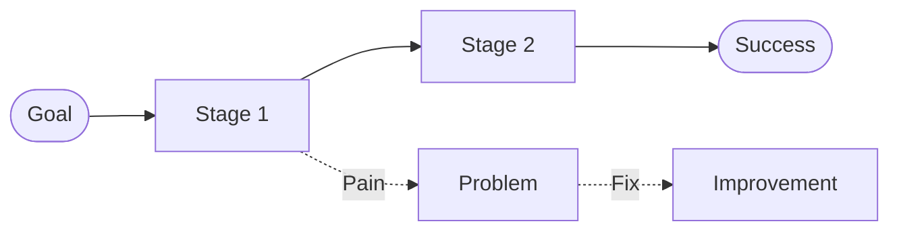

# Journey Maps

This directory contains user journey maps that visualize how users interact with the Fawkes platform to accomplish specific goals.

## About Journey Maps

Journey maps help us:
- Understand the end-to-end user experience
- Identify pain points and moments of delight
- Discover improvement opportunities
- Align teams around user needs
- Prioritize features based on impact

## Creating a Journey Map

1. **Copy the template**:
   ```bash
   cp ../templates/journey-map.md your-journey-name.md
   ```

2. **Choose a specific scenario**:
   - Pick one persona and one goal
   - Example: "Platform Engineer deploying new microservice"
   - Focus on a journey users undertake regularly

3. **Map the actual journey** (not the ideal):
   - Base on real user research
   - Include both successful and failed paths
   - Document actions, thoughts, emotions at each stage

4. **Identify opportunities**:
   - Highlight pain points
   - Suggest improvements
   - Prioritize by impact

## Naming Convention

Use: `{persona}-{scenario}.md`

Examples:
- `platform-engineer-incident-response.md`
- `app-developer-first-deployment.md`
- `product-manager-metrics-review.md`

## Journey Map Elements

Each journey map should include:

1. **Persona and Scenario**: Who and what goal
2. **Journey Stages**: Logical phases (discovery, setup, execution, validation)
3. **Actions**: What the user does at each stage
4. **Thoughts**: What's going through their mind
5. **Emotions**: How they feel (with intensity ratings)
6. **Pain Points**: Specific problems encountered
7. **Opportunities**: Proposed improvements
8. **Touchpoints**: Platform features and tools used

## Visualization

Use Mermaid diagrams for visual flow:



## Current Journey Maps

<!-- List your journey maps here as you create them -->
<!-- Example:
- [Platform Engineer - Incident Response](platform-engineer-incident-response.md)
- [App Developer - First Deployment](app-developer-first-deployment.md)
-->

## Best Practices

✅ **Do:**
- Base on actual user research (interviews, observations)
- Include specific examples and quotes
- Map the current state, not the ideal
- Show emotional highs and lows
- Identify both pain points and delights
- Link to related personas
- Update as you learn more

❌ **Don't:**
- Rely on assumptions without data
- Create overly complex maps
- Make it generic (be specific to one persona/scenario)
- Skip the emotional dimension
- Forget to prioritize opportunities
- Let maps become outdated

## Journey Map Workshop

**Format**: 2-hour collaborative session

**Steps**:
1. Introduce persona and scenario (10 min)
2. Brainstorm journey stages (15 min)
3. Detail actions for each stage (20 min)
4. Add thoughts and emotions (20 min)
5. Identify pain points (20 min)
6. Generate opportunities (20 min)
7. Prioritize improvements (15 min)

**Materials**:
- Sticky notes and markers
- Large whiteboard or paper
- Research artifacts (interview notes, personas)
- Mermaid diagram tool for digitization

## Resources

- [Journey Map Template](../templates/journey-map.md)
- [Persona Directory](../personas/)
- [Interview Notes](../interviews/)
- [Main Research README](../README.md)
- [Nielsen Norman: Journey Mapping 101](https://www.nngroup.com/articles/customer-journey-mapping/)
