# Journey Map Template

## Document Information

**Version**: 1.0
**Last Updated**: December 2025
**Status**: Active
**Owner**: Product Team

---

## How to Use This Template

A journey map visualizes a user's experience as they interact with the platform to accomplish a specific goal. Journey maps help teams:

- Understand the end-to-end user experience
- Identify pain points and moments of delight
- Discover opportunities for improvement
- Align teams around user needs
- Prioritize improvements based on impact

**Creating Your Journey Map:**
1. Choose a specific persona and scenario
2. Map the actual journey (based on research), not the ideal one
3. Include both actions and emotions
4. Identify specific pain points and opportunities
5. Use visuals to make it engaging and memorable
6. Validate with real users

---

## Journey Map Template Structure

### 1. Persona and Scenario

**Persona**: [Name and brief description - reference to your persona document]

**Scenario**: [Specific goal or task the user is trying to accomplish]

**Context**: [Relevant background - when, why, and under what conditions this journey occurs]

**Frequency**: [How often users undertake this journey - daily, weekly, monthly, rarely]

**Business Value**: [Why this journey matters to the business]

---

### 2. Journey Stages

Break the journey into logical phases. Common stages:
- **Awareness/Discovery**: User becomes aware of need or capability
- **Learning**: User researches and learns how to accomplish goal
- **Setup/Configuration**: User prepares tools and environment
- **Execution**: User performs the main task
- **Monitoring/Validation**: User confirms success
- **Reflection**: User evaluates experience and outcome

---

### 3. Actions Per Stage

For each stage, document:
- What the user does (specific steps)
- What tools/systems they use
- Who they interact with
- What information they need

---

### 4. Thoughts and Emotions

For each stage, capture:
- **Thoughts**: What's going through the user's mind?
- **Emotions**: How do they feel? (frustrated, confident, confused, delighted)
- **Emotional Intensity**: Rate from 1-5 or show as a line graph
- **Quotes**: Direct quotes from user research

---

### 5. Pain Points

For each stage, identify:
- Specific problems or friction
- Root causes
- Severity (critical, major, minor)
- Frequency (how often this occurs)

---

### 6. Opportunities for Improvement

For each pain point:
- Proposed solution or improvement
- Expected impact (effort vs. value)
- Priority (high, medium, low)
- Owner/team responsible

---

### 7. Touchpoints with Platform

For each stage, note:
- Platform features used
- Documentation consulted
- Support channels utilized
- External tools integrated

---

## Journey Map Template (Table Format)

| Stage | Actions | Thoughts | Emotions | Pain Points | Opportunities | Touchpoints |
|-------|---------|----------|----------|-------------|---------------|-------------|
| **[Stage 1]** | [User actions] | [User thoughts] | [Emotions: 😊 😐 😟] | [Problems encountered] | [Improvement ideas] | [Platform features used] |
| **[Stage 2]** | [User actions] | [User thoughts] | [Emotions: 😊 😐 😟] | [Problems encountered] | [Improvement ideas] | [Platform features used] |
| **[Stage 3]** | [User actions] | [User thoughts] | [Emotions: 😊 😐 😟] | [Problems encountered] | [Improvement ideas] | [Platform features used] |

---

## Journey Map Template (Mermaid Diagram Format)

### Text-Based Journey Flow

### Emotional Journey Line

```mermaid
%%{init: {'theme':'base'}}%%
graph LR
    subgraph "Emotional Journey"
        A[Stage 1: High 😊] --> B[Stage 2: Medium 😐]
        B --> C[Stage 3: Low 😟]
        C --> D[Stage 4: High 😊]
        D --> E[Stage 5: Medium 😐]
    end

    style A fill:#90EE90
    style B fill:#FFD700
    style C fill:#FF6B6B
    style D fill:#90EE90
    style E fill:#FFD700
```

### Detailed Journey Map with Swim Lanes

---

## Example Journey Map: Deploying a New Microservice

### 1. Persona and Scenario

**Persona**: Maria Rodriguez - Application Developer

**Scenario**: Deploy a new payment validation microservice to production for the first time

**Context**: Maria has developed a new microservice that validates payment information before processing. It's been tested locally and in the dev environment. She needs to deploy it to production before the sprint ends tomorrow. This is her first time deploying a completely new service (not just an update to existing).

**Frequency**: Deploying a new service happens 2-3 times per year for a typical developer

**Business Value**: Successful deployments demonstrate platform efficiency (DORA metric: deployment frequency). Poor deployment experience causes developer frustration and delays feature delivery.

---

### 2. Detailed Journey Stages

#### Stage 1: Pre-Deployment Preparation (30 minutes)

**Actions**:
1. Reviews deployment checklist from Confluence
2. Ensures all tests are passing in CI pipeline
3. Gets code review approval from tech lead
4. Checks service dependencies are healthy
5. Prepares rollback plan
6. Notifies team in Mattermost about upcoming deployment

**Thoughts**:
- "Did I configure everything correctly?"
- "What if I forget something important?"
- "Is there a complete checklist somewhere?"

**Emotions**: Anxious 😟 (Intensity: 3/5)

**Pain Points**:
- Deployment checklist is outdated (last updated 6 months ago)
- Unclear which environment variables are required
- No automated validation of configuration before deployment
- Rollback procedure is manual and poorly documented

**Opportunities**:
- Automated pre-flight checks that validate configuration
- Interactive deployment wizard that guides through requirements
- Up-to-date checklist generated from actual deployment requirements
- One-click rollback capability

**Touchpoints**:
- Confluence (documentation)
- Jenkins (CI pipeline status)
- GitHub (code review)
- Mattermost (team communication)

---

#### Stage 2: Service Configuration (45 minutes)

**Actions**:
1. Creates Kubernetes deployment manifest
2. Configures service discovery and load balancing
3. Sets up environment-specific configuration
4. Configures secrets and database connections
5. Defines resource limits and autoscaling rules
6. Asks platform team for clarification on ingress configuration

**Thoughts**:
- "There must be an easier way to do this"
- "Am I doing this the same way as the rest of the team?"
- "Why do I need to know so much about Kubernetes?"

**Emotions**: Frustrated 😟 (Intensity: 4/5)

**Pain Points**:
- Copying and modifying YAML from another service (brittle, error-prone)
- Kubernetes concepts are complex for application developers
- No template or wizard for common service types
- Ingress configuration requires platform team expertise
- Trial and error to get resource limits right

**Opportunities**:
- Golden path template for common service types (REST API, worker, etc.)
- Service scaffolding tool that generates configuration
- Built-in validation that catches common configuration errors
- Self-service ingress configuration with guardrails
- Resource recommendations based on similar services

**Touchpoints**:
- kubectl (Kubernetes CLI)
- Text editor (writing YAML)
- Kubernetes documentation
- Platform team support channel
- Another service's deployment as reference

---

#### Stage 3: Initial Deployment to Staging (1 hour)

**Actions**:
1. Applies Kubernetes manifests to staging environment
2. Waits for pods to start (unclear if they're actually starting)
3. Deployment fails - pods in CrashLoopBackOff
4. Searches logs in Kibana (takes 10 minutes to find the right logs)
5. Discovers misconfigured database connection string
6. Fixes configuration and redeploys
7. Tests service endpoints manually with curl
8. Verifies service in Grafana dashboard

**Thoughts**:
- "Why is this taking so long?"
- "What does CrashLoopBackOff even mean?"
- "Where are the logs?"
- "Is this going to work in production?"

**Emotions**: Stressed 😟 (Intensity: 5/5)

**Pain Points**:
- No visibility into deployment progress or why pods aren't starting
- Error messages from Kubernetes are cryptic
- Finding relevant logs requires knowing multiple systems
- No easy way to test service before declaring deployment successful
- Manual verification steps are time-consuming and error-prone

**Opportunities**:
- Real-time deployment status with clear progress indicators
- Plain-English explanations of common deployment errors
- Integrated log viewer that automatically shows relevant logs
- Automated health checks and smoke tests post-deployment
- Deployment success/failure notifications in Mattermost

**Touchpoints**:
- kubectl (status checking)
- Kibana (log searching)
- Grafana (service metrics)
- curl/Postman (manual testing)
- Documentation (error troubleshooting)

---

#### Stage 4: Production Deployment (2 hours, including waiting)

**Actions**:
1. Updates production manifests (careful copy-paste from staging)
2. Posts in team channel: "Deploying to production, standby"
3. Triggers production deployment manually via Jenkins job
4. Watches Jenkins logs anxiously
5. Deployment appears successful but has no traffic yet
6. Updates DNS/ingress rules to route traffic to new service
7. Watches Grafana for error rates (refreshing every 30 seconds)
8. Everything looks good after 15 minutes
9. Posts success message to team
10. Documents deployment in Confluence runbook

**Thoughts**:
- "Please don't let this break anything"
- "Am I doing this at the right time?"
- "How will I know if something goes wrong?"
- "When can I stop watching the dashboard?"

**Emotions**: Anxious → Relieved 😟 → 😊 (Intensity: 4/5 → 2/5)

**Pain Points**:
- Manual Jenkins job triggering (why not automatic from merge to main?)
- No gradual rollout or traffic shifting (all-or-nothing deployment)
- Unclear when it's safe to stop monitoring
- No automatic rollback if errors spike
- Have to stay online to monitor even though it's end of day

**Opportunities**:
- GitOps automatic deployment on merge to main branch
- Canary deployments with automatic traffic shifting
- Automated rollback if error rates or latency exceed thresholds
- Clear "deployment complete and healthy" notification
- Scheduled deployments during business hours only

**Touchpoints**:
- Jenkins (deployment trigger)
- Kubernetes (deployment status)
- Grafana (monitoring metrics)
- Mattermost (team communication)
- Confluence (documentation updates)

---

#### Stage 5: Post-Deployment Monitoring (Next day, 30 minutes)

**Actions**:
1. Checks service metrics first thing in the morning
2. Reviews overnight logs for any errors
3. Validates business metrics (payment validations are processing)
4. Updates team in standup
5. Closes Jira ticket

**Thoughts**:
- "Did everything stay healthy overnight?"
- "I hope I didn't miss any errors"
- "What should I be looking for?"

**Emotions**: Cautiously optimistic 😐 (Intensity: 2/5)

**Pain Points**:
- Uncertain what "healthy" looks like for a new service
- No proactive alerts, has to manually check
- Business metrics are in a separate system from technical metrics
- Unclear how long to keep watching

**Opportunities**:
- Automated deployment validation and notification
- Baseline metrics automatically generated for new services
- Unified dashboard showing both technical and business metrics
- Smart alerts that trigger only on actual anomalies
- "Deployment health report" summarizing first 24 hours

**Touchpoints**:
- Grafana (metrics)
- Kibana (logs)
- Business intelligence dashboard
- Jira (ticket tracking)

---

### 3. Journey Map Visualization (Mermaid)

---

### 4. Emotional Journey Graph

```mermaid
%%{init: {'theme':'base', 'themeVariables': {'fontSize':'16px'}}}%%
graph LR
    subgraph "Emotional Intensity Over Time"
        S1["Stage 1<br/>Preparation<br/>😟 3/5"] --> S2["Stage 2<br/>Configuration<br/>😟 4/5"]
        S2 --> S3["Stage 3<br/>Staging Deploy<br/>😟 5/5"]
        S3 --> S4["Stage 4<br/>Prod Deploy<br/>😟→😊 4/5→2/5"]
        S4 --> S5["Stage 5<br/>Monitoring<br/>😐 2/5"]
    end

    style S1 fill:#FFD700
    style S2 fill:#FFA500
    style S3 fill:#FF6B6B
    style S4 fill:#98D8C8
    style S5 fill:#90EE90
```

---

### 5. Summary: Key Insights

**Biggest Pain Points** (Prioritized):
1. **Service configuration complexity** - Requires deep Kubernetes knowledge, no templates
2. **Difficult troubleshooting** - Cryptic errors, hard to find relevant logs
3. **Manual deployment process** - Time-consuming, stressful, error-prone
4. **Unclear success criteria** - Don't know when it's safe to stop monitoring
5. **No safety net** - All-or-nothing deployment, manual rollback

**Quick Wins** (High Impact, Low Effort):
1. Create golden path service templates for common patterns
2. Add automated pre-flight configuration validation
3. Improve error messages with troubleshooting links
4. Implement deployment notifications in Mattermost
5. Create deployment health dashboard

**Strategic Improvements** (High Impact, Higher Effort):
1. Implement GitOps with ArgoCD for automatic deployments
2. Add canary deployment capability with automatic rollback
3. Build service scaffolding tool ("create-service" wizard)
4. Integrate logs, metrics, and traces in single view
5. Develop automated smoke tests for deployments

**Success Metrics**:
- Time to deploy new service: Target < 30 minutes (currently 4+ hours)
- Developer confidence rating: Target > 8/10 (currently ~4/10)
- Failed deployments: Target < 5% (currently ~20%)
- Time to recover from failed deployment: Target < 5 minutes (currently ~30 minutes)

---

## Additional Journey Map Examples

### Example: Troubleshooting a Production Incident

---

### Example: Onboarding to the Platform

---

## Tips for Creating Effective Journey Maps

### Research-Based
- Base on actual user research, not assumptions
- Include direct quotes from users
- Validate with multiple users
- Update as you learn more

### Specific and Concrete
- Focus on one persona and one scenario
- Use real examples and actual steps
- Include specific pain points, not generalizations
- Note actual time durations

### Visual and Engaging
- Use color to indicate emotion (green = positive, red = negative)
- Include emojis for quick emotional scanning
- Make it scannable (people should grasp it in 30 seconds)
- Display prominently where team can see it

### Actionable
- Clearly identify opportunities for improvement
- Prioritize based on impact and effort
- Assign owners to improvements
- Track which improvements have been addressed

### Collaborative
- Create journey maps as a team activity
- Include people from different functions (product, engineering, design)
- Workshop format: sticky notes on wall, then digitize
- Share widely and gather feedback

---

## Journey Map Workshop Format

**Preparation** (30 minutes before):
- Select persona and scenario
- Gather research materials (interview notes, analytics)
- Prepare materials (sticky notes, markers, large paper/whiteboard)

**Workshop** (2 hours):
1. **Introduce persona and scenario** (10 min)
2. **Brainstorm journey stages** (15 min)
3. **Detail actions for each stage** (20 min)
4. **Add thoughts and emotions** (20 min)
5. **Identify pain points** (20 min)
6. **Generate opportunities** (20 min)
7. **Prioritize improvements** (15 min)

**Follow-up** (After workshop):
- Digitize journey map (Mermaid diagram)
- Add to documentation
- Share with stakeholders
- Create backlog items for top opportunities
- Schedule review in 3-6 months

---

## Additional Resources

- [Interview Guide Template](./interview-guide.md)
- [Persona Template](./persona.md)
- Nielsen Norman Group Journey Mapping 101: https://www.nngroup.com/articles/customer-journey-mapping/
- Adaptive Path's Guide to Experience Mapping
- Mermaid Documentation: https://mermaid.js.org/
