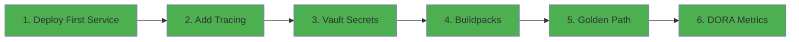

# Tutorials

Tutorials are **learning-oriented** experiences. They guide you through a series of steps to complete a project or learn a new concept. Unlike how-to guides, tutorials focus on learning, not accomplishing a specific task.

## What You'll Find Here

Tutorials in Fawkes are designed to:

- Take you by the hand through a complete learning experience
- Help you build understanding through practical exercises
- Introduce concepts in a logical, incremental order
- Provide a safe environment to learn and experiment

## Getting Started Tutorials

These tutorials help you get hands-on experience with the Fawkes platform. **Complete them in order** for the best learning experience.

| Tutorial                                                             | Duration | What You'll Learn                                                              | Status       |
| -------------------------------------------------------------------- | -------- | ------------------------------------------------------------------------------ | ------------ |
| [1. Deploy Your First Service](1-deploy-first-service.md)            | 30 min   | Deploy an application to Fawkes platform, achieve Time to First Success (TTFS) | ✅ Available |
| [2. Add Distributed Tracing](2-add-tracing-tempo.md)                 | 25 min   | Instrument with OpenTelemetry and view traces in Grafana Tempo                 | ✅ Available |
| [3. Consume Vault Secrets](3-consume-vault-secret.md)                | 30 min   | Implement compliant secret management with HashiCorp Vault                     | ✅ Available |
| [4. Migrate to Buildpacks](4-buildpack-migration.md)                 | 25 min   | Replace Dockerfiles with Cloud Native Buildpacks for automated security        | ✅ Available |
| [5. Create a Golden Path Template](5-create-golden-path-template.md) | 35 min   | Build a Backstage template to enable platform self-service                     | ✅ Available |
| [6. Measure DORA Metrics](6-measure-dora-metrics.md)                 | 30 min   | Analyze your service performance with DORA metrics in DevLake                  | ✅ Available |

## Platform Demo Resources

| Resource                                                      | Purpose                                                           | Status       |
| ------------------------------------------------------------- | ----------------------------------------------------------------- | ------------ |
| [Epic 1 Demo Video Script](epic-1-demo-video-script.md)       | Comprehensive script for recording 30-minute Epic 1 platform demo | ✅ Available |
| [Epic 1 Demo Video Checklist](epic-1-demo-video-checklist.md) | Quick reference checklist for recording the demo video            | ✅ Available |

!!! success "Start Here for Time to First Success!"
Begin with [Tutorial 1: Deploy Your First Service](1-deploy-first-service.md) to get your first application running on Fawkes in under 30 minutes.

## Tutorial Learning Path

### Tutorial Design Principles

These tutorials follow the [Diátaxis framework](https://diataxis.fr/) for documentation:

- **Learning-oriented**: Designed to help you learn by doing
- **Concrete and specific**: Clear, numbered steps with expected outcomes
- **Safe to explore**: Use isolated environments and reversible actions
- **Incremental**: Each tutorial builds on the previous one

!!! tip "Complement with the Dojo"
After completing these tutorials, continue your learning journey with the Dojo belt progression system for deeper platform engineering expertise.

## Dojo Learning Path

The Fawkes Dojo provides structured, belt-based learning:

| Belt Level     | Focus Area            | Duration | Start Here                                                                                 |
| -------------- | --------------------- | -------- | ------------------------------------------------------------------------------------------ |
| 🥋 White Belt  | Platform Fundamentals | 8 hours  | [Module 1: What is IDP](../dojo/modules/white-belt/module-01-what-is-idp.md)               |
| 🟡 Yellow Belt | CI/CD Mastery         | 8 hours  | [Module 5: CI Fundamentals](../dojo/modules/yellow-belt/module-05-ci-fundamentals.md)      |
| 🟢 Green Belt  | GitOps & Deployment   | 8 hours  | [Module 9: GitOps with ArgoCD](../dojo/modules/green-belt/module-09-gitops-argocd.md)      |
| 🟤 Brown Belt  | Observability & SRE   | 8 hours  | [Module 13: Observability](../dojo/modules/brown-belt/module-13-observability.md)          |
| ⚫ Black Belt  | Platform Architecture | 8 hours  | [Module 17: Platform as Product](../dojo/modules/black-belt/module-17-platform-product.md) |

## How Tutorials Differ from How-To Guides

| Tutorials                    | How-To Guides              |
| ---------------------------- | -------------------------- |
| Learning-oriented            | Task-oriented              |
| Designed for beginners       | Designed for practitioners |
| Focus on understanding       | Focus on accomplishing     |
| Complete learning experience | Solve specific problems    |

[Start White Belt :material-school:](../dojo/modules/white-belt/module-01-what-is-idp.md){ .md-button .md-button--primary }
[View How-To Guides :material-book-open:](../how-to/index.md){ .md-button }
