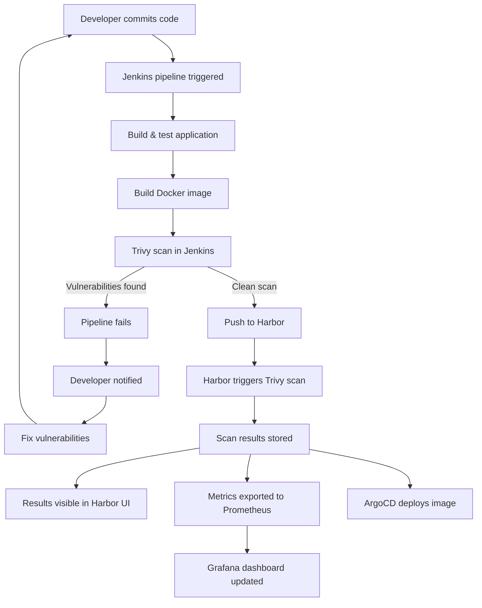

# Trivy - Container Security Scanner

## Purpose

Trivy provides comprehensive vulnerability scanning for container images, filesystems, and Git repositories. It's integrated into the CI/CD pipeline to ensure all deployed containers meet security standards.

## Integration Status

✅ **Jenkins Pipelines**: Fully integrated via Golden Path shared library  
✅ **Harbor Registry**: Automatic scanning on image push  
✅ **Security Quality Gates**: HIGH/CRITICAL vulnerabilities block deployments  
✅ **Scan Reports**: Archived in Jenkins and visible in Harbor UI  
📊 **Grafana Dashboard**: Available at Grafana → Security → Trivy Container Security Scanning

## Key Features

- **Vulnerability Detection**: Scan for CVEs in OS packages and application dependencies
- **Misconfiguration Detection**: Detect IaC misconfigurations (Kubernetes, Terraform, Docker)
- **Secret Detection**: Find hardcoded secrets and credentials
- **SBOM Generation**: Software Bill of Materials in SPDX/CycloneDX
- **Multiple Targets**: Images, filesystems, repositories, Kubernetes clusters
- **Fast Scanning**: Cached DB for quick scans

## Quick Start

### Scan Container Image

```bash
# Scan image from registry
trivy image myapp:latest

# Scan with severity filter
trivy image --severity HIGH,CRITICAL myapp:latest

# Generate JSON report
trivy image -f json -o report.json myapp:latest
```

### Scan Kubernetes Cluster

```bash
# Scan all workloads in namespace
trivy k8s --namespace fawkes

# Generate report
trivy k8s --report summary --namespace fawkes
```

### Scan IaC Files

```bash
# Scan Terraform
trivy config infra/terraform/

# Scan Kubernetes manifests
trivy config platform/apps/
```

## Integration with Jenkins

Trivy is fully integrated into the Golden Path CI/CD pipeline via the shared library (`goldenPathPipeline.groovy` and `securityScan.groovy`).

### Automatic Integration

When you use the Golden Path pipeline, Trivy scanning is automatically included:

```groovy
@Library('fawkes-pipeline-library') _
goldenPathPipeline {
    appName = 'my-service'
    language = 'java'
    dockerImage = 'harbor.127.0.0.1.nip.io/fawkes/my-service'
    // Trivy scanning is automatically enabled
}
```

### Manual Integration

For custom pipelines, use the `securityScan` step:

```groovy
@Library('fawkes-pipeline-library') _

pipeline {
    agent any
    stages {
        stage('Build Image') {
            steps {
                script {
                    docker.build("myapp:${BUILD_NUMBER}")
                }
            }
        }
        
        stage('Security Scan') {
            steps {
                script {
                    securityScan {
                        image = "myapp:${BUILD_NUMBER}"
                        trivySeverity = 'HIGH,CRITICAL'
                        failOnVulnerabilities = true
                    }
                }
            }
        }
    }
}
```

### Pipeline Behavior

The Golden Path pipeline includes a dedicated **Container Security Scan** stage that:

1. Runs after Docker image is built
2. Uses a Trivy sidecar container in the Jenkins pod
3. Scans for HIGH and CRITICAL vulnerabilities
4. Generates both table and JSON format reports
5. Archives reports as build artifacts
6. **Fails the pipeline** if vulnerabilities are found (configurable)

### Quality Gates

Default security quality gates:
- **CRITICAL** vulnerabilities: Immediate pipeline failure
- **HIGH** vulnerabilities: Immediate pipeline failure  
- **MEDIUM/LOW** vulnerabilities: Warning only (pipeline continues)

Quality gates can be customized:

```groovy
goldenPathPipeline {
    appName = 'my-service'
    trivySeverity = 'CRITICAL'  // Only fail on CRITICAL
    trivyExitCode = '0'          // Never fail pipeline
}
```

## Integration with Harbor

Harbor uses Trivy as the integrated scanner for automatic vulnerability scanning.

### Configuration

Trivy is enabled in Harbor via the ArgoCD Application manifest (`platform/apps/harbor-application.yaml`):

```yaml
trivy:
  enabled: true
  replicas: 1
  resources:
    requests:
      cpu: 200m
      memory: 512Mi
    limits:
      cpu: 1
      memory: 1Gi
```

### Automatic Scanning

All images pushed to Harbor are automatically scanned:

1. **Image Push**: Developer pushes image to Harbor
2. **Trigger**: Harbor automatically triggers Trivy scan
3. **Scan**: Trivy scans for OS and application vulnerabilities
4. **Results**: Scan results visible in Harbor UI and API
5. **Policy**: Optional policies can block image pulls based on severity

### Scanning Workflow

```bash
# Push image to Harbor
docker tag myapp:latest harbor.127.0.0.1.nip.io/fawkes/myapp:latest
docker push harbor.127.0.0.1.nip.io/fawkes/myapp:latest

# Harbor automatically scans the image
# View results in Harbor UI or via API
curl -u admin:password \
  http://harbor.127.0.0.1.nip.io/api/v2.0/projects/fawkes/repositories/myapp/artifacts/latest/scan
```

### Trivy Scanner Pod

Check Trivy scanner status in Harbor:

```bash
# Check pod status
kubectl get pods -n fawkes -l component=trivy

# View scanner logs
kubectl logs -n fawkes -l component=trivy

# Check scanner registration
# Harbor UI → Interrogation Services → Scanners
```

## SBOM Generation

Generate Software Bill of Materials for compliance:

```bash
# Generate SBOM in SPDX format
trivy image --format spdx-json -o sbom.spdx.json myapp:latest

# Generate SBOM in CycloneDX format
trivy image --format cyclonedx -o sbom.cyclonedx.json myapp:latest
```

## Vulnerability Database

Trivy downloads and caches the vulnerability database for offline scanning:

```bash
# Update database manually
trivy image --download-db-only

# Check database version
trivy version --format json | jq .VulnerabilityDB

# Database location
~/.cache/trivy/db/
```

### Automatic Updates

The Trivy database is automatically updated:
- **Jenkins**: Database updated at the start of each pipeline run
- **Harbor**: Database updated every 12 hours via cronjob
- **Update Time**: < 1 minute for typical updates
- **Storage**: ~200MB compressed database

### Database Sources

Trivy aggregates vulnerability data from:
- [National Vulnerability Database (NVD)](https://nvd.nist.gov/)
- [Red Hat Security Data](https://www.redhat.com/security/data/)
- [Debian Security Tracker](https://security-tracker.debian.org/)
- [Ubuntu Security Notices](https://ubuntu.com/security/notices)
- [Alpine Security Database](https://secdb.alpinelinux.org/)
- [GitHub Security Advisories](https://github.com/advisories)

## Scanning Strategies

### Pre-Commit Scanning

Scan before committing code:

```yaml
# .pre-commit-config.yaml
repos:
  - repo: local
    hooks:
      - id: trivy
        name: Trivy filesystem scan
        entry: trivy fs --exit-code 1 .
        language: system
        pass_filenames: false
```

### Scheduled Scanning

Regular scans of running containers:

```yaml
apiVersion: batch/v1
kind: CronJob
metadata:
  name: trivy-scan
spec:
  schedule: "0 2 * * *"  # Daily at 2 AM
  jobTemplate:
    spec:
      template:
        spec:
          containers:
            - name: trivy
              image: aquasec/trivy:latest
              command:
                - trivy
                - k8s
                - --namespace
                - fawkes
```

## Reporting

Generate various report formats:

```bash
# Table format (default)
trivy image myapp:latest

# JSON format
trivy image -f json myapp:latest

# SARIF format (for GitHub Security)
trivy image -f sarif myapp:latest

# Template format
trivy image -f template --template "@contrib/gitlab.tpl" myapp:latest
```

## Ignoring Vulnerabilities

Create `.trivyignore` file to suppress false positives:

```text
# Ignore specific CVE
CVE-2021-12345

# Ignore with expiration
CVE-2021-67890 exp:2024-12-31

# Ignore with reason
CVE-2021-11111 # Fixed in next release
```

## Troubleshooting

### Database Update Failures

```bash
# Check database path
trivy image --cache-dir /path/to/cache myapp:latest

# Clear cache and re-download
rm -rf ~/.cache/trivy
trivy image --download-db-only
```

### High Memory Usage

Trivy can use significant memory for large images:

```bash
# Limit memory usage
trivy image --timeout 10m --slow myapp:latest
```

### Offline Scanning

For air-gapped environments:

```bash
# Download database
trivy image --download-db-only

# Copy database to air-gapped system
cp -r ~/.cache/trivy /path/to/airgap/

# Use offline database
trivy image --cache-dir /path/to/airgap/trivy myapp:latest
```

## Metrics and Monitoring

Trivy exports metrics for monitoring and alerting.

### Prometheus Metrics

Expected metrics (to be implemented):

```promql
# Vulnerability counts by severity
trivy_vulnerabilities_total{severity="critical|high|medium|low", image="..."}

# Scan metrics
trivy_scan_total{source="jenkins|harbor"}
trivy_scan_success_total{source="jenkins|harbor"}
trivy_scan_failure_total{source="jenkins|harbor"}
trivy_scan_duration_seconds{source="jenkins|harbor"}

# Image tracking
trivy_scan_timestamp{image="..."}
```

### Grafana Dashboard

A comprehensive Trivy security dashboard is available:

**Location**: Grafana → Dashboards → Security → Trivy Container Security Scanning

**Panels**:
- Critical & High Vulnerabilities count
- Images scanned today
- Scan success rate
- Vulnerability trends (7 days)
- Top 10 vulnerable images
- Scan activity by source (Jenkins vs Harbor)
- Average scan duration
- Failed scans (24h)

**Access**:
```bash
# Port forward to Grafana
kubectl port-forward -n fawkes svc/grafana 3000:80

# Open browser
open http://localhost:3000
# Navigate to Security folder
```

### ServiceMonitor Configuration

```yaml
apiVersion: monitoring.coreos.com/v1
kind: ServiceMonitor
metadata:
  name: trivy
  namespace: fawkes
spec:
  selector:
    matchLabels:
      app: trivy
  endpoints:
    - port: metrics
      interval: 30s
      path: /metrics
```

## Complete Workflow: Code to Deployment

Here's the end-to-end Trivy integration workflow:



### Stage-by-Stage Flow

1. **Code Commit** (Developer)
   - Developer pushes code to main branch
   - GitHub webhook triggers Jenkins

2. **Build Stage** (Jenkins)
   - Application code compiled
   - Unit tests executed
   - Build artifacts created

3. **Image Build** (Jenkins)
   - Dockerfile used to build container
   - Image tagged with Git SHA
   - Image available in Jenkins workspace

4. **Container Scan** (Jenkins + Trivy)
   - Trivy sidecar container scans image
   - Checks for OS package vulnerabilities
   - Checks for application dependency vulnerabilities
   - Severity filter: HIGH,CRITICAL
   - Exit code 1 on vulnerabilities found

5. **Quality Gate** (Jenkins)
   - If CRITICAL/HIGH found → Pipeline fails
   - If MEDIUM/LOW only → Pipeline continues
   - Scan reports archived as artifacts
   - SonarQube link added to build description

6. **Push to Registry** (Jenkins → Harbor)
   - Clean images pushed to Harbor
   - Tagged with both SHA and 'latest'
   - Credentials from Vault secrets

7. **Harbor Scan** (Harbor + Trivy)
   - Automatic scan on push (scan-on-push enabled)
   - Secondary verification of vulnerabilities
   - Results stored in Harbor database
   - Accessible via Harbor UI and API

8. **Visibility** (Metrics & Dashboards)
   - Jenkins publishes scan metrics
   - Harbor exports scan results
   - Prometheus collects metrics
   - Grafana displays trends and alerts
   - DORA metrics updated (CFR tracking)

9. **Deployment** (ArgoCD)
   - Only clean images deployed
   - GitOps manifest updated with new tag
   - ArgoCD syncs to Kubernetes
   - Kyverno policies enforce pod security

### Failure Scenario

```
Developer commits → Jenkins builds → Docker image created
→ Trivy scans → **3 CRITICAL vulnerabilities found**
→ Pipeline FAILS → Mattermost notification sent
→ Developer reviews scan report → Updates dependencies
→ New commit → Process repeats → Clean scan → Deployment proceeds
```

## Testing

### BDD Acceptance Tests

Comprehensive BDD tests are available: `tests/bdd/features/trivy-integration.feature`

**Test Scenarios**:
- ✅ Trivy integrated in Jenkins Golden Path pipeline
- ✅ Trivy scan generates reports in Jenkins
- ✅ Trivy scan enforces security quality gate
- ✅ Harbor automatically scans images on push
- ✅ Trivy scanner pod running in Harbor
- ✅ Query scan results via Harbor API
- ✅ Pipeline fails on vulnerabilities based on severity
- ✅ Complete end-to-end workflow validation

**Run Tests**:
```bash
# Run all Trivy integration tests
cd tests/bdd
behave features/trivy-integration.feature

# Run specific scenario
behave features/trivy-integration.feature \
  -n "Container Security Scan stage executes"

# Run with tags
behave --tags=jenkins features/trivy-integration.feature
behave --tags=harbor features/trivy-integration.feature
```

### Manual Testing

**Test Jenkins Integration**:
```bash
# Trigger a test build
curl -X POST http://jenkins.fawkes.local/job/test-pipeline/build \
  --user admin:password

# Check scan results
curl http://jenkins.fawkes.local/job/test-pipeline/lastBuild/artifact/trivy-report.json
```

**Test Harbor Integration**:
```bash
# Push test image
docker pull alpine:latest
docker tag alpine:latest harbor.127.0.0.1.nip.io/library/test-scan:latest
docker push harbor.127.0.0.1.nip.io/library/test-scan:latest

# Wait for scan (automatic)
sleep 60

# Check scan results
curl -u admin:Harbor12345 \
  http://harbor.127.0.0.1.nip.io/api/v2.0/projects/library/repositories/test-scan/artifacts/latest/additions/vulnerabilities
```

## Related Documentation

### Fawkes Platform
- [Jenkins Golden Path Pipeline](../jenkins/README.md)
- [Harbor Container Registry](../harbor/README.md)
- [Security Scanning (SonarQube)](../sonarqube/README.md)
- [Grafana Dashboards](../grafana/dashboards/README.md)
- [Architecture - Security Layer](../../../docs/architecture.md#security-layer)

### Trivy Official Documentation
- [Trivy Documentation](https://aquasecurity.github.io/trivy/)
- [Trivy GitHub Repository](https://github.com/aquasecurity/trivy)
- [Trivy Vulnerability Database](https://github.com/aquasecurity/trivy-db)
- [Trivy Operator for Kubernetes](https://github.com/aquasecurity/trivy-operator)

### CI/CD Integration
- [Jenkins Shared Library - securityScan.groovy](../../../jenkins-shared-library/vars/securityScan.groovy)
- [Jenkins Shared Library - goldenPathPipeline.groovy](../../../jenkins-shared-library/vars/goldenPathPipeline.groovy)
- [BDD Tests - Trivy Integration](../../../tests/bdd/features/trivy-integration.feature)
- [BDD Tests - Golden Path](../../../tests/bdd/features/jenkins/golden-path.feature)

### Container Security Best Practices
- [CNCF Cloud Native Security](https://www.cncf.io/blog/2020/11/18/introduction-to-cloud-native-security/)
- [CIS Docker Benchmark](https://www.cisecurity.org/benchmark/docker)
- [NIST Container Security Guide](https://nvlpubs.nist.gov/nistpubs/SpecialPublications/NIST.SP.800-190.pdf)
- [OWASP Docker Security Cheat Sheet](https://cheatsheetseries.owasp.org/cheatsheets/Docker_Security_Cheat_Sheet.html)

## Troubleshooting

### Issue: Trivy scan fails with database error

**Symptom**: `failed to download vulnerability DB`

**Solution**:
```bash
# Clear cache and re-download
rm -rf ~/.cache/trivy
trivy image --download-db-only

# For Harbor, restart the Trivy pod
kubectl delete pod -n fawkes -l component=trivy
```

### Issue: Pipeline always passes despite vulnerabilities

**Symptom**: Images with HIGH/CRITICAL vulns are not blocking deployment

**Solution**:
Check exit code configuration in Golden Path:
```groovy
goldenPathPipeline {
    trivyExitCode = '1'           // Must be '1' to fail on vulns
    failOnVulnerabilities = true  // Must be true
}
```

### Issue: Scan takes too long

**Symptom**: Trivy scans timeout or take > 5 minutes

**Solution**:
```bash
# Increase timeout in pipeline
trivyTimeout = '10m'

# Use cached database (skip update)
sh "trivy image --skip-update ${image}"

# Reduce scan scope
sh "trivy image --scanners vuln ${image}"  # Skip misconfigs
```

### Issue: Harbor doesn't show scan results

**Symptom**: Harbor UI shows "Not Scanned" for pushed images

**Solution**:
```bash
# Check Trivy pod is running
kubectl get pods -n fawkes -l component=trivy

# Check Harbor jobservice logs
kubectl logs -n fawkes -l component=jobservice

# Manually trigger scan via API
curl -X POST -u admin:Harbor12345 \
  http://harbor.127.0.0.1.nip.io/api/v2.0/projects/fawkes/repositories/myapp/artifacts/latest/scan
```

### Issue: False positives in scan results

**Symptom**: Known-safe vulnerabilities flagged

**Solution**:
Create `.trivyignore` file in repository root:
```text
# Ignore specific CVE (with reason)
CVE-2021-12345  # Fixed in next release, vendor confirmed

# Ignore with expiration date
CVE-2021-67890 exp:2024-12-31
```

## Support

For issues with Trivy integration:

1. **Check Logs**:
   ```bash
   kubectl logs -n fawkes -l component=trivy
   kubectl logs -n fawkes -l app=jenkins
   ```

2. **Check Status**:
   ```bash
   kubectl get pods -n fawkes
   kubectl describe pod -n fawkes <trivy-pod-name>
   ```

3. **Review Scan Reports**: Check Jenkins build artifacts

4. **Open GitHub Issue**: [paruff/fawkes/issues](https://github.com/paruff/fawkes/issues)

---

**Maintained by**: Fawkes Platform Team  
**Last Updated**: December 2024  
**Issue**: #20 - Integrate Trivy container scanning
